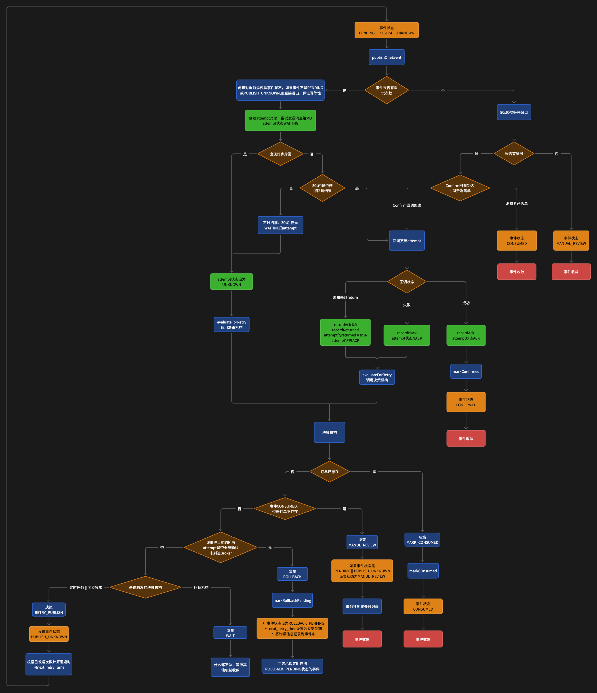
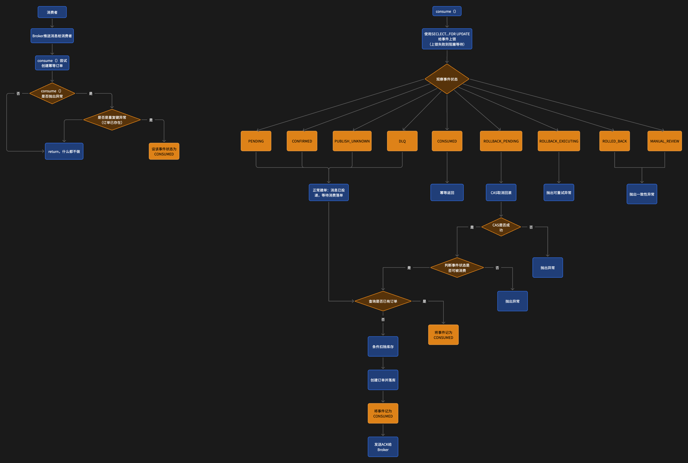
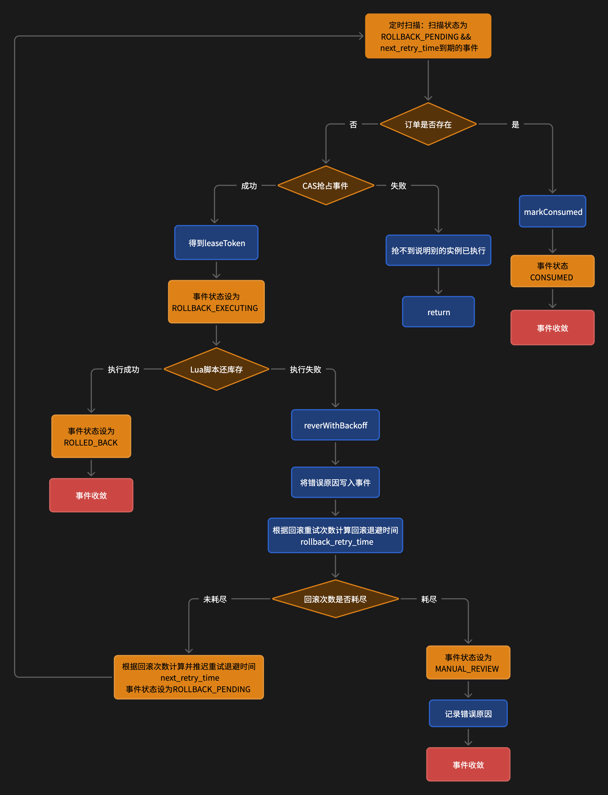

# DianPing｜餐饮点评与优惠券秒杀

DianPing 是一个基于 Java 8 与 Spring Boot 的餐饮点评项目，包含用户登录、商铺查询、探店内容、社交关系、签到和优惠券等业务。在原有点评场景上，项目的主要工程实践集中在**优惠券秒杀链路的异步化与可靠性治理**：从 Redis 原子预留、MySQL 事件账本、RabbitMQ 异步下单，到失败重试、幂等消费、库存回滚、数据对账和人工兜底，形成可追踪的业务闭环。

> 当前结论以仓库代码、自动化测试和 2026-09-06 隔离环境压测为准。项目已完成双实例短时容量阶梯与全链路一致性验收，但尚未完成真实 RabbitMQ 故障注入、多实例宕机恢复和长时间稳定性测试，因此不声明生产级吞吐、消息零丢失或零超卖。

## 项目功能

| 业务模块 | 主要实现 |
| --- | --- |
| 用户与会话 | 验证码/密码登录、Redis Token 会话、滑动续期、权限拦截 |
| 商铺服务 | 商铺详情缓存、缓存穿透防护、按类型分页、Redis GEO 附近商铺 |
| 探店内容 | 笔记发布与查询、点赞排行、评论、图片上传 |
| 社交关系 | 关注/取关、共同关注、基于 Redis ZSet 的推模式 Feed 流 |
| 用户签到 | Redis BitMap 月度签到与连续签到统计 |
| 优惠券 | 普通券、秒杀券、活动时间与库存管理 |
| 秒杀订单 | Lua 原子预留、Outbox 发布、RabbitMQ 异步消费、状态查询与失败收敛 |

项目保留了 `nginx/html` 下的 Vue 2 + Element UI 页面，后端提供 REST API；核心后端服务默认监听 `8081` 端口。

## 技术栈

| 分类 | 技术 |
| --- | --- |
| 基础框架 | Java 8、Spring Boot 2.3.12.RELEASE |
| 数据访问 | MyBatis-Plus 3.4.3、MySQL |
| 缓存与数据结构 | Redis、Lettuce、Lua |
| 消息队列 | RabbitMQ、Spring AMQP |
| 前端与代理 | Vue 2、Element UI、Nginx |
| 工程辅助 | Maven、JUnit 5、Mockito、Hutool |

## 优惠券秒杀设计

秒杀接口返回的是“请求已受理”，正式订单由消息消费者异步创建。`eventId` 和 `orderId` 在进入 Lua 前生成，并在预留、发布、消费、对账和回滚阶段始终复用，使一次业务请求能够跨 Redis、MySQL 和 RabbitMQ 被持续追踪。

### 核心流程

为便于查看关键分支，秒杀链路拆分为消息发布、消费落单和库存回滚三个流程。

#### Outbox 发布与失败决策



#### 消费落单与幂等处理



#### Redis 预留回滚与人工收敛



### 1. 请求受理：Redis 原子预留

`VoucherOrderServiceImpl.seckillVoucher()` 先校验登录状态、优惠券和活动时间，再调用 `seckill.lua` 原子完成：

- 判断 Redis 库存是否充足；
- 判断用户是否已经参与过该券的秒杀；
- 扣减 Redis 库存并记录用户占用；
- 写入 `eventId → orderId/userId/createdAt/version` 预留详情；
- 建立用户、订单与事件之间的反向索引，并加入待对账集合。

这些 Key 使用 `{voucherId}` Hash Tag，确保相关数据位于同一个 Redis Cluster Slot。Lua 成功后，请求线程尽力写入 `tb_seckill_order_event` 的 `PENDING` 事件并返回 `orderId + PROCESSING`。如果事件写入失败，不立即恢复库存，而是由对账任务依据 Redis 预留重建事件，避免把结果未知误判为确定失败。

### 2. 异步发布：MySQL Outbox 与发送证据

HTTP 请求线程不直接发送 RabbitMQ 消息。`SeckillOrderPublishRetryTask` 扫描到期事件，通过数据库条件更新抢占租约，再执行一次消息发布：

- `tb_seckill_order_event` 保存业务事件状态、重试时间、租约和栅栏令牌；
- `tb_seckill_publish_attempt` 为每次真实发送保存独立的 `attemptId`；
- Publisher Confirm、Return、同步异常和确认超时分别落库，不依赖内存状态；
- 发送任务使用退避策略重试，达到上限后进入人工核对，而不是无限重发。

发布结果未知时，消息可能已经到达 Broker，因此 `PUBLISH_UNKNOWN` 不会直接触发库存回滚。系统继续结合订单记录、发送尝试和后续消费结果进行判断。

### 3. 消费落单：单事务与幂等收敛

`SeckillOrderConsumer` 收到消息后，将落单交给 `VoucherOrderHandler` 在一个 MySQL 事务中完成：

1. 锁定并校验事件记录，拒绝消息字段与事件账本不一致的情况；
2. 如果事件已 `CONSUMED` 或订单已存在，按重复投递幂等返回；
3. 使用 `stock = stock - 1 WHERE voucher_id = ? AND stock > 0` 条件更新扣减 MySQL 库存；
4. 写入 `tb_voucher_order`，并由 `(user_id, voucher_id)` 唯一索引兜底一人一单；
5. 将事件推进为 `CONSUMED`，事务提交后再由监听容器确认消息。

消息允许重复到达，业务结果依靠事件状态、订单唯一约束和身份一致性校验收敛。

### 4. 异常闭环：重试、回滚、对账与人工处理

| 异常输入 | 判断依据 | 后续动作 |
| --- | --- | --- |
| Confirm 超时、发送异常 | 是否存在订单、是否仍有可能送达的 attempt | 延迟重发或等待更多证据 |
| 所有发送尝试均明确失败 | 无订单，且不存在结果未知的发送 | 推进到 `ROLLBACK_PENDING` |
| 消费临时异常 | Spring AMQP 有限次重试 | 重试耗尽后记录失败并进入 DLQ |
| Redis 预留存在、MySQL 事件缺失 | 预留详情与反向索引 | 幂等补建 `PENDING` 事件 |
| 订单已存在、预留仍残留 | MySQL 订单与事件状态 | 标记成功并清理预留 |
| 证据冲突或自动重试耗尽 | 订单、事件、attempt、预留无法安全收敛 | 写入失败工单，等待人工核对 |

回滚任务执行前再次确认订单不存在，再通过 `seckill_rollback.lua` 按 `eventId` 精确恢复库存并撤销用户占用。Redis/MySQL 对账包含近期优惠券快速扫描和历史优惠券分页兜底，用于处理跨存储写入间隙遗留的预留记录。

## 秒杀数据模型

| 存储 | 数据 | 作用 |
| --- | --- | --- |
| Redis | `seckill:stock:{voucherId}` | 秒杀可售库存 |
| Redis | `seckill:order:{voucherId}` | 已占用库存的用户集合 |
| Redis | `seckill:reservation:{voucherId}` | 事件级预留详情 |
| Redis | `seckill:reservation:user:{voucherId}` | 用户到事件的索引 |
| Redis | `seckill:reservation:order:{voucherId}` | 订单到事件的索引 |
| Redis | `seckill:reservation:pending:{voucherId}` | 待对账预留 |
| MySQL | `tb_seckill_order_event` | Outbox 事件与主状态机 |
| MySQL | `tb_seckill_publish_attempt` | 每次消息发送的结果证据 |
| MySQL | `tb_voucher_order` | 正式业务订单 |
| MySQL | `tb_seckill_failure_case` | 自动流程无法收敛的失败记录 |
| MySQL | `tb_seckill_failure_audit` | 人工处置审计记录 |

主要事件状态如下：

```text
PENDING / PUBLISH_UNKNOWN / CONFIRMED
                    │
                    ├── CONSUMED             订单创建成功
                    ├── ROLLBACK_PENDING
                    │       └── ROLLBACK_EXECUTING ── ROLLED_BACK
                    ├── DLQ                  消费失败隔离
                    └── MANUAL_REVIEW        等待人工核对
```

`CONSUMED` 和 `ROLLED_BACK` 是自动终态，迟到的 Confirm、Return 或任务执行结果不能覆盖终态。

## 核心 API

接口统一返回 `Result<T>`；需要登录的接口通过 `authorization` 请求头携带 Token。

| 方法 | 路径 | 说明 |
| --- | --- | --- |
| POST | `/user/code?phone=` | 获取登录验证码 |
| POST | `/user/login` | 登录并获取 Token |
| GET | `/shop/{id}` | 查询商铺详情 |
| GET | `/shop/of/location` | 查询附近商铺 |
| POST | `/blog` | 发布探店笔记 |
| GET | `/blog/of/follow` | 查询关注 Feed 流 |
| POST | `/user/sign` | 用户签到 |
| GET | `/voucher/list/{shopId}` | 查询店铺优惠券 |
| POST | `/voucher-order/seckill/{voucherId}` | 发起秒杀，返回受理状态与订单 ID |
| GET | `/voucher-order/status/{voucherId}/{orderId}` | 查询本人秒杀订单处理状态 |

订单状态接口可能返回 `PROCESSING`、`SUCCESS`、`FAILED`、`MANUAL_REVIEW`、`NOT_FOUND` 或 `UNAVAILABLE`。其中 `UNAVAILABLE` 表示依赖查询异常或证据不足，不等同于订单不存在。

## 项目结构

```text
src/main/java/com/dish/review
├── controller/                 REST API
├── service/                    业务服务、状态机、失败决策
├── service/impl/               点评业务与秒杀请求入口
├── mq/                         发布、消费、确认、重试、回滚与对账任务
├── mapper/                     MyBatis-Plus Mapper
├── entity/                     业务实体与秒杀事件实体
└── config/                     MVC、Redis、RabbitMQ 配置

src/main/resources
├── db/dish_review.sql          基础表结构与演示数据
├── db/migration/               增量迁移脚本
├── mapper/                     MyBatis XML
└── seckill*.lua                预留、完成、回滚与库存初始化脚本

nginx/html/                     Vue 2 前端页面
docs/development/               秒杀可靠性规格与交付记录
docs/learning/                  调用链和学习文档
```

## 本地运行

### 环境要求

- JDK 8
- MySQL 5.6+
- Redis 5+
- RabbitMQ
- Maven 3.6+，或直接使用仓库内 Maven Wrapper

### 1. 初始化数据库

基础 SQL 会创建 `dish_review` 数据库并导入点评演示数据：

```bash
mysql -u root -p < src/main/resources/db/dish_review.sql
```

新环境还需要按顺序执行秒杀可靠性相关迁移：

```bash
mysql -u root -p dish_review < src/main/resources/db/migration/20260821_seckill_reliability_upgrade.sql
mysql -u root -p dish_review < src/main/resources/db/migration/20260822_add_seckill_failure_audit.sql
mysql -u root -p dish_review < src/main/resources/db/migration/20260823_add_late_confirm_evidence.sql
mysql -u root -p dish_review < src/main/resources/db/migration/20260823_add_query_indexes.sql
mysql -u root -p dish_review < src/main/resources/db/migration/20260823_add_user_role.sql
mysql -u root -p dish_review < src/main/resources/db/migration/20260906_add_seckill_reservation_completion_marker.sql
```

### 2. 配置依赖

本地配置默认连接 `localhost`。敏感信息通过环境变量注入，不要提交真实密码：

```bash
export MYSQL_HOST=127.0.0.1
export MYSQL_PORT=3306
export MYSQL_USER=root
export MYSQL_PASSWORD='your-password'

export REDIS_HOST=127.0.0.1
export REDIS_PORT=6379
export REDIS_PASSWORD=''

export RABBITMQ_HOST=127.0.0.1
export RABBITMQ_PORT=5672
export RABBITMQ_USERNAME='your-username'
export RABBITMQ_PASSWORD='your-password'
export RABBITMQ_VHOST=/
```

秒杀消费者和后台补偿任务默认关闭，确认数据库迁移及 RabbitMQ、Redis 连接正常后再显式开启：

```bash
export SECKILL_RABBIT_CONSUMER_ENABLED=true
export SECKILL_TASKS_ENABLED=true
```

### 3. 启动与验证

```bash
./mvnw spring-boot:run
```

服务启动后可访问：

- 应用接口：`http://localhost:8081`
- 健康检查：`http://localhost:8081/actuator/health`
- 前端页面：使用 `nginx/conf/nginx.conf` 启动 Nginx 后访问 `http://localhost:8080`

## 测试与验证边界

在 JDK 8 环境执行：

```bash
./mvnw test
```

2026-08-29 本地复验结果：`200 tests / 0 failures / 0 errors / 0 skipped`。

自动化测试覆盖了点评服务装配、登录与文件安全，以及秒杀状态迁移、发布/回滚退避、租约抢占、发送结果记录、消费幂等、DLQ、订单状态查询和对账分支。测试环境默认关闭秒杀定时任务和 RabbitMQ 消费者，不会连接真实 Broker 完成端到端投递。

| 验证层级 | 当前状态 |
| --- | --- |
| Java 8 编译与自动化测试 | 已通过 |
| 秒杀状态机与异常分支 | 已通过单元/组件级测试 |
| MySQL 迁移脚本 | 已有脚本与既有环境执行记录 |
| 真实 RabbitMQ 故障注入 | 待验证 |
| 多实例宕机恢复与跨存储故障窗口 | 待验证 |
| 双实例短时容量阶梯 | 已完成；300 QPS 为当前最高通过档，500 QPS 失败 |
| 秒杀全链路最终一致性 | 已验收；37,177 个事件全部收敛且 Redis/MQ 无残留 |
| 10 分钟以上稳定性与恢复时延 | 待验证 |

### 压力测试结果（2026-09-06）

本轮使用一台 AutoDL 压测机，经单条 SSH 隧道访问另一台 AutoDL 目标机上的两个应用实例；MySQL、Redis 和 RabbitMQ 使用隔离测试环境。测试采用不同用户 Token 的恒定到达率模型，每个有效档位使用不重叠的 Token 区间。

| 目标速率 | 时长 | 完成请求 | 实际速率 | HTTP 失败 | 业务受理 | 丢迭代 | p95 | 结论 |
| ---: | ---: | ---: | ---: | ---: | ---: | ---: | ---: | --- |
| 50 QPS | 30 s | 1,500 | 49.96 QPS | 0 | 100% | 0 | 40.57 ms | 通过 |
| 100 QPS | 30 s | 3,001 | 99.87 QPS | 0 | 100% | 0 | 22.81 ms | 通过 |
| 200 QPS | 30 s | 6,001 | 199.74 QPS | 0 | 100% | 0 | 16.13 ms | 通过 |
| 300 QPS | 30 s | 9,001 | 299.56 QPS | 0 | 100% | 0 | 16.73 ms | 通过 |
| 500 QPS | 30 s | 14,409 | 360.16 QPS | 4.04% | 95.95% | 93 | 17.09 ms* | 失败 |

`*` 500 QPS 档最大耗时达到 28.43 秒，因此 p95 不能单独代表该档健康。

最终验收中，券 11 的 37,177 个事件全部进入 `CONSUMED`，正式订单数同为 37,177，MySQL 剩余库存 82,823；Redis 预留结构、RabbitMQ 主队列和 DLQ 均已清空。300 QPS 是当前拓扑下**30 秒短时测试的最高通过档位**，不是生产容量承诺；500 QPS 失败后的积压还需要临时调高恢复参数才能清空，默认配置下的恢复时延仍需专项验证。

详细测试环境、失败边界、全链路验收和原始数据说明见[秒杀双机压测与容量边界报告](docs/development/16-seckill-capacity-test-report-20260906.md)。可复现脚本位于 `scripts/pressure/`，保留的有效原始数据位于 `results/pressure-capacity-20260906/`。

## 延伸文档

- [RabbitMQ 秒杀可靠性开发规格](docs/development/10-rabbitmq-seckill-reliability-development-spec.md)
- [RabbitMQ 秒杀可靠性交付记录](docs/development/11-rabbitmq-seckill-reliability-delivery-report.md)
- [秒杀双机压测与容量边界报告（2026-09-06）](docs/development/16-seckill-capacity-test-report-20260906.md)
- [秒杀完整调用链](docs/learning/09-rabbitmq-seckill-flow.md)
- [项目学习与二次开发指南](docs/learning/08-interview-and-secondary-development-guide.md)
