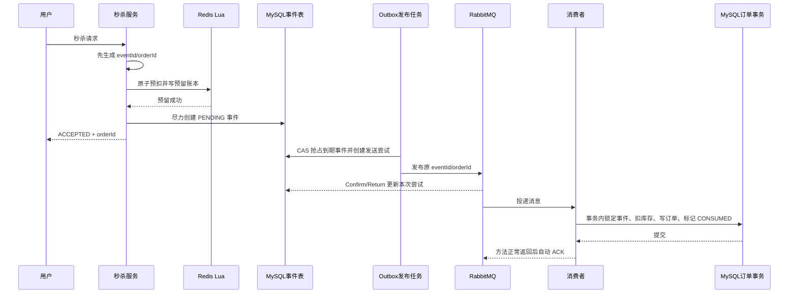

# RabbitMQ 秒杀可靠性闭环开发规格

> 目标读者：负责实现本方案的 Trae 或其他开发者
>
> 基线：Java 8、Spring Boot 2.3.12、Spring AMQP 2.2.18、Redis Lua、MySQL 8
>
> 文档性质：开发规格，不代表当前代码已经实现或通过真实环境验收

## 1. 开发目标

在现有 RabbitMQ 秒杀链路上完成一次成体系的可靠性改造，不再针对单个异常逐个增加临时补丁。

最终链路采用：

```text
Redis 原子预扣和预留账本
  + MySQL 事件 Outbox
  + RabbitMQ 至少一次投递
  + MySQL 幂等消费
  + 持久化回滚任务
  + Redis/MySQL/RabbitMQ 对账
  + DLQ 处置闭环
```

本项目不追求分布式“恰好一次”。目标是允许消息重复，但不允许重复订单、错误恢复库存、库存为负数或失败静默丢失。

## 2. 当前基线与必须修复的问题

当前已经具备：

- Redis Lua 原子检查库存、一人一单和库存预扣。
- MySQL 事件表、发布 Confirm/Return、发布补偿任务。
- RabbitMQ 持久化交换机、主队列、DLX 和 DLQ。
- 消费端数据库事务、条件扣库存和 `(user_id, voucher_id)` 唯一索引。
- 固定 `eventId/orderId` 重发以及消费幂等。
- Redis 幂等回滚 Lua。

本次必须解决：

1. Redis 预扣成功后、事件落库前崩溃，没有可发现的持久化事件。
2. `createPending()` 抛异常不等于数据库一定没有提交，当前立即回滚存在误回滚风险。
3. Confirm、Return 和同步发送异常描述的是某一次发送，当前事件表只记录总次数，证据不充分。
4. RabbitTemplate 内部重试和事件补偿叠加，实际发送次数难以解释。
5. `PUBLISH_UNKNOWN` 可以无限重发，没有最大存活时间和人工终态。
6. `FAILED` 同时表示发布失败、消费失败等多种含义，无法指导后续处理。
7. Redis 回滚失败只打印日志，没有持久化补偿。
8. 消费者没有完整区分临时技术异常、永久消息异常和业务一致性异常。
9. DLQ 没有消费者、失败记录、重放和人工处置入口。
10. Redis 秒杀库存初始化失败只打印日志，而且不能安全处理部分初始化状态。
11. 经典队列的死信转发不是可靠持久化边界，消息可能在主队列到 DLQ 之间丢失。
12. 旧事件和现有 Redis 用户集合没有预留账本，升级时不能直接按新逻辑处理。

### 2.1 方案审查后的收敛决定

为避免把“完善”做成过度设计，本规格固定以下取舍：

- 不使用业务、发布、消费、回滚四组独立状态列，改为一个受控的事件主状态机。
- 不引入 Seata；跨 Redis、MySQL、RabbitMQ 的一致性由预留账本、Outbox、幂等和对账完成。
- 不让请求线程、RabbitTemplate 和补偿任务同时控制重试，Outbox 是唯一生产者重试入口。
- 不根据事件最后一次发送结果直接回滚，发布尝试表保存每次发送的独立证据。
- 不让 Confirm、Return、DLQ 各自做补偿，所有失败统一进入决策服务。
- 不无限慢重试；超过自动处理边界后进入 MANUAL_REVIEW，但未知结果仍禁止自动回滚。

## 3. 不可破坏的业务约束

所有实现和测试都必须满足：

1. 同一用户对同一优惠券最多存在一条 MySQL 订单。
2. MySQL 秒杀库存不能小于零。
3. 同一业务事件的所有重发必须复用原 `eventId` 和 `orderId`。
4. MySQL 已存在订单时，任何任务都禁止恢复 Redis 库存和购买资格。
5. 发布结果未知时禁止自动回滚 Redis。
6. 每条 Redis 预留最终必须收敛为：订单成功、已回滚或人工处理。
7. 重要失败必须持久化，不能只记录日志。
8. 自动重试必须有次数或时间上限，禁止无限热循环。
9. 消费失败必须先留下 MySQL 失败事实，再允许 RabbitMQ 删除或死信转发原消息。

数据职责固定为：

- MySQL 订单表：最终业务事实。
- Redis 库存和用户集合：秒杀准入与临时预留。
- Redis 预留账本：关闭“Lua 成功、事件未落库”的崩溃窗口。
- MySQL 事件表：工作流事实和自动任务调度依据。
- 发布尝试表：某一次 RabbitMQ 发送的证据。
- RabbitMQ：异步传输，不作为最终业务事实。

## 4. 目标正常流程



关键变化：

- `eventId/orderId` 必须在 Lua 前生成。
- Lua 成功时同时写入 Redis 预留账本。
- 请求线程不再直接负责 RabbitMQ 重试，也不直接因下游技术异常回滚。
- 请求线程只写事件；统一由 Outbox 发布任务发送消息。
- Redis 预留成功后，接口返回的是异步受理结果，不代表订单已经落库。

## 5. Redis 预留账本

### 5.1 Key 设计

保持现有 hash tag，确保单券相关 Key 在 Redis Cluster 中位于同一槽：

```text
seckill:stock:{voucherId}                 String  可售库存
seckill:order:{voucherId}                 Set     已预留或已下单 userId
seckill:reservation:{voucherId}           Hash    eventId -> 预留详情
seckill:reservation:user:{voucherId}      Hash    userId -> eventId
seckill:reservation:pending:{voucherId}   ZSet    eventId -> reservedAt
```

预留详情只包含数字和版本，可以使用固定分隔格式：

```text
orderId|userId|createdAt|messageVersion
```

不要在 Lua 中引入复杂 JSON 解析。

### 5.2 改造 `seckill.lua`

传入：

```text
KEYS：库存、用户集合、预留详情、用户事件映射、待对账 ZSet
ARGV：userId、eventId、orderId、createdAt、messageVersion
```

一次 Lua 原子完成：

1. 库存 Key 不存在，返回 `3`。
2. 库存不足，返回 `1`。
3. 用户已在集合或用户事件映射已存在，返回 `2`。
4. `DECR` 库存。
5. `SADD` 用户。
6. `HSET` 事件预留详情。
7. `HSET` 用户到事件的映射。
8. `ZADD` 待对账事件。
9. 返回 `0`。

Lua 返回非零或抛异常时，不允许继续创建新事件和发布消息。

如果 Redis 调用超时，结果可能未知。异常处理应尽力根据 `voucherId + userId` 查询用户事件映射：找到预留则返回其原 `orderId` 或“处理中”；Redis 仍不可用时返回“请求结果确认中”，不能把它描述成确定失败。

### 5.3 改造 `seckill_rollback.lua`

回滚必须按 `eventId + userId` 执行，而不是只按用户执行。

脚本必须：

1. 检查库存 Key 是否存在，不存在返回 `-1`。
2. 检查 `userId -> eventId` 是否匹配。
3. 映射不存在表示已处理，返回 `0`。
4. 映射指向其他事件表示冲突，返回 `-2`，禁止删除用户和增加库存。
5. 删除预留详情、用户事件映射和待对账 ZSet 成员。
6. `SREM` 用户；只有确实移除一个用户时才 `INCR` 库存。
7. 成功恢复返回 `1`。

### 5.4 新增预留完成脚本

新增 `seckill_reservation_complete.lua`：

- 校验 `userId -> eventId` 匹配。
- 删除预留详情、用户事件映射和待对账 ZSet 成员。
- 保留 `seckill:order:{voucherId}` 中的用户，继续执行一人一单限制。
- 重复执行返回幂等成功。

该脚本失败不回滚数据库订单，由对账任务稍后重试。

### 5.5 预留数据生命周期

- PENDING 预留禁止设置早于业务收敛时间的 TTL。
- CONSUMED 后可以删除预留详情和待对账成员，但必须保留一人一单用户集合。
- ROLLED_BACK 后由回滚 Lua 原子删除预留详情并恢复资格。
- 优惠券结束后只能由清理任务删除已经终结且超过保留期的辅助数据。
- 存在 PENDING、PUBLISH_UNKNOWN、ROLLBACK_PENDING 或 MANUAL_REVIEW 时禁止整券清理。

## 6. MySQL 数据模型

### 6.1 事件主状态

继续使用 `tb_seckill_order_event.status`，不要再增加多组互相独立的状态列。

```text
0 PENDING              等待发布或补偿发布
1 CONFIRMED            Broker 已确认接收
2 CONSUMED             订单事务已完成，业务成功终态
3 FAILED               旧状态，仅兼容迁移，新代码禁止写入
4 PUBLISH_UNKNOWN      存在结果未知的发送尝试
5 ROLLBACK_PENDING     已决定回滚，等待执行
6 ROLLBACK_EXECUTING   回滚脚本正在执行
7 ROLLED_BACK          Redis 已恢复，业务失败终态
8 DLQ                  消息已经隔离并持久化失败记录
9 MANUAL_REVIEW        自动处理停止，等待人工核对
```

自动终态为 `CONSUMED` 和 `ROLLED_BACK`。`MANUAL_REVIEW` 表示自动流程终止，但允许人工审核后执行重放或回滚。

### 6.2 允许的主要状态迁移

| 原状态 | 允许转入 |
| --- | --- |
| PENDING | CONFIRMED、PUBLISH_UNKNOWN、CONSUMED、ROLLBACK_PENDING、MANUAL_REVIEW |
| PUBLISH_UNKNOWN | CONFIRMED、CONSUMED、ROLLBACK_PENDING、MANUAL_REVIEW |
| CONFIRMED | CONSUMED、DLQ、MANUAL_REVIEW |
| DLQ | PENDING、CONSUMED、ROLLBACK_PENDING、MANUAL_REVIEW |
| ROLLBACK_PENDING | ROLLBACK_EXECUTING、CONFIRMED、CONSUMED、MANUAL_REVIEW |
| ROLLBACK_EXECUTING | ROLLED_BACK、ROLLBACK_PENDING、MANUAL_REVIEW |

规则：

- `CONSUMED` 不允许被迟到的 Confirm、Return 或失败回调覆盖。
- `ROLLED_BACK` 后收到迟到消息时禁止创建订单，记录异常并 ACK 隔离。
- 消费者遇到 `ROLLBACK_PENDING`，只有 CAS 成功取消回滚后才可继续。
- 消费者遇到 `ROLLBACK_EXECUTING`，抛出可重试异常，等待回滚状态收敛。
- 所有状态更新必须带当前状态或 `row_version` 条件，禁止无条件覆盖。
- 当前项目没有配置 MyBatis-Plus 乐观锁插件；Trae 应使用明确的条件 UPDATE/CAS，或者先显式增加并验证插件，不能只添加 `@Version` 就假设乐观锁已经生效。

### 6.3 扩展事件表

新建迁移文件，不要修改已经执行过的 `20260820_add_seckill_order_event.sql`。

事件表至少增加：

```text
rollback_retry_count  回滚执行次数
lease_owner           当前任务实例
lease_until           任务租约到期时间
lease_token           每次抢占生成的 fencing token
row_version           乐观锁版本
last_error_code       稳定错误码
confirmed_at          Broker 确认时间
consumed_at           订单完成时间
terminal_at           终态时间
```

保留现有 `retry_count` 作为事件级发布尝试计数，`next_retry_time` 继续作为下一次自动动作时间。

租约领取、续期和释放都必须携带 `lease_token`。旧任务租约过期后，即使它稍后恢复，也不能清除或覆盖新任务的租约和状态。任务到期判断与租约时间优先使用 MySQL `CURRENT_TIMESTAMP`，避免多实例本地时钟偏差。

为定时任务增加覆盖查询条件的组合索引，至少包含 `(status, next_retry_time, lease_until)`；上线前用 EXPLAIN 验证扫描没有退化成事件表全表扫描。

旧 `FAILED` 数据迁移为 `MANUAL_REVIEW`，不能直接迁移为 `ROLLED_BACK`。

### 6.4 新增发布尝试表

新增 `tb_seckill_publish_attempt`：

```text
attempt_id            主键，每次实际 convertAndSend 唯一
event_id              关联事件
attempt_no            事件内发送序号
confirm_status        0=WAITING，1=ACK，2=NACK
returned              是否触发 Return
send_exception        同步调用是否抛异常
error_code
error_message
sent_at
confirm_at
return_at
create_time
update_time
```

约束和索引：

- 唯一索引 `(event_id, attempt_no)`。
- 索引 `(event_id, confirm_status, returned)`。
- 确认超时扫描索引 `(confirm_status, sent_at)`。
- `attemptId` 同时写入 `CorrelationData.id` 和消息 Header。

Confirm ACK 和 Return 可能同时出现，因此不要只用一个互斥的“发送成功/失败”字段覆盖两者。

### 6.5 新增失败记录表

新增 `tb_seckill_failure_case`，承接 DLQ、回滚异常和对账冲突：

```text
failure_id
idempotency_key       防止同一失败被重复落库
event_id/order_id/user_id/voucher_id
source                PUBLISH、CONSUMER_DLQ、ROLLBACK、RECONCILE
status                OPEN、REPLAYED、ROLLED_BACK、CLOSED、MANUAL
error_code/error_message
message_payload
x_death_info
replay_count
next_action_time
create_time/update_time
```

`idempotency_key` 必须有唯一索引，并为待处理扫描增加 `(status, next_action_time)` 索引。消息正文和异常信息要限制长度，禁止保存密码或连接串。

## 7. 生产者与 Outbox

### 7.1 请求线程

改造 `VoucherOrderServiceImpl.seckillVoucher()`：

1. 完成现有参数、登录和活动时间校验。
2. 在 Lua 前生成 `eventId/orderId/createdAt`。
3. Lua 原子预扣并写 Redis 预留账本。
4. 尽力创建 PENDING 事件。
5. 事件写入抛技术异常时禁止直接执行回滚；Redis 对账任务负责恢复事件。
6. Redis 预留成功后返回 `Result.ok(orderId)`，含义为“已经受理”。
7. 删除请求线程中的直接 `orderPublisher.publish()` 和 `scheduleRetry()`。

不要在数据库短暂不可用时把已经完成的 Redis 预留描述为确定失败。

### 7.2 Outbox 发布任务

将现有 `SeckillOrderPublishRetryTask` 改造成唯一发布入口：

1. 扫描 PENDING/PUBLISH_UNKNOWN 且已到期、租约为空或已过期的事件。
2. 使用 CAS 写入 `lease_owner/lease_until` 抢占事件。
3. 在同一 MySQL 事务内创建发布尝试并增加事件 `retry_count`。
4. 提交事务后调用一次 `RabbitTemplate.convertAndSend()`。
5. 发送前不生成新的业务 ID，只生成新的 `attemptId`。
6. 同步异常只更新本次尝试，并把事件改为 PUBLISH_UNKNOWN。
7. 发布调用结束后释放租约；进程崩溃则依靠租约过期重新领取。

禁用 `spring.rabbitmq.template.retry`，避免模板重试与 Outbox 重试相乘。消费者重试配置继续保留。

### 7.3 Confirm 和 Return

改造 `RabbitMqPublisherCallback`：

- 每次发送使用唯一 `CorrelationData(attemptId)`，并在对象中保留 eventId。
- 优先监听该 `CorrelationData.getFuture()`，不要用 eventId 作为多次发送共用的关联 ID。
- Future 完成时同时读取 Confirm 和 `getReturnedMessage()`，在一个结果处理器中更新发送尝试。
- ACK 且 `returnedMessage == null`：该次消息已经被目标队列接收，可将事件推进为 CONFIRMED。
- ACK 且存在 ReturnedMessage：交换机收到了消息但没有路由到队列，该次尝试属于明确未投递。
- NACK：Broker 拒绝承担该次消息，该次尝试属于明确失败。
- 同步异常、连接关闭或确认超时：默认记为 UNKNOWN，不能推断消息一定未到 Broker。
- `ReturnCallback` 可以根据 Header 幂等记录 `returned=true`，但不得单独决定事件回滚；Confirm Future 完成时再统一核对 CorrelationData 中的 ReturnedMessage。
- 结果处理器只记录尝试证据并调用统一决策服务，禁止直接修改 Redis。
- 回调数据库更新失败时记录结构化错误，依靠 WAITING 尝试超时扫描补偿。
- 迟到回调不得覆盖 CONSUMED、ROLLED_BACK 等终态。

RabbitMQ 对 mandatory 不可路由消息保证先发送 `basic.return`，再发送 publisher confirm；Spring AMQP 2.2 也保证在 Confirm Future 完成前把 ReturnedMessage 写入 CorrelationData。因此不需要人为增加“等待 Return 的猜测窗口”。

增加发送尝试超时任务：超过可配置确认超时时间仍为 WAITING，则标记该尝试结果未知，并安排事件重试。

## 8. 统一失败决策服务

新增 `SeckillOrderFailureDecisionService`。Confirm、Return、发送异常、DLQ 和对账任务只记录证据，是否重发或回滚统一由该服务决定。

为了避免该类变成难以测试的“万能服务”，将它拆成两层：纯决策函数根据订单、事件、尝试和失败记录快照返回 `RETRY_PUBLISH/WAIT/ROLLBACK/MARK_CONSUMED/MANUAL_REVIEW`；执行层再通过 CAS 落状态或创建任务。纯决策函数不得直接访问 Redis、RabbitMQ 或发送消息。

决策顺序不可调整：

1. 查询 MySQL 订单。
2. 订单存在：事件收敛为 CONSUMED，安排 Redis 预留完成任务，禁止回滚。
3. 订单不存在，检查发布尝试和事件状态。
4. 只要存在“ACK 且没有 Return”的可路由尝试，或存在“没有 Return 的 WAITING/UNKNOWN 尝试”，就不能自动回滚。
5. `returned=true` 本身已经证明该次尝试不可路由；所有尝试都明确 NACK 或 Return，且没有消费证据，才能进入 ROLLBACK_PENDING。
6. 临时消费异常进入有限重放。
7. 永久消息异常、数据冲突或证据矛盾进入 MANUAL_REVIEW。

不要使用“最后一次发送失败”推断“整个事件从未到达 RabbitMQ”。

## 9. 重试策略

### 9.1 生产者

Outbox 是唯一重试控制者。建议默认值做成配置项：

```text
快速重试：1 秒、2 秒、4 秒
慢速补偿：30 秒、2 分钟、10 分钟、30 分钟
超过最大尝试次数或最大存活时间：MANUAL_REVIEW
```

达到上限后停止自动发布，但不能因为“未知”自动回滚。

### 9.2 消费者

保留当前 1/2/4 秒有限重试，但增加明确异常类型：

```text
SeckillRetryableException         数据库连接、超时、死锁等临时故障
SeckillPermanentMessageException 字段、版本、反序列化等永久消息错误
SeckillConsistencyException      Redis/MySQL 库存或事件状态冲突
```

处理规则：

- Retryable：有限重试，耗尽后 DLQ。
- PermanentMessage：不重试，直接 DLQ。
- Consistency：不做相同业务重试，持久化失败记录并进入人工核对。
- DuplicateKey 且订单已存在：幂等成功。

不要把所有 `IllegalStateException` 都当作可重试异常。

反序列化和消息转换异常可能发生在 `@RabbitListener` 方法执行前，普通消费者代码无法捕获。需要配置专用容器 ErrorHandler：从失败的原始 AMQP Message 提取 messageId、Header 和受限长度的消息摘要，先持久化失败记录，再拒绝进入 DLQ；持久化失败时强制重新入队。禁止把无法转换的原始消息无限完整写入日志或数据库。

## 10. 消费事务

改造 `VoucherOrderHandler.createOrder()`：

1. 在事务内锁定或 CAS 检查事件状态。
2. CONSUMED：幂等返回。
3. ROLLED_BACK：禁止创建订单，记录迟到消息异常。
4. ROLLBACK_EXECUTING：抛可重试异常。
5. ROLLBACK_PENDING：先 CAS 取消回滚，成功后才继续。
6. 查询已有订单；存在则标记 CONSUMED。
7. 条件扣减 MySQL 库存。
8. 写订单。
9. 标记事件 CONSUMED。
10. 事务提交后由监听容器自动 ACK。

数据库库存不足不是普通瞬时异常。它表示 Redis 和 MySQL 可能不一致，应抛 `SeckillConsistencyException`。

事务提交后、ACK 前消费者宕机时，RabbitMQ 可能重投；唯一索引、原订单 ID 和 CONSUMED 状态必须把它转为幂等成功。

继续使用 Spring `AcknowledgeMode.AUTO`：监听方法正常返回后由容器发送协议 ACK，抛异常则不确认。它不是 RabbitMQ 的 `autoAck/noAck` 模式。当前同步监听器不需要改成 MANUAL ACK，也不需要开启 RabbitMQ channel transaction；数据库先提交、ACK 后发送，ACK 丢失依靠幂等重投即可。

## 11. 持久化回滚任务

新增 `SeckillReservationRollbackTask`：

1. 扫描 ROLLBACK_PENDING 到期事件。
2. 再次查询 MySQL 订单；存在则改为 CONSUMED，禁止回滚。
3. CAS 改为 ROLLBACK_EXECUTING 并记录执行令牌。
4. 调用按 eventId 校验的回滚 Lua。
5. Lua 返回 1 或 0，标记 ROLLED_BACK。
6. 返回 -1、-2 或抛异常，恢复为 ROLLBACK_PENDING 并退避重试。
7. 达到上限后进入 MANUAL_REVIEW，并持久化失败记录。

设置 ROLLBACK_EXECUTING 是为了避免“Lua 已恢复库存、数据库状态还未更新”时消费者并发创建订单。

任务崩溃后，对账任务根据 Redis 预留是否仍存在判断 Lua 是否已经执行，再安全收敛状态。

## 12. Redis/MySQL 对账

新增 `SeckillOrderReconciliationTask`，分批处理，禁止全量大 Scan 阻塞 Redis。

### 12.1 Redis 预留到 MySQL

- 从 MySQL 查询有效秒杀券 ID。
- 按券读取 `reservation:pending` 中超过阈值的 eventId。
- MySQL 订单存在：补建或修正事件为 CONSUMED，清理预留详情但保留用户集合。
- 事件不存在：使用 Redis 预留详情幂等创建 PENDING 事件。
- 信息不完整：写失败记录并进入人工处理，禁止猜测回滚。

### 12.2 MySQL 事件到 Redis

- CONSUMED：执行预留完成脚本。
- ROLLED_BACK：确认预留详情和用户事件映射已经移除。
- ROLLBACK_EXECUTING 超时：检查 Redis 预留是否还存在，再决定 ROLLED_BACK 或恢复待回滚。
- PUBLISH_UNKNOWN 超过最大存活时间：转 MANUAL_REVIEW 并告警。

### 12.3 库存重建原则

禁止简单执行 `Redis库存 = MySQL库存`。

安全公式：

```text
Redis 可售库存
= MySQL 当前剩余库存
- 尚未创建订单但仍有效的 Redis 预留数
```

用户集合应由“MySQL 已下单用户 + 有效预留用户”重建。

## 13. DLQ 闭环

DLQ 只能作为运维副本，不能作为消费失败的唯一持久化事实。经典队列在把消息转发到 DLX 时不提供端到端 publisher confirm，目标队列不可用或路由错误时可能丢失死信。

先改造 `MessageRecoverer`：

1. 消费重试耗尽后，先幂等写入 `tb_seckill_failure_case`。
2. 同一事务内把事件改为 DLQ。
3. 事务提交后再调用 `RejectAndDontRequeueRecoverer`，让原消息进入 Broker DLQ。
4. 如果失败记录落库失败，抛出 `ImmediateRequeueAmqpException`，禁止 ACK 或丢弃原消息。
5. 对失败记录数据库不可用的持续重入设置高优先级告警；避免在无监控情况下形成长期重入循环。

失败记录必须由独立 Service 的 `@Transactional` 方法先提交完成，Recoverer 返回后再执行 Reject。不要把“写失败记录”和最终抛出的拒绝异常放进同一个数据库事务，否则拒绝异常可能把刚写入的失败记录一起回滚。

对于发生在 Listener 方法之前的反序列化、消息转换异常，使用第 9.2 节约定的容器 ErrorHandler 完成同样的“先落失败记录，再拒绝消息”流程，不能依赖业务 Listener 或 MessageRecoverer 一定会被调用。

再新增 `SeckillOrderDeadLetterConsumer`：

1. 读取死信消息和 `x-death` 信息。
2. 根据 `idempotency_key` 补充已有失败记录中的 `x-death` 和 DLQ 到达时间。
3. 如果前置失败记录不存在，先补建并报警，再允许 ACK 死信。
4. 如果事件已经 CONSUMED，按幂等成功关闭失败记录。
5. 不在 DLQ 消费方法中直接恢复 Redis 库存。

当前项目只有登录校验，没有可靠的管理员角色和权限模型。因此 P0 只实现失败处置 Service 和审计记录，不得直接暴露公网写接口。

只有在项目补充 RBAC 后，才提供以下管理接口：

```text
GET  /admin/seckill/failures
GET  /admin/seckill/failures/{failureId}
POST /admin/seckill/failures/{failureId}/replay
POST /admin/seckill/failures/{failureId}/rollback
POST /admin/seckill/failures/{failureId}/close
```

重放必须：

- 复用原 eventId/orderId。
- 检查订单是否已存在。
- 限制 replayCount。
- 记录操作者、时间和原因。
- 不允许直接调用 RabbitTemplate 绕过 Outbox；应把事件重新置为 PENDING，由发布任务发送。

没有 RBAC 时，Trae 只能提供禁用默认值的内部 Controller 草稿或 Service 测试，不得用固定 Header、硬编码 Token 或普通登录用户代替管理员授权。

## 14. 秒杀库存初始化

保留 MySQL 提交后初始化 Redis 的方向，但改为原子初始化脚本：

1. 库存 Key 已存在，按幂等成功处理，不覆盖库存。
2. 库存 Key 不存在，但用户集合或预留 Key 已存在，返回冲突并告警，禁止清空。
3. 所有相关 Key 都不存在时才设置初始库存。
4. 禁止无条件 `delete(orderKey)`。

增加缺失库存扫描任务：发现 MySQL 有秒杀券但 Redis 库存 Key 缺失时，只能调用上述安全初始化逻辑；有历史用户或预留数据时进入人工处理。

## 15. 订单状态查询

增加用户侧查询接口，例如：

```text
GET /voucher-order/status/{orderId}
```

返回值至少包括：

```text
PROCESSING     已预留或正在发布/消费
SUCCESS        MySQL 订单已创建
FAILED         已安全回滚
MANUAL_REVIEW  自动流程无法判断
NOT_FOUND      无订单、事件和预留证据
UNAVAILABLE    依赖暂时不可用，当前无法判断
```

只能查询当前用户自己的订单状态。接口应优先查询 MySQL 订单，其次查询事件，必要时再查询 Redis 预留。只有相关数据源都成功查询且确实没有记录时才能返回 NOT_FOUND；MySQL 或 Redis 查询失败时返回 UNAVAILABLE，禁止把技术故障伪装成“订单不存在”。

## 16. 类与文件改造清单

### 必须修改

- `VoucherOrderServiceImpl`：ID 前置、写 Redis 预留账本、移除直接发布和直接回滚。
- `SeckillVoucherLuaExecutor`：五个同槽 Key、预留/完成/事件级回滚接口。
- `seckill.lua`、`seckill_rollback.lua`：按第 5 节改造。
- `SeckillOrderEvent`、`SeckillOrderEventService`：新状态、CAS、租约和终态保护。
- `SeckillOrderPublisher`：每次只发送一次，使用 attemptId。
- `SeckillOrderCorrelationData`：关联 attemptId 和 eventId。
- `RabbitMqPublisherCallback`：只落发送证据，不直接回滚。
- `SeckillOrderPublishRetryTask`：改为唯一 Outbox 发布器。
- `SeckillOrderConsumer`、`VoucherOrderHandler`：异常分类和回滚并发保护。
- `RabbitMqConfig`、`application.yaml`：关闭生产者模板重试，保留分类后的消费者重试。
- `VoucherServiceImpl`：安全原子初始化，不删除已有用户集合。

### 建议新增

- `SeckillPublishAttempt`、Mapper、Service。
- `SeckillFailureCase`、Mapper、Service。
- `SeckillOrderFailureDecisionService`。
- `SeckillReservationRollbackTask`。
- `SeckillOrderReconciliationTask`。
- `SeckillOrderDeadLetterConsumer`。
- `SeckillRabbitListenerErrorHandler`：覆盖 Listener 前的转换失败。
- `SeckillOrderFailureAdminService`；Controller 仅在 RBAC 完成后增加。
- `SeckillOrderStatusController` 或在现有 Controller 中增加状态查询。
- `seckill_reservation_complete.lua`。
- 新数据库迁移 SQL。

类名可按项目现有风格微调，但职责边界不能合并回回调函数或 Controller。

## 17. 分阶段开发顺序

Trae 必须按以下顺序执行。每阶段先编译和测试，通过后再进入下一阶段。

### 阶段 1：数据模型和状态机

- 增加迁移 SQL、实体、Mapper。
- 实现状态迁移、CAS、租约和终态保护。
- 增加状态机单元测试。

验收：非法状态迁移失败；迟到回调不能覆盖 CONSUMED。

### 阶段 2：Redis 预留账本

- ID 移到 Lua 前。
- 实现新预留、事件级回滚和预留完成 Lua。
- 改造 Lua 执行器。

验收：重复预留、重复完成、重复回滚均幂等；不同 eventId 不能回滚他人预留。

### 阶段 3：Outbox 和发布尝试

- 请求线程移除直接发布。
- Outbox 成为唯一生产者入口。
- 每次发送生成 attemptId。
- 关闭 RabbitTemplate 生产者内部重试。

验收：一次调度只调用一次 `convertAndSend()`；进程重启后到期事件可继续发布。

### 阶段 4：Confirm/Return 和失败决策

- 回调只记录尝试证据。
- 实现确认超时和统一失败决策。
- 移除所有回调内直接 Redis 回滚。

验收：ACK+Return、NACK、同步异常、Confirm 丢失均得到正确事件状态。

### 阶段 5：消费、DLQ 和回滚

- 增加异常分类。
- 增加 Listener 前消息转换失败的持久化 ErrorHandler。
- 增加“先持久化失败记录、再拒绝原消息”的 Recoverer。
- 增加 DLQ 消费和失败记录补充逻辑。
- 增加持久化回滚任务及并发保护。

验收：事务提交后 ACK 丢失不会重复下单；回滚和消费并发时不会同时成功。

### 阶段 6：对账、查询和监控

- 增加三类对账。
- 增加用户订单状态接口和失败管理 Service；只有 RBAC 已完成时才增加失败管理 Controller。
- 增加关键指标和告警日志。

验收：孤儿 Redis 预留、超时回滚、长期未知和 DLQ 均可被发现并收敛。

### 阶段 7：真实故障验收和文档同步

- 执行第 18 节测试矩阵。
- 更新 `docs/learning/09-rabbitmq-seckill-flow.md`，明确已实现与未验收边界。
- 更新面试文档，但不得虚构压测数据和生产可靠性结论。

### 17.1 上线迁移顺序

现有 Redis 用户集合和旧事件没有预留账本，不能直接切换脚本。上线必须按以下顺序：

1. 备份事件表，统计 PENDING、CONFIRMED、FAILED、PUBLISH_UNKNOWN 和 CONSUMED 数量。
2. 执行只增加列和新表的数据库迁移；不得先删除旧字段或旧状态。
3. 暂停新的秒杀入口，等待正在执行的请求结束。
4. 对已有事件逐条核对订单：有订单转 CONSUMED；旧 FAILED 转 MANUAL_REVIEW；未终结事件补建 Redis 预留账本或转人工核对。
5. 对 Redis 用户集合中没有 MySQL 订单、也没有事件依据的成员生成失败记录，禁止自动删除。
6. 部署同时兼容旧状态和新状态的代码。
7. 启动对账和 Outbox，但暂不开启新的秒杀流量；确认没有异常回滚和重复订单。
8. 小流量开放秒杀入口，完成一笔正常、一笔重复和一笔故障验证后再全量开放。
9. 观察期结束后才允许清理旧兼容代码。

Trae 只生成迁移 SQL、核验 SQL 和操作说明；未经授权不得执行远端迁移或清理。

## 18. 测试矩阵

### 18.1 单元测试

- 所有允许与禁止的状态迁移。
- 发布和回滚退避计算。
- 最大次数、最大存活时间。
- 失败决策：订单存在优先、未知禁止回滚、全部明确失败才回滚。
- 消费异常分类。
- DLQ 失败记录幂等。

### 18.2 Redis Lua 测试

- 库存不足、重复用户、库存未初始化。
- 预留成功后六个 Key 一致（含 orderId 反向索引 Hash）。
- 同一事件重复回滚只增加一次库存。
- 不同事件不能删除同一用户的新预留。
- 预留完成后保留一人一单集合。
- Redis Cluster hash slot 一致。

### 18.3 数据库集成测试

- 并发消费同一事件只有一条订单。
- 不同 eventId 但同一用户和券仍只有一条订单。
- 条件扣库存不会变成负数。
- 订单、库存和 CONSUMED 同事务回滚。
- 多实例 CAS 只有一个任务获得租约。

### 18.4 RabbitMQ 故障注入

- 交换机不存在导致 NACK。
- routing key 错误导致 Return。
- Broker 收到消息但 Confirm 未被应用记录。
- 所有消费者停止后再恢复。
- 消费事务提交后、ACK 前终止消费者。
- 数据库短暂断连、死锁和恢复。
- 消费重试耗尽进入 DLQ，再从失败记录重放。
- 非法 JSON 在进入 Listener 前转换失败，仍能持久化失败记录并进入 DLQ。
- 模拟 DLX 目标不可用，验证即使死信没有到达 DLQ，MySQL 失败记录仍然存在。
- 模拟失败记录数据库不可用，验证 Recoverer 触发重新入队而不是 ACK。

### 18.5 跨存储崩溃窗口

- Lua 成功后、事件写入前终止进程。
- 事件写入后、Outbox 发布前终止进程。
- 回滚 Lua 成功后、事件更新前终止进程。
- 预留完成 Lua 失败后恢复。

每项都必须验证：

```text
订单数 <= 1
MySQL 库存 >= 0
没有订单时库存最终恢复或进入人工状态
有订单时绝不恢复库存
事件最终为 CONSUMED、ROLLED_BACK 或 MANUAL_REVIEW
```

## 19. 监控指标

至少输出可聚合日志或指标：

- PENDING、PUBLISH_UNKNOWN、ROLLBACK_PENDING、DLQ、MANUAL_REVIEW 数量和最长停留时间。
- 发布尝试数、Confirm 延迟、NACK 和 Return 数。
- 消费重试数、DLQ 深度和最老消息年龄。
- 回滚成功、失败、冲突和最长等待时间。
- Redis 孤儿预留数量。
- Redis 与 MySQL 库存不一致数量。

所有日志统一携带可用的 `eventId/orderId/attemptId/voucherId/userId`，但不记录密码、连接串和完整用户隐私信息。

### 19.1 部署可靠性前提

应用代码只能保证业务层收敛，不能抵消基础设施永久丢盘。真实环境验收前还要确认：

- Redis 已启用与业务要求匹配的持久化和备份策略；否则预留账本仍可能随 Redis 故障丢失。
- RabbitMQ 的交换机、队列和消息均持久化，磁盘告警和容量监控可用。
- 配置合理心跳，建议从 15 秒开始在真实网络中验证，禁止关闭心跳或设置低于 5 秒的激进值。
- 当前单节点 RabbitMQ 容器不等于高可用；单机故障时应用层 Outbox 能重发未确认事件，但不能让 Broker 本身具备机器级容灾。
- 只有在至少 3 个 RabbitMQ 节点、版本和磁盘条件满足时才评估 quorum queue；单节点 quorum queue 不提供机器级容灾。
- 如果迁移到 quorum queue，应同时评估 at-least-once dead-lettering；不能只修改 Java 队列参数后直接重声明已有队列。
- 生产环境优先用 RabbitMQ policy 管理 DLX 等可变参数。现有硬编码 x-arguments 迁移到 policy 时需要新队列或受控切换，不能直接删除参数后重声明同名队列。
- 高负载生产环境评估为发布者和消费者使用独立连接，避免发布端流控影响消费者 ACK；当前单机学习环境不强制增加这项复杂度。
- MySQL 有备份和恢复方案，事件表与订单表使用同一可靠数据库。
- 消费者默认关闭的环境必须在拓扑、账号和真实连通性验收后再启用。

Trae 不得根据本节自行修改服务器配置，只需在交付报告中列出未满足项。

## 20. 明确禁止事项

- 禁止引入 Seata 或把本次任务扩展成通用分布式事务平台。
- 禁止修改已经执行过的迁移文件；只能新增迁移。
- 禁止删除或自动修复现有生产订单数据。
- 禁止在 Confirm、Return、Controller 或 DLQ 回调里直接恢复 Redis。
- 禁止在发送结果未知时回滚。
- 禁止为重试生成新的 orderId/eventId。
- 禁止同时保留 RabbitTemplate 生产者重试和 Outbox 多层重试。
- 禁止自动清空秒杀用户集合。
- 禁止 DLQ 消息未落失败记录就 ACK。
- 禁止把“成功进入 DLQ”当作消费失败已经可靠持久化的唯一证据。
- 禁止在没有 RBAC 的情况下开放重放、回滚和关闭失败记录的公网接口。
- 禁止仅靠日志作为回滚失败或对账冲突的最终兜底。
- 禁止在没有真实故障验收时宣称“不丢消息”“高并发零超卖”或“生产可用”。

## 21. Trae 每阶段交付格式

每个阶段完成后必须提供：

1. 修改文件列表。
2. 状态、表结构或接口变化。
3. 实际执行的编译和测试命令。
4. 测试结果以及未执行项。
5. 仍然存在的故障窗口。
6. 是否需要人工执行 SQL 或修改环境配置。

未经用户明确授权，不得：

- 连接或修改远端 MySQL、Redis、RabbitMQ。
- 启停服务器容器。
- 提交或推送 Git。
- 删除现有数据或清理 DLQ。

## 22. 官方语义依据

Trae 实现涉及 RabbitMQ 或 Spring AMQP 语义时，应优先核对以下官方资料，不得仅根据博客或旧教程猜测：

- [RabbitMQ Consumer Acknowledgements and Publisher Confirms](https://www.rabbitmq.com/docs/confirms)：Confirm、mandatory Return 顺序、持久化消息确认与重投语义。
- [RabbitMQ Reliability Guide](https://www.rabbitmq.com/docs/reliability)：未知消息重发、消费幂等、持久化与连接故障边界。
- [Spring AMQP 2.2 Reference](https://docs.spring.io/spring-amqp/docs/2.2.6.RELEASE/reference/html/)：CorrelationData Future、ReturnedMessage、Listener Retry 和容器 ACK 行为。
- [Spring AMQP 2.2 CorrelationData API](https://docs.spring.io/spring-amqp/docs/2.2.20.RELEASE/api/org/springframework/amqp/rabbit/connection/CorrelationData.html)：`getFuture()` 与 Confirm 关联能力。
- [RabbitMQ Dead Letter Exchanges](https://www.rabbitmq.com/docs/3.13/dlx)：DLX 丢失窗口以及优先使用 policy 的建议。
- [RabbitMQ Quorum Queues](https://www.rabbitmq.com/docs/quorum-queues)：集群前提、确认后的数据安全和 at-least-once dead-lettering 边界。
- [RabbitMQ Heartbeats](https://www.rabbitmq.com/docs/4.2/heartbeats)：故障探测时间与过低心跳的风险。

本项目实际依赖是 Spring AMQP 2.2.18。使用新版文档中的 API 前，必须先确认该 API 在 2.2.18 中存在；禁止为追求“最佳实践”直接复制 Spring AMQP 3.x/4.x 才支持的代码。

## 23. 最终完成定义

只有同时满足以下条件才能宣布本任务完成：

- 阶段 1 至阶段 6 的代码和测试全部完成。
- Java 8 编译和单元测试通过。
- 新 SQL 通过静态检查，但未授权时不得擅自在线执行。
- 真实 Redis、MySQL、RabbitMQ 环境完成关键故障验收。
- 所有预留能够收敛到 CONSUMED、ROLLED_BACK 或 MANUAL_REVIEW。
- MQ 流程文档和面试文档已经按实际代码同步。
- 明确列出仍未验证的并发量、故障场景和部署边界。

面试或简历中的准确表述应为：

> 秒杀链路采用 Redis Lua 原子预留、MySQL Outbox、RabbitMQ 至少一次投递、数据库幂等消费、持久化回滚和定时对账实现最终一致性；对结果未知的发送不直接恢复库存，而是依据订单、发送尝试和预留记录完成状态判定。
