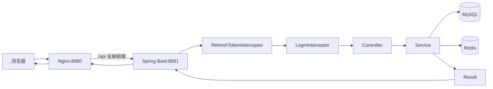
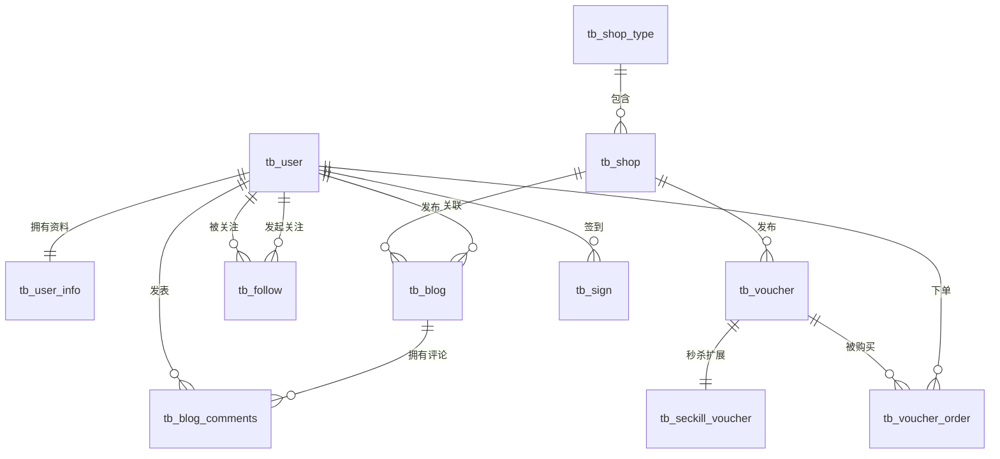

# DishReview 学习文档：阶段 0～1

> 本文只用于熟悉现有项目，不代表已经完成代码优化。
>
> 阶段 0：建立项目整体地图；阶段 1：理解数据库表结构、表关系和索引设计。

## 一、学习目标

完成本文后，应能够做到：

1. 用 3 分钟说明 DishReview 是什么、使用了哪些技术、请求如何流转。
2. 从一个接口追踪到 Controller、Service、Mapper、MySQL/Redis。
3. 说明主要数据表分别解决什么业务问题，以及表之间的关系。
4. 根据实际 SQL 判断一个索引是否合理，而不是只背“某字段要加索引”。
5. 指出当前表结构中值得继续验证的设计点，但暂时不急着修改。

本文中的所有判断都以当前仓库代码和 `src/main/resources/db/dish_review.sql` 为准。配置文件中的真实连接信息和凭据不在本文重复记录。

---

## 二、阶段 0：项目整体地图

### 2.1 项目定位

DishReview 是一个餐饮点评平台，当前代码包含这些业务方向：

- 用户注册/登录、验证码登录、密码登录、登出；
- 店铺类型和店铺查询；
- 探店博客、博客评论、关注关系；
- 普通优惠券和秒杀优惠券；
- 秒杀下单和订单库存扣减；
- 图片上传；
- Redis 缓存、登录状态、验证码限流、分布式锁和分布式 ID。

面试时不要把它描述成“只用了 Redis 的 CRUD 项目”。更准确的说法是：这是一个以 Spring Boot 为核心、MySQL 保存业务数据、Redis 支撑缓存和并发场景的餐饮点评后端项目。

### 2.2 技术栈

| 层次 | 当前技术 | 在项目中的作用 |
|---|---|---|
| 语言 | Java 8 | 后端实现语言 |
| Web | Spring Boot 2.3.12 | 应用启动、MVC、依赖注入 |
| 持久化 | MyBatis-Plus 3.4.3 | Entity、Mapper、条件查询、分页和更新 |
| 数据库 | MySQL | 用户、店铺、博客、优惠券、订单等持久化数据 |
| 缓存/并发 | Redis + Spring Data Redis | 缓存、Token、验证码、限流、分布式锁、ID 序列 |
| 工具 | Hutool、Lombok、AspectJ | JSON、Bean 转换、工具方法、AOP 代理 |
| 前置服务 | Nginx | 静态前端、`/api` 反向代理和安全响应头 |
| 测试 | Spring Boot Test | 当前已有基础测试和安全修复测试 |

技术版本来源于 `pom.xml`，不要只根据项目名称或目录猜技术栈。

### 2.3 目录职责

```text
src/main/java/com/dish/review/
├── controller/       HTTP 接口层，接收参数并返回 Result
├── service/          业务接口
│   └── impl/         业务实现，编排数据库、Redis 和事务
├── mapper/           MyBatis-Plus Mapper，连接 Entity 与数据库表
├── entity/           数据库实体对象
├── dto/               接口输入输出对象，例如登录表单、用户 DTO
├── config/            MVC 拦截器、MyBatis、全局异常处理
└── utils/             Redis 工具、锁、Token 上下文、正则等通用组件

src/main/resources/
├── application.yaml  应用、MySQL、Redis 和业务配置
├── db/                数据库建表及初始化数据
└── mapper/            需要手写 SQL 的 MyBatis XML

nginx/
├── conf/nginx.conf    前端静态资源和后端反向代理配置
└── html/              前端页面和图片资源

src/test/              测试代码
pom.xml                Maven 依赖和构建配置
```

### 2.4 应用如何启动

入口是 `DishReviewApplication`：

1. `@SpringBootApplication` 启动 Spring Boot 自动配置和组件扫描。
2. `@MapperScan("com.dish.review.mapper")` 扫描 MyBatis Mapper。
3. `@EnableAspectJAutoProxy(exposeProxy = true)` 允许通过 `AopContext.currentProxy()` 获取当前代理；秒杀事务代码依赖这一点。
4. Spring 读取 `application.yaml`，初始化 Web、MySQL、Redis 等组件。
5. 应用监听后端端口；当前配置中的后端端口是 `8081`。

Nginx 配置监听 `8080`：

- `/` 返回前端静态页面；
- `/api` 去掉前缀后代理到 `127.0.0.1:8081`；
- 因此浏览器请求 `/api/shop/1` 时，后端实际接收的路径是 `/shop/1`。

### 2.5 一次请求的完整链路



实际理解时要注意拦截器顺序：

- `RefreshTokenInterceptor` 顺序为 `0`：读取请求头中的 Token，从 Redis 恢复用户并刷新 TTL。
- `LoginInterceptor` 顺序为 `1`：检查需要登录的接口是否存在当前用户。
- 请求结束后，`RefreshTokenInterceptor.afterCompletion()` 清理 `UserHolder` 中的 ThreadLocal，避免线程复用导致用户信息泄漏。
- 公开接口由 `MvcConfig` 排除，例如登录、验证码、店铺查询、店铺类型和优惠券查询；写入或修改接口通常要求登录。

### 2.6 分层职责如何判断

以 `GET /shop/{id}` 为例：


| 层 | 文件 | 主要职责 |
|---|---|---|
| Controller | `ShopController` | 读取路径参数，调用 Service，返回结果 |
| Service | `ShopServiceImpl` | 先查 Redis，必要时查 MySQL，并处理缓存策略 |
| Mapper | `ShopMapper` | 继承 `BaseMapper<Shop>`，提供店铺表的持久化能力 |
| Entity | `Shop` | 映射 `tb_shop` 的字段 |
| Redis 工具 | `CacheClient` | 封装缓存穿透和逻辑过期查询 |
| DTO/Result | `Result` | 统一接口返回结构 |

Controller 不应该承载缓存策略，Mapper 不应该决定登录权限；看到代码时可以用这个职责边界判断实现是否清晰。

### 2.7 三条最值得先读的代码链路

#### 链路 A：店铺详情与缓存

```text
ShopController.queryShopById
  -> IShopService.queryById
  -> ShopServiceImpl.queryById
  -> CacheClient.queryWithLogicalExpire
  -> Redis 命中：直接返回
  -> Redis 未命中：getById 查询 MySQL
  -> 缓存过期：返回旧值，并尝试异步重建缓存
```

这条链路用于理解缓存穿透、缓存击穿、逻辑过期、互斥锁和缓存更新。

#### 链路 B：验证码登录

```text
UserController
  -> UserServiceImpl.sendCode
  -> Redis SETNX 做发送频率限制
  -> Redis 保存验证码

UserController.login
  -> UserServiceImpl.login
  -> Redis 读取并删除验证码
  -> MySQL 按 phone 查找或创建用户
  -> Redis Hash 保存 UserDTO
  -> 返回 Token
```

这条链路用于理解 Redis String、Hash、TTL、Token 和数据库唯一索引。

#### 链路 C：秒杀下单

```text
VoucherOrderController
  -> VoucherOrderServiceImpl.seckillVoucher
  -> 检查秒杀时间和数据库库存
  -> SimpleRedisLock.lock:userId 防止一人重复下单
  -> AopContext.currentProxy()
  -> createVoucherOrder 开启事务
  -> 查询一人一单
  -> 条件扣减库存
  -> RedisIdWorker 生成订单号
  -> MySQL 保存订单
```

这条链路用于理解分布式锁、事务代理、条件更新、幂等和订单 ID。

### 2.8 Redis 在整体架构中的位置

当前 Redis 的主要职责不是替代 MySQL，而是处理适合高速访问或并发控制的数据：

| Redis 数据 | 结构/方式 | 目的 |
|---|---|---|
| 登录验证码 | String + TTL | 临时验证码 |
| 验证码发送限制 | String + `SETNX` + TTL | 限制发送频率 |
| 登录用户 | Hash + TTL | 保存脱敏后的 UserDTO 和 Token 会话 |
| 店铺缓存 | String JSON | 减少店铺详情对 MySQL 的访问 |
| 缓存重建锁 | String + `SETNX` | 避免多个线程同时重建缓存 |
| 用户下单锁 | String + 过期时间 | 限制同一用户重复下单 |
| 订单 ID 序列 | `INCR` | 生成分布式订单号 |

`RedisConstants` 中还预留了点赞、Feed、GEO、签到和秒杀库存相关 Key。看到常量存在，不等于对应功能已经完整接入；学习时要区分“定义了”和“业务真正使用了”。

### 2.9 阶段 0 自测题

不看代码，尝试回答：

1. 浏览器访问 `/api/shop/1` 后，为什么 Controller 收到的是 `/shop/1`？
2. 两个拦截器为什么要设置不同顺序？
3. 为什么 Token 存 Redis，而不是只存 Java 的 HttpSession？
4. `ShopController`、`ShopServiceImpl`、`ShopMapper` 各自不应该负责什么？
5. 店铺详情查询命中 Redis、未命中 Redis、逻辑过期时，分别走哪条路径？
6. 为什么 `AopContext.currentProxy()` 会出现在秒杀服务中？

阶段 0 的验收标准：你能画出请求链路，并用自己的话讲清上面三条代码链路。

---

## 三、阶段 1：数据库设计与索引

### 3.1 先建立一个正确的分析框架

读表结构时不要只看字段类型，按以下顺序分析：

1. 这个表代表哪个业务实体或关系？
2. 一条记录的唯一标识是什么？
3. 哪些字段必须存在，哪些字段允许为空？
4. 哪些字段需要唯一？
5. 业务查询通常按哪些字段过滤、连接、排序？
6. 这些查询是否有匹配的索引？
7. 加索引后会增加哪些写入成本？
8. 数据库约束和 Java 代码是否共同保证了业务规则？

索引设计的起点是查询场景，而不是字段名称本身。

### 3.2 当前表清单

| 表 | 业务含义 | 关键关系 |
|---|---|---|
| `tb_user` | 用户登录身份和基础资料 | 用户主表 |
| `tb_user_info` | 用户详细资料、粉丝数、积分、等级 | 与用户一对一，`user_id` 同时是主键 |
| `tb_shop_type` | 店铺类型 | 一个类型对应多个店铺 |
| `tb_shop` | 店铺基础信息和统计信息 | 属于一个店铺类型 |
| `tb_blog` | 用户发布的探店博客 | 属于一个用户，可关联一个店铺 |
| `tb_blog_comments` | 博客评论和回复 | 关联用户、博客，支持父子评论 |
| `tb_follow` | 用户关注关系 | 用户与用户之间的关系表 |
| `tb_voucher` | 优惠券基础信息 | 属于一个店铺 |
| `tb_seckill_voucher` | 秒杀券的库存和时间 | 与优惠券一对一扩展 |
| `tb_voucher_order` | 用户购买优惠券产生的订单 | 关联用户和优惠券 |
| `tb_sign` | 用户签到记录 | 关联用户和日期 |

### 3.3 表关系图



当前 SQL 没有声明外键约束，因此上图表示的是业务关系，不代表 MySQL 会自动阻止孤儿数据。项目目前主要依赖应用代码维护这些关系，这是简化项目中常见的做法，但面试时要明确说“当前未使用数据库外键”，不要把业务关系误说成数据库外键关系。

### 3.4 几个重要的表设计决定

#### 1. 为什么大量使用 BIGINT 主键

用户、店铺、博客、优惠券等实体都使用 BIGINT 主键，便于支持较大的数据量。秒杀订单表的 `id` 没有使用 MySQL 自增，因为订单号由 `RedisIdWorker` 生成：

```text
时间戳部分 << 32 | 当天序列号
```

这样可以在多个应用实例中生成趋势递增、相对唯一的订单号，并减少单点自增的依赖。

#### 2. 为什么手机号要唯一

`tb_user.phone` 有唯一索引。登录按手机号查询用户，如果没有唯一约束，Java 代码即使使用 `.one()`，数据库中仍可能存在重复手机号，业务身份就不再唯一。

#### 3. 为什么金额使用整数

优惠券的 `pay_value` 和 `actual_value` 以“分”为单位保存为整数，例如 200 表示 2 元。这样避免浮点数计算产生精度误差。

#### 4. 为什么秒杀信息单独拆表

普通优惠券和秒杀优惠券共享标题、规则、金额等基础字段；库存、开始时间和结束时间只属于秒杀场景，因此放在 `tb_seckill_voucher` 中。该表以 `voucher_id` 为主键，表达一个优惠券最多有一条秒杀扩展记录。

#### 5. 为什么用户资料单独拆表

登录身份和用户资料的访问场景不同。`tb_user` 保存手机号、密码、昵称、头像；`tb_user_info` 保存城市、积分、粉丝数、等级等扩展信息。`tb_user_info.user_id` 既是主键又是用户标识，表达一对一关系。

#### 6. 当前设计中的可讨论点

- `tb_blog.images` 用逗号保存多个图片路径，读取简单，但不利于单张图片查询、排序和约束；更复杂的系统可能拆出博客图片表。
- `tb_shop` 中的经纬度是普通 `double`，当前可用于基础数据保存；如果要做高效附近搜索，需要进一步考虑 Redis GEO 或空间索引。
- 部分关联字段的 `UNSIGNED` 定义并不完全统一，例如博客的 `shop_id` 与店铺主键类型存在差异，这属于后续应检查的 schema 一致性问题。
- 状态、支付方式、性别等使用 tinyint 保存，节省空间，但必须在代码、注释或枚举中维护数字含义。
- 当前没有统一声明外键和关联索引，数据完整性与查询性能主要由应用逻辑和现有索引承担。

### 3.5 当前已有索引

从 `dish_review.sql` 可以看到，当前显式索引主要是：

| 表 | 索引 | 作用 |
|---|---|---|
| 多数业务表 | 主键 `id` | 按主键定位记录，并保证唯一 |
| `tb_user` | 唯一索引 `phone` | 按手机号快速查询，并禁止重复手机号 |
| `tb_shop` | `type_id` 普通索引 | 支持按店铺类型筛选 |
| `tb_user_info` | 主键 `user_id` | 支持按用户查唯一资料 |
| `tb_seckill_voucher` | 主键 `voucher_id` | 支持按优惠券定位秒杀库存 |

注意：InnoDB 的主键本身就是聚簇索引；不是所有索引都需要单独写成 `INDEX`。

### 3.6 用实际查询理解索引

#### 查询一：按手机号登录

代码在 `UserServiceImpl` 中执行类似：

```java
query().eq("phone", phone).one();
```

对应 `tb_user.phone` 唯一索引。这个索引同时解决两个问题：

1. 查询手机号时减少全表扫描；
2. 让“手机号唯一”成为数据库层约束，而不只是 Java 层约定。

#### 查询二：按店铺类型分页

`ShopController.queryShopByType()` 使用：

```java
query().eq("type_id", typeId).page(...);
```

对应 `tb_shop(type_id)`。如果数据量变大，这个索引可以先定位某类店铺，再完成分页。

#### 查询三：按店铺名称关键字查询

`ShopController.queryShopByName()` 使用 MyBatis-Plus 的 `like("name", name)`。这类查询通常会生成前后带 `%` 的模糊条件：

```sql
WHERE name LIKE '%关键字%'
```

普通 B+Tree 索引通常无法有效处理左侧以 `%` 开头的条件。当前数据量较小时可以接受；数据量较大时，应评估前缀匹配、全文索引或专门的搜索方案，而不是盲目给 `name` 加普通索引。

#### 查询四：按店铺查询上架优惠券

`VoucherMapper.xml` 中的条件是：

```sql
WHERE v.shop_id = #{shopId} AND v.status = 1
```

当前 `tb_voucher` 只有主键，没有显式的 `shop_id/status` 组合索引。这是一个值得用 `EXPLAIN` 验证的候选点。通常可以考虑 `(shop_id, status)`，但是否真正添加，要结合数据量、查询频率和执行计划决定。

#### 查询五：判断用户是否已经购买过优惠券

秒杀代码按以下两个字段查询：

```java
query().eq("user_id", userId).eq("voucher_id", voucherId).count();
```

这说明 `tb_voucher_order(user_id, voucher_id)` 具有明显的查询价值。由于业务要求“一人一单”，还应思考数据库层的唯一组合约束：

```text
查询性能：组合索引可以减少扫描范围
业务正确性：唯一组合约束可以阻止并发下的重复订单
```

但这不是当前阶段直接修改表结构的指令。添加唯一索引前，要先检查历史数据是否已有重复记录，并验证事务、锁和异常处理方案。

### 3.7 设计索引时必须掌握的原则

1. **根据查询建索引**：先看 `WHERE`、`JOIN`、`ORDER BY`，再决定索引。
2. **区分普通索引和唯一索引**：唯一索引既优化查询，也限制数据重复。
3. **组合索引要考虑最左匹配原则**：`(user_id, voucher_id)` 适合同时按两个字段查询，也适合只按 `user_id` 查询，但不一定适合只按 `voucher_id` 查询。
4. **低区分度字段要谨慎**：例如状态只有几个值，单独给 `status` 建索引通常价值有限；和高区分度字段组合更可能有意义。
5. **索引不是越多越好**：插入、更新、删除时也要维护索引，并且索引占用磁盘和内存。
6. **不能只凭感觉**：最终要用 `EXPLAIN` 查看 `key`、`type`、`rows`、`Extra` 等信息。
7. **先保证业务约束，再谈性能**：一人一单这类规则不能只依赖“先查再插入”，还要考虑数据库唯一约束、事务和并发。

### 3.8 阶段 1 的只读练习

先不要修改 SQL，尝试针对每条语句回答：可能使用哪个索引？如果没有索引，会发生什么？

```sql
EXPLAIN SELECT * FROM tb_user WHERE phone = '某个手机号';

EXPLAIN SELECT * FROM tb_shop WHERE type_id = 1 LIMIT 10;

EXPLAIN SELECT * FROM tb_voucher
WHERE shop_id = 1 AND status = 1;

EXPLAIN SELECT COUNT(*) FROM tb_voucher_order
WHERE user_id = 1 AND voucher_id = 1;
```

重点观察：

- `key` 是否选择了预期索引；
- `type` 是否从全表扫描变成索引访问；
- `rows` 估算扫描行数是否合理；
- `Extra` 是否出现需要额外排序或回表的提示。

### 3.9 阶段 1 自测题

1. `tb_user_info.user_id` 为什么可以同时作为主键和用户关联字段？
2. `tb_seckill_voucher.voucher_id` 做主键，如何表达秒杀券与优惠券的一对一关系？
3. 为什么金额不使用 `double`？
4. 为什么 `tb_voucher_order.id` 不使用自增主键？
5. `tb_user.phone` 为什么应该是唯一索引而不是普通索引？
6. `tb_shop(type_id)` 对哪条查询有帮助？
7. 为什么 `LIKE '%关键字%'` 通常不能充分利用普通 B+Tree 索引？
8. “一人一单”为什么不能只依赖 Java 代码中的 `count()` 判断？
9. 当前项目没有外键，这会带来什么好处和风险？
10. 为什么给所有字段都加索引会降低系统性能？

阶段 1 的验收标准：你能画出表关系图，任选三张表说明字段设计，并针对手机号、店铺类型、订单去重三个场景解释索引选择。

---

## 四、学习时的推荐阅读顺序

```text
先看 pom.xml 和 application.yaml
  -> 看 DishReviewApplication
  -> 看 MvcConfig 和两个拦截器
  -> 看 ShopController / ShopServiceImpl
  -> 看 UserServiceImpl
  -> 看 VoucherOrderServiceImpl
  -> 最后对照 dish_review.sql 和 VoucherMapper.xml
```

每读完一条链路，合上代码，用下面的句式复述：

> 这个接口解决了什么问题？先访问了哪里？为什么访问 Redis/MySQL？失败或并发时怎么办？数据最终在哪里落库？当前实现的不足是什么？

如果这五个问题能够回答清楚，就已经从“看过代码”进入了“理解项目”。

## 五、本文暂不处理的内容

- 不修改现有表结构和索引；
- 不重构 Redis 缓存实现；
- 不恢复或删除工作区已有的安全报告变更；
- 不把 Redis 常量中尚未接入的功能描述成已完成能力。

这些内容留到后续阶段，在理解现有实现并完成验证后再决定是否优化。
