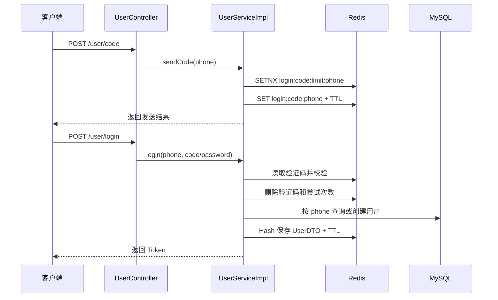
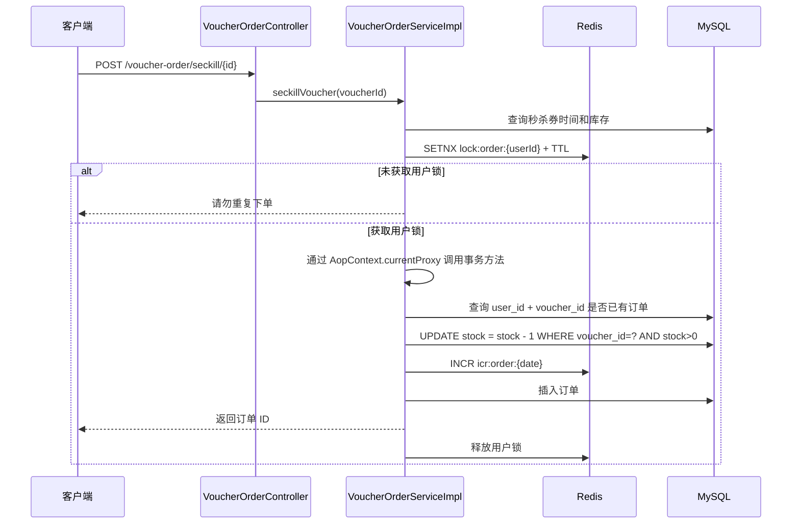

# DishReview 学习文档：阶段 3～4

## 1.阶段 3：核心业务模块

### 1.1 业务边界

DishReview 的业务可以分成四层：

```text
用户身份层
  用户、用户资料、验证码登录、Token、权限

内容与社交层
  店铺、店铺类型、博客、博客评论、关注关系、点赞

交易层
  优惠券、秒杀优惠券、库存、优惠券订单

基础设施层
  MySQL 持久化、Redis 缓存与并发控制、Nginx、文件上传
```

理解一个业务接口时，始终问四个问题：

1. 谁在调用它？用户、商户还是后台管理者？
2. 它读写哪些业务数据？
3. 哪些数据必须落 MySQL，哪些数据适合放 Redis？
4. 请求失败、重复请求或并发请求时，系统如何保证结果正确？

### 1.2 用户业务：身份、会话和当前用户

#### 登录入口

`UserController` 提供：

- `POST /user/code`：发送验证码；
- `POST /user/login`：验证码或密码登录；
- `POST /user/logout`：删除 Redis 中的 Token；
- `GET /user/me`：从 `UserHolder` 读取当前用户；
- `GET /user/info/{id}`：读取用户详细资料。

真正的登录业务在 `UserServiceImpl` 中完成，Controller 只负责接收参数和转发。

#### 验证码登录的数据流



这里的设计重点：

1. 验证码是临时数据，适合放 Redis，并设置短 TTL。
2. 发送频率限制使用 `SETNX`，让“第一次设置成功”成为唯一放行条件。
3. 登录成功后 Redis 保存的是 `UserDTO`，不是包含密码的完整 `User`。
4. 数据库通过 `phone` 唯一索引保证用户身份唯一。
5. Token 本身不是用户信息，Token 只作为 Redis Hash 的 Key 前缀部分。

#### Token 请求链路

```text
请求头 authorization
  -> RefreshTokenInterceptor
  -> Redis Hash login:token:{token}
  -> 恢复 UserDTO 到 UserHolder
  -> 刷新 Redis TTL
  -> LoginInterceptor 判断是否需要登录
  -> Controller / Service 使用 UserHolder.getUser()
  -> 请求完成后清理 ThreadLocal
```

这里要理解两个不同的“状态”：

- Redis 保存跨请求的登录状态；
- `UserHolder` 只保存当前请求线程中的临时状态。

不能把 ThreadLocal 当作全局登录存储，也不能忘记请求完成后清理 ThreadLocal。

### 1.3 店铺业务：高频读与缓存

店铺业务包含三种查询：

1. 根据 ID 查询店铺详情；
2. 按类型分页查询店铺；
3. 按名称关键字分页查询店铺。

其中只有店铺详情明确接入了 `CacheClient`。

当前 `ShopServiceImpl.queryById()` 选择的是逻辑过期方案；缓存穿透和互斥锁方案仍以注释代码或辅助方法形式保留。

#### 店铺更新

当前更新流程是：

```text
PUT /shop
  -> 更新 MySQL
  -> 删除 cache:shop:{id}
```

这体现了“修改数据库后删除缓存”的基本策略。它不是严格意义上的分布式一致性方案，后续还需要思考：数据库更新成功但删除缓存失败怎么办？删除缓存成功但事务最终回滚怎么办？

### 1.4 店铺类型业务：Redis List

`ShopTypeServiceImpl.queryTypeList()` 的流程：

```text
读取 Redis List shopType:typeList
  -> List 非空：逐条 JSON 反序列化并返回
  -> List 为空：查询 tb_shop_type
  -> 将每个 ShopType 序列化后 rightPushAll
  -> 返回数据库结果
```

这个场景适合缓存，因为店铺类型数据通常读多写少、数量不大。

当前实现值得观察的地方：

- Key 是硬编码字符串，没有复用 `RedisConstants`；
- 没有设置 TTL；
- 没有看到店铺类型更新时的缓存删除逻辑；
- 如果重复初始化缓存，是否会追加重复数据，需要结合实际运维流程确认。

这些是后续优化候选，不是本文要求立即修改的内容。

### 1.5 博客业务：内容、点赞和热门列表

#### 发布博客

`BlogController.saveBlog()` 的主要流程：

1. 对标题和内容做 HTML 转义，降低存储型 XSS 风险；
2. 从 `UserHolder` 获取当前登录用户；
3. 写入 `blog.user_id`；
4. 保存到 `tb_blog`；
5. 返回博客 ID。

这里体现了一个重要原则：用户身份不能由客户端直接决定，应从服务端认证上下文中取得。

#### 点赞博客

当前点赞接口执行：

```java
blogService.update()
        .setSql("liked = liked + 1")
        .eq("id", id)
        .update();
```

它通过数据库的原子加法避免了简单的“先查后改”覆盖问题，但当前没有看到：

- 是否限制同一用户只能点赞一次；
- 点赞用户集合是否保存到 Redis Set；
- 点赞取消流程；
- 点赞数量和用户点赞关系的一致性方案。

`RedisConstants.BLOG_LIKED_KEY` 已经存在，但当前代码中没有形成完整的点赞 Redis 流程。面试时应说“有预留 Key，当前点赞实现仍主要是数据库计数”，不要说成“已经用 Redis Set 完成点赞”。

#### 热门博客

`queryHotBlog()` 按 `liked` 倒序分页，再逐条按 `user_id` 查询用户信息：

```text
查询博客列表
  -> 遍历每条博客
  -> 根据 user_id 查询用户
  -> 补充昵称和头像
```

这里存在典型的 N+1 查询特征：博客列表有 N 条，就可能额外查询 N 次用户。后续可以学习批量查询、联表查询或缓存用户信息，但在优化前要先理解当前实现和真实数据规模。

### 1.6 优惠券和秒杀业务

优惠券分成两层：

- `tb_voucher` 保存标题、金额、规则、店铺和状态；
- `tb_seckill_voucher` 保存库存、开始时间和结束时间。

新增秒杀券时，`VoucherServiceImpl.addSeckillVoucher()` 在一个事务中完成：

```text
保存 tb_voucher
  -> 获得 voucher.id
  -> 保存 tb_seckill_voucher(voucher_id, stock, begin_time, end_time)
```

这解释了为什么秒杀券表的 `voucher_id` 不能脱离优惠券单独存在。

### 1.7 秒杀下单业务链路

当前秒杀流程是整个项目最适合面试深入讲解的业务：



这里有四个不同层次的保护：

1. **时间校验**：不允许在开始前或结束后下单。
2. **库存校验**：先判断库存，再通过 SQL 的 `stock > 0` 条件更新做最终扣减。
3. **分布式锁**：以用户 ID 为粒度，限制同一用户并发重复下单。
4. **事务**：库存扣减和订单保存需要保持在同一个数据库事务中。

为什么不能只在 Java 中判断库存？因为多个请求可能同时读到同一个库存值。`UPDATE ... SET stock = stock - 1 WHERE stock > 0` 让数据库在更新时再次判断条件，避免库存扣成负数。

为什么不能只依赖 Redis 锁保证一人一单？因为锁可能过期、请求可能重试、数据库可能出现历史重复数据；数据库查询和后续唯一约束仍然是重要的兜底。

---

## 2.阶段 4：Redis 在项目中的实际应用

### 2.1 Redis 的定位

在当前项目中，Redis 承担四种角色：

```text
临时数据存储：验证码、发送限制、登录会话
高频读缓存：店铺、店铺类型
并发控制：缓存重建锁、用户下单锁
原子计数器：订单序列号
```

### 2.2 当前实际使用的 Redis Key

| Key 模式                       | 数据结构        | TTL/生命周期      | 代码位置                            | 作用        |
| ---------------------------- | ----------- | ------------- | ------------------------------- | --------- |
| `login:code:{phone}`         | String      | 2 分钟          | `UserServiceImpl`               | 登录验证码     |
| `login:code:limit:{phone}`   | String      | 60 秒          | `UserServiceImpl`               | 限制验证码发送频率 |
| `login:code:attempt:{phone}` | String      | 2 分钟          | `UserServiceImpl`               | 记录错误尝试次数  |
| `login:token:{token}`        | Hash        | 30 分钟，访问时续期   | `UserServiceImpl`、拦截器           | 登录用户信息    |
| `cache:shop:{id}`            | String JSON | 物理 TTL 或逻辑过期  | `CacheClient`、`ShopServiceImpl` | 店铺缓存      |
| `lock:shop:{id}`             | String      | 约 10 秒        | `CacheClient`、`ShopServiceImpl` | 缓存重建互斥锁   |
| `lock:order:{userId}`        | String      | 秒杀代码传入 1200 秒 | `SimpleRedisLock`               | 用户下单锁     |
| `icr:order:{yyyy:MM:dd}`     | String      | 当前未显式设置       | `RedisIdWorker`                 | 每日订单序列    |
| `shopType:typeList`          | List JSON   | 当前未设置         | `ShopTypeServiceImpl`           | 店铺类型列表    |

当前 Redis Key 命名大体遵循“业务前缀:对象:标识”的形式。这样做的好处是便于定位、批量观察和避免不同业务之间发生 Key 冲突。

### 2.3 Redis String：验证码、锁和计数器

String 并不只用于普通字符串，在 Redis 中它还适合承担：

- 带 TTL 的临时值；
- `SETNX` 互斥标记；
- `INCR` 原子计数器；
- JSON 序列化后的缓存对象。

因此下面几种数据虽然都是 String，业务语义完全不同：

```text
验证码：String -> "123456"
缓存对象：String -> "{...json...}"
锁：String -> "应用UUID-线程ID"
订单序列：String -> Redis 自增整数
```

### 2.4 Token Hash 与滑动过期

登录成功后，用户信息以 Hash 保存：

```text
Key: login:token:{token}
Fields: id、phone、nickName、icon 等 UserDTO 字段
TTL: 30 分钟
```

请求经过 `RefreshTokenInterceptor` 时：

1. 从请求头读取 `authorization`；
2. 查询对应 Redis Hash；
3. Hash 存在则恢复 `UserDTO` 到 `UserHolder`；
4. 调用 `expire` 刷新 30 分钟 TTL；
5. 请求结束后清理 ThreadLocal。

这叫滑动过期：用户持续访问时会话持续有效，长时间不访问时 Redis Key 自动过期。

为什么使用 Hash 而不是把整个对象保存成一个 JSON String？Hash 可以按字段存取，且便于保存用户的多个属性；但它也要求序列化和反序列化规则稳定，字段变化时要注意兼容性。

### 2.5 店铺缓存与缓存穿透

#### 缓存穿透

缓存穿透是请求大量不存在的数据：

```text
请求不存在的 id
  -> Redis 没有
  -> 每次都查 MySQL
  -> 恶意请求导致数据库压力增加
```

`CacheClient.queryWithPassThrough()` 的处理方式是：

1. 先查 Redis；
2. Redis 有正常 JSON，直接返回；
3. Redis 有空字符串，直接返回不存在；
4. Redis 没有 Key，查询数据库；
5. 数据库不存在时，把空字符串写入 Redis，并设置短 TTL。

空值缓存可以阻断短时间内对同一个不存在 ID 的重复查询，但要注意空值 TTL 不能过长，否则新数据创建后可能在一段时间内仍被判断为不存在。

### 2.6 缓存击穿与互斥锁

缓存击穿是某个热点 Key 过期的瞬间，大量请求同时访问数据库：

```text
热点缓存同时失效
  -> 大量请求发现缓存不存在或过期
  -> 大量请求同时查询 MySQL
  -> 数据库瞬时压力升高
```

项目中存在两种思路：

#### 方案 A：互斥锁重建

`queryWithMutex()` 通过：

```java
setIfAbsent(lockKey, "1", 10, TimeUnit.SECONDS)
```

让一个线程负责查库和回填，其他线程等待后重试。

优点：实现直观，重建时不会返回旧数据。

缺点：抢不到锁的线程需要等待或重试；锁超时太短可能导致重建未完成；递归重试还可能造成线程堆积。

#### 方案 B：逻辑过期

`queryWithLogicalExpire()` 把对象和逻辑过期时间一起存入 Redis，但不设置 Redis 物理 TTL：

```json
{
  "data": { "id": 1, "name": "店铺" },
  "expireTime": "..."
}
```

读取时：

- 未过期：直接返回；
- 已过期：抢锁异步重建（开启独立线程，实现缓存重建），并先返回旧数据；
- 没抢到锁：直接返回旧数据。

优点：热点请求不需要等待数据库重建，吞吐量更稳定。

缺点：可能短时间返回旧数据；必须确保缓存曾经被预热；重建失败时需要有监控或补偿机制。

### 3.9 分布式锁：SimpleRedisLock

`SimpleRedisLock` 的核心设计是：

```text
Key: lock:{name}
Value: 应用随机 UUID + 当前线程 ID
获取: SETNX + 过期时间
释放: 先检查 Value 是否属于自己，再删除
```

为什么 Value 不能只写固定字符串 `1`？

因为锁超时后可能被其他线程重新获取。如果原线程恢复执行后直接删除 Key，就会误删新线程持有的锁。写入持有者标识并在释放前校验，可以降低误删风险。

当前实现仍有一个重要并发窗口：

```text
GET 检查锁值
  -> 线程被暂停
  -> 锁过期，其他线程获得同名锁
  -> 原线程执行 DELETE
```

因此“检查”和“删除”应该使用 Lua 脚本保证原子性。当前代码注释也已经明确指出这一点，后续可把它作为优化练习。

### 3.10 分布式 ID：Redis INCR

`RedisIdWorker.nextId()` 生成订单 ID 的逻辑：

1. 计算当前时间相对固定起始时间的秒数；
2. 按日期构造 Redis 自增 Key：`icr:order:yyyy:MM:dd`；
3. 使用 `INCR` 获取当天序列号；
4. 将时间戳左移 32 位，再与序列号按位或组合。

```text
订单 ID = 时间戳部分 << 32 | 当日序列号
```

这样做的关键原因：

- Redis `INCR` 是原子的；
- 多个应用实例可以共享同一序列；
- 订单 ID 不依赖单个 MySQL 自增列；
- 时间部分使 ID 大体有序。

需要继续追问的边界：

- 序列号每天是否可能超过 32 位能表达的范围？
- 时间使用 UTC 与本地日期 Key 是否完全一致？
- Redis 不可用时订单创建怎么办？
- Redis Key 是否需要设置过期时间？

### 3.11 Redis Key 中“已定义但未接入”的功能

`RedisConstants` 中还定义了：

```text
SECKILL_STOCK_KEY
BLOG_LIKED_KEY
FEED_KEY
SHOP_GEO_KEY
USER_SIGN_KEY
```

当前阅读仓库时，不应仅凭这些常量判断功能已经完成。它们更像是后续功能的设计入口：

| 预留 Key | 未来可能对应的 Redis 结构 | 需要学习的问题                 |
| ------ | ---------------- | ----------------------- |
| 秒杀库存   | String           | 如何预扣库存，如何与 MySQL 最终库存一致 |
| 博客点赞   | Set              | 如何判断用户是否点过赞，如何处理取消点赞    |
| Feed   | ZSet/List        | 如何按时间拉取关注用户动态，如何做分页     |
| 商铺 GEO | GEO              | 如何按经纬度搜索附近店铺            |
| 用户签到   | Bitmap           | 如何按日期记录和统计签到            |

这些内容属于后续完善方向，不应在当前项目介绍中包装成已实现能力。

### 3.12 Redis 观察练习

连接到本地或测试 Redis 后，优先使用范围明确的只读命令观察数据，不要使用可能影响环境的删除命令：

```bash
TYPE login:token:<token>
TTL login:token:<token>
HGETALL login:token:<token>

TYPE cache:shop:<id>
TTL cache:shop:<id>
GET cache:shop:<id>

TYPE shopType:typeList
LRANGE shopType:typeList 0 -1
```

生产或共享环境中不要把密码、完整 Token、手机号和命令输出截图提交到 GitHub。观察 Key 时优先使用精确 Key 或受限范围的 `SCAN`，不要随意使用 `KEYS *`。

### 3.13 阶段 4 自测题

1. 为什么验证码适合放 Redis 而不是 MySQL？
2. `SETNX + TTL` 如何实现验证码发送频率限制？
3. Token 为什么使用 Hash？请求经过拦截器时发生了什么？
4. ThreadLocal 和 Redis 登录状态分别解决什么问题？
5. 什么是缓存穿透？当前项目用什么方式缓解？
6. 什么是缓存击穿？互斥锁和逻辑过期有什么区别？
7. 逻辑过期为什么可以返回旧数据？它的代价是什么？
8. 分布式锁为什么需要 Value 标识持有者？
9. 当前 `SimpleRedisLock.unlock()` 为什么仍然不是完全安全的？
10. `RedisIdWorker` 为什么使用 `INCR`？订单 ID 的两部分分别是什么？
11. `RedisConstants` 中哪些 Key 当前只是预留，并没有完整业务实现？
12. 店铺更新时为什么删除缓存，而不是直接把新对象写回缓存？两种策略各有什么风险？

阶段 4 的验收标准：你能拿出一个真实接口，画出它的 MySQL/Redis 数据流，并解释每个 Key 的数据结构、TTL、失效策略和并发风险。

---

## 四、把项目讲给面试官的表达模板

对于任何一个核心功能，按下面顺序表达：

```text
业务问题
  -> 为什么需要这个功能或组件

数据流
  -> 请求经过哪些层，读写 MySQL 还是 Redis

关键方案
  -> 使用了什么数据结构、锁、事务或缓存策略

并发与异常
  -> 重复请求、缓存失效、Redis 异常、数据库更新失败怎么办

当前边界
  -> 当前实现还有什么不足，后续准备如何验证和优化
```

### 示例：店铺详情

> 店铺详情是高频读场景，因此先查询 Redis，减少 MySQL 压力。当前入口使用逻辑过期方案：缓存未过期直接返回，过期时通过互斥锁让一个线程异步重建缓存，同时返回旧数据，降低热点 Key 失效时的数据库压力。店铺更新后删除缓存，保证下次读取重新加载。当前实现还需要继续验证缓存重建异常、锁释放原子性和逻辑过期单位等边界。

### 示例：秒杀下单

> 秒杀下单需要同时保证库存不超卖和一人一单。项目先校验时间和库存，再用 Redis 分布式锁按用户维度限制并发重复下单，在事务方法中查询历史订单、通过 `stock > 0` 条件更新扣减库存，再创建订单。订单号由 Redis `INCR` 生成。当前一人一单的数据库唯一约束、锁释放原子性和更高并发下的库存预扣仍是后续可以完善的方向。

## 五、本文暂不处理的内容

- 不新增或修改业务代码；
- 不把预留 Redis Key 直接实现成新功能；
- 不直接升级为 Lua、Redis Stream 或异步队列方案；
- 不在没有压测和执行计划证据的情况下声称完成性能优化；
- 不把当前测试模式验证码、远程配置和安全修复细节包装成生产级能力。

先把本文中的业务链路和 Redis 数据流讲清楚，再进入下一阶段的并发、秒杀优化和测试验证。
