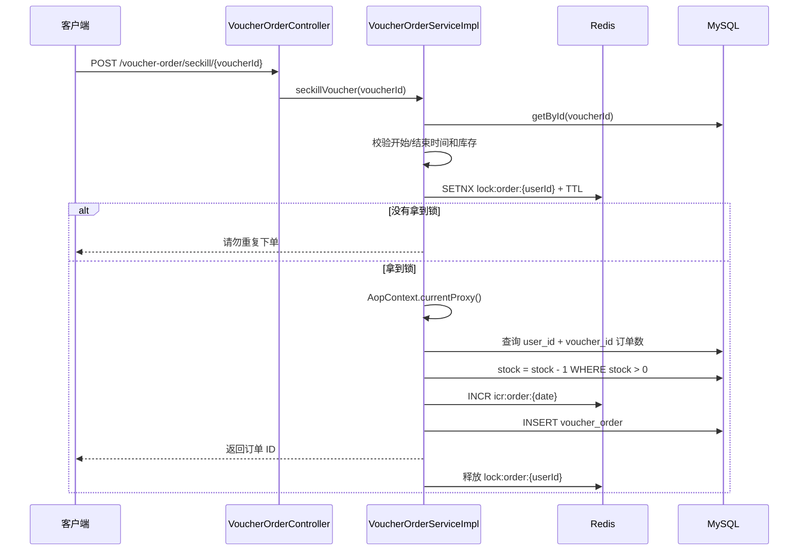

# DishReview 学习文档：阶段 5——秒杀与并发

---

## 1.秒杀场景

普通下单通常是一次请求处理一个资源；秒杀是在很短时间内大量用户访问同一个优惠券。系统同时面对：

- 大量请求集中读取同一个库存；
- 多个请求竞争最后几件库存；
- 同一个用户重复点击或重试；
- 请求执行时间变长，客户端重复发送；
- Redis、MySQL 或应用实例在高峰期出现故障。

因此秒杀不能只写成：

```text
查库存 -> stock - 1 -> 保存订单
```

需要分别保证以下业务不变量：

| 不变量      | 含义                     |
| -------- | ---------------------- |
| 库存不为负    | 成功订单数不能超过可售库存          |
| 一人一单     | 同一用户对同一张券不能创建重复订单      |
| 订单与扣库存一致 | 不能只扣库存不落订单，也不能只落订单不扣库存 |
| 订单 ID 唯一 | 多实例下生成的订单号不能冲突         |
| 失败可重试    | 网络超时或请求重试不能造成重复业务结果    |

---

## 2.当前代码的秒杀请求链路

入口是 `VoucherOrderController.seckillVoucher()`：

```text
POST /voucher-order/seckill/{id}
  -> VoucherOrderServiceImpl.seckillVoucher(voucherId)
  -> 查询秒杀券
  -> 校验开始时间、结束时间、库存
  -> 获取 lock:order:{userId}
  -> 通过 AopContext.currentProxy() 调用事务方法
  -> createVoucherOrder(voucherId)
  -> 查询一人一单
  -> 条件扣减库存
  -> Redis 生成订单 ID
  -> 保存订单
  -> finally 释放用户锁
```

### 2.1 时序图



### 2.2 保证业务功能

验证：验证优惠卷库存足，时间没问题之后，相应用户请求


上锁：但是为了防止同时相应多个用户请求，于是设立了一个Redis的分布式锁，保证同一时间只有一个用户的请求被响应


业务：通过事务进行创建订单操作（需要获取事务代理对象，使事务生效:如果直接调用该方法，是当前的实例对象去调用，不是事务代理对象，导致事务不生效），创建订单前，再次对库存用户是否已购买进行验证；验证通过后使用原子操作扣除库存，若失败则返回库存不足，若扣除库存成功，则创建订单

---

## 3.一人一单：锁、查询和数据库约束

当前代码有两层逻辑：

### 3.1 Redis 用户锁

锁名是：

```text
lock:order:{userId}
```

锁按用户维度，而不是按优惠券维度，意味着同一个用户同时只能进入一个下单临界区。这样可以减少同一用户并发重复提交，但也会让同一用户购买不同优惠券时互相等待。

锁粒度需要结合业务选择：

| 锁粒度   | 优点              | 代价               |
| ----- | --------------- | ---------------- |
| 按用户   | 直接限制用户重复提交，实现简单 | 同一用户购买不同券也会互相阻塞  |
| 按用户+券 | 并发度更高，限制更精确     | Key 设计和幂等语义更复杂   |
| 按券    | 保护同一券库存         | 锁竞争很大，不能单独解决一人一单 |

### 3.2 数据库唯一约束

阶段 1 已经指出，`tb_voucher_order` 当前显式索引中没有看到 `(user_id, voucher_id)` 唯一组合约束。后续可以评估：

```sql
UNIQUE KEY uk_user_voucher (user_id, voucher_id)
```

它同时有两个价值：

- 加快按用户和优惠券判断订单的查询；
- 在并发或锁失效时，作为最终的业务约束兜底。

添加前必须先检查历史数据是否有重复订单，否则建索引会失败；同时要设计好重复键异常如何转换为业务结果。

不要把“准备添加唯一索引”说成“项目已经使用唯一索引”。当前项目的事实是：代码有 Redis 用户锁和事务内查询，数据库唯一约束需要后续验证和完善。

---

## 4.为什么使用 `AopContext.currentProxy()`

`createVoucherOrder()` 上有 `@Transactional`，但外层 `seckillVoucher()` 不能简单地写：

```java
this.createVoucherOrder(voucherId);
```

因为这是同一个对象内部调用，可能绕过 Spring 事务代理，导致 `@Transactional` 不生效。

当前应用在启动类上配置了：

```java
@EnableAspectJAutoProxy(exposeProxy = true)
```

随后通过：

```java
IVoucherOrderService proxy =
        (IVoucherOrderService) AopContext.currentProxy();
proxy.createVoucherOrder(voucherId);
```

让调用重新经过 Spring 代理，从而让事务拦截器生效。

应说明：

- 事务边界在 `createVoucherOrder()`；
- Redis 锁的生命周期在外层方法中通过 `finally` 释放；
- 如果数据库事务回滚，库存扣减和订单插入应一起回滚；
- Redis 锁不是数据库事务的一部分，两者并不能自动做到分布式事务一致。

---

## 5.分布式锁的正确性与当前风险

### 5.1 获取锁

`SimpleRedisLock` 使用：

```text
SET lock:{name} {owner} NX EX {timeout}
```

当前 Value 由应用随机 UUID 和线程 ID 组成，用于区分锁持有者。

必须同时具备：

1. 互斥：只有一个请求能成功设置 Key；
2. 自动过期：持有者宕机后不会永久死锁；
3. 持有者标识：释放锁前确认是自己持有的锁。

### 5.2 当前实现的释放窗口

当前 `unlock()` 是：

```text
GET 锁的 Value
  -> 判断是否等于当前线程标识
  -> DELETE 锁
```

这两个 Redis 操作不是原子的，存在如下极端情况：

```text
线程 A GET 到自己的 Value
线程 A 被暂停
锁过期
线程 B 获取同一个锁
线程 A 继续执行 DELETE，误删线程 B 的锁
```

后续优化通常是 Lua 脚本，把“比较 Value”和“删除 Key”放在一次原子执行中。当前项目还没有完整实现这个升级。

### 5.3 锁超时时间问题

秒杀代码传入 `1200L` 秒作为用户锁的超时时间。这个时间可以避免业务未完成时锁过早释放，但也会造成：

- 请求异常且没有执行到释放逻辑时，用户可能长时间无法再次下单；
- 业务执行时间如果超过锁 TTL，锁可能提前释放；
- 没有续期机制时，TTL 只能是静态估计。

锁 TTL 应根据真实执行时间、重试策略和故障恢复要求确定，不能只追求“设置得足够大”。

---

## 6.Redis ID 与订单创建

`RedisIdWorker` 使用 Redis `INCR` 生成每天的序列号：

```text
Key: icr:order:{yyyy:MM:dd}
Value: 当天递增序列
```

最终 ID 由两部分组成：

```text
时间戳部分 << 32 | 当日序列部分
```

使用它的原因：

- `INCR` 是原子操作；
- 多个应用实例可以共享序列；
- 不依赖单个 MySQL 自增主键；
- 时间部分让订单 ID 大体有序。

需要继续检查的边界：

- 起始时间、时区和日期 Key 是否一致；
- 单日序列是否可能超过预留位数；
- Redis 不可用时是否允许创建订单；
- 订单 ID 生成成功但数据库插入失败时，序列号是否允许出现空洞。

订单 ID 出现空洞通常不代表业务错误，重要的是唯一性和可追踪性，不要把“连续无缺号”当成分布式 ID 的必要条件。

---

## 7.并发场景推演

| 场景            | 当前保护                 | 仍需思考的问题           |
| ------------- | -------------------- | ----------------- |
| 同一用户快速点击两次    | Redis 用户锁            | 锁过期或释放非原子时怎么办     |
| 两个用户抢最后一张券    | SQL `stock > 0` 条件更新 | 失败请求是否会创建订单       |
| 数据库扣库存成功、插单失败 | Spring 事务            | Redis 生成的 ID 如何处理 |
| 客户端超时后重试      | 用户锁和订单查询             | 是否需要明确幂等 Token    |
| Redis 暂时不可用   | 当前没有完整降级方案           | 是否拒绝秒杀，如何报警       |
| MySQL 响应变慢    | 事务和锁 TTL             | 是否造成锁提前释放或线程堆积    |
| 应用实例宕机        | Redis TTL            | 事务中断后的库存和订单如何恢复   |

### 7.1 典型面试追问

**问：为什么已经有 Redis 锁，还要数据库条件扣库存？**

答：Redis 锁主要控制同一用户的并发下单，不能代替数据库的库存原子更新；多个用户仍然会同时竞争库存，因此需要 `stock > 0` 的条件更新作为库存层面的保护。

**问：为什么只用数据库唯一索引，不用 Redis 锁？**

答：唯一索引可以兜底保证数据不重复，但大量请求仍会进入数据库并产生冲突；Redis 锁可以提前挡住同一用户的并发请求，减少数据库压力。两者解决层次不同，可以配合使用。

**问：事务能不能同时保证 Redis 锁和 MySQL 数据一致？**

答：不能。Spring 本地事务只能管理数据库资源，Redis 锁不会随 MySQL 事务自动回滚，因此需要明确锁的 TTL、释放逻辑和异常补偿。

---

## 阶段验收

不看代码完成以下任务：

1. 画出秒杀请求时序图；
2. 说明 Redis 锁保护的对象和数据库条件更新保护的对象；
3. 解释 `AopContext.currentProxy()` 与事务代理的关系；
4. 推演库存为 1 时两个用户同时请求的结果；
5. 指出当前锁释放的非原子风险；
6. 说出至少一个需要真实并发测试才能确认的问题。

如果你能把“锁、事务、条件更新、唯一约束、幂等”分别讲清楚，阶段 5 就不是只会背秒杀代码，而是已经理解了并发设计。
