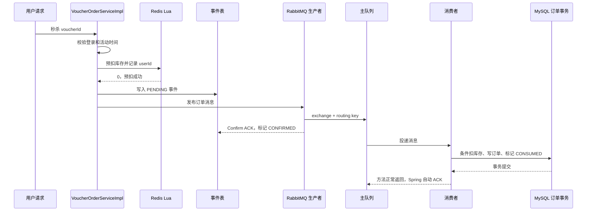

# RabbitMQ 优惠券秒杀链路说明与验收

## 1. RabbitMQ 在这里解决什么问题

秒杀请求到达时，接口不直接创建 MySQL 订单，而是先用 Redis Lua 完成库存预扣和一人一单判断，再把订单消息发送到 RabbitMQ。消费者异步写 MySQL，从而削减请求高峰对数据库的直接冲击。

这套方案的目标是：

- Redis 快速拦截无库存和重复请求。
- RabbitMQ 缓冲订单写入流量。
- MySQL 条件更新和唯一索引守住最终数据正确性。
- 事件表记录消息状态，为发布结果未知和失败补偿提供依据。

## 2. 队列拓扑

| 组件 | 名称 | 作用 |
| --- | --- | --- |
| 主交换机 | `dianping.seckill.direct` | 接收秒杀订单消息 |
| 主路由键 | `seckill.order.create` | 把订单消息路由到主队列 |
| 主队列 | `dianping.seckill.order.queue` | 保存等待消费的订单消息 |
| 死信交换机 | `dianping.seckill.dlx` | 接收主队列拒绝的消息 |
| 死信路由键 | `seckill.order.dead` | 把死信路由到秒杀专用 DLQ |
| 死信队列 | `dianping.seckill.order.dlq` | 隔离最终无法处理的订单消息 |

交换机、队列和消息均配置为持久化。主队列通过死信参数绑定死信交换机；消息重试耗尽后会被拒绝且不重新进入主队列，随后由 RabbitMQ 转发到 DLQ。

## 3. 正常秒杀流程



关键顺序是“Redis 预扣 → 事件落库 → 发布消息”。事件必须先落库，否则生产者发生异常时没有持久化依据进行补偿。

### 3.1 正常流程逐步拆解

| 阶段 | 执行位置 | 做什么 | 成功后的状态 |
| --- | --- | --- | --- |
| 1. 请求校验 | `VoucherOrderServiceImpl` | 校验参数、登录状态、优惠券是否存在以及活动时间 | 尚未修改 Redis、RabbitMQ、MySQL |
| 2. Redis 预扣 | `SeckillVoucherLuaExecutor.reserve()` | Lua 原子检查库存和用户集合；成功后库存减一、用户加入 Set | Redis 已为该用户预留一份资格 |
| 3. 生成标识 | `VoucherOrderServiceImpl` | 生成固定 `orderId` 和随机 `eventId` | 后续重发仍复用这两个 ID |
| 4. 事件落库 | `SeckillOrderEventService.createPending()` | 写入 PENDING，并设置 30 秒初始兜底时间 | MySQL 有了可追踪、可补偿的发布记录 |
| 5. 发布消息 | `SeckillOrderPublisher.publish()` | 先持久化增加一次 publish 调用次数，再发送带 Header 和 `CorrelationData` 的持久化 JSON 消息 | 发布调用已发起，但订单还没有落库 |
| 6. Broker 确认 | `RabbitMqPublisherCallback.confirm()` | Confirm ACK 后把 PENDING 改为 CONFIRMED | 只证明 Broker 接收了消息，不证明订单完成 |
| 7. 消费落库 | `VoucherOrderHandler.createOrder()` | 同一事务内检查幂等、条件扣 MySQL 库存、插入订单、标记 CONSUMED | 数据库订单事务提交 |
| 8. 消费确认 | Spring AMQP 容器 | 监听方法正常返回后自动 ACK | RabbitMQ 才可以删除这次投递 |

### 3.2 三个容易说错的时间点

1. 接口返回 `orderId`：表示请求已通过 Redis 预扣并创建了 PENDING 事件，生产者已尝试进入异步处理；不表示 MySQL 订单已经创建。
2. Confirm ACK：表示消息到达 RabbitMQ 交换机处理流程，不表示消息一定已经被消费者成功处理。
3. Consumer ACK：当前使用 `acknowledge-mode: auto`，监听方法正常返回后由 Spring ACK；它发生在数据库事务方法成功返回之后。

因此，这套实现采用“异步受理 + 至少一次投递思路 + 业务幂等”，不能宣称 RabbitMQ 帮项目实现了严格的全链路 exactly-once，也不能在真实故障验收前承诺消息绝不丢失。

## 4. 消息里有什么

`SeckillOrderMessage` 包含：

| 字段 | 作用 |
| --- | --- |
| `eventId` | 消息唯一标识，关联事件表、日志和发布回调 |
| `orderId` | 最终订单主键；重发时保持不变 |
| `userId` | 下单用户，也是 Redis 回滚参数 |
| `voucherId` | 秒杀券 ID，也是库存和回滚参数 |
| `createdAt` | 原消息创建时间 |
| `version` | 消息结构版本，当前为 1 |

生产者还把关键 ID 写入 Header。Confirm 使用 `SeckillOrderCorrelationData` 找到事件并取得回滚参数；Return 使用消息 Header 完成同样的定位。

## 5. 事件状态怎么变化

| 状态 | 含义 | 典型来源 |
| --- | --- | --- |
| `PENDING` | 等待发布确认或补偿重发 | 发布前创建事件 |
| `CONFIRMED` | RabbitMQ 已接收消息，但订单未必落库 | Confirm ACK |
| `CONSUMED` | 消费事务已完成 | 订单处理器提交事务 |
| `FAILED` | 已确定发布失败或消费最终失败 | NACK、Return、消费重试耗尽 |
| `PUBLISH_UNKNOWN` | 快速发布补偿耗尽，仍不能确定消息是否到达 Broker | 转为每 60 秒低频重发 |

正常状态是 `PENDING → CONFIRMED → CONSUMED`。如果消费者先于 Confirm 回调完成，也允许 `PENDING → CONSUMED`；后到的 ACK 会把它视为幂等成功，不会倒退状态。

发送持续异常时是 `PENDING → PUBLISH_UNKNOWN`。该状态不是确定失败，不回滚 Redis，也不会停止处理；Confirm ACK 可将其改为 CONFIRMED，消费者成功可将其改为 CONSUMED。首次发布且没有补偿历史时的明确 NACK/Return 才能直接判为 FAILED；已有补偿历史时，单次失败不能代表更早的消息均未到达。

## 6. 各类失败怎么处理

| 场景 | 处理方式 | 是否立即回滚 Redis |
| --- | --- | --- |
| 发送方法抛出连接异常 | 结果可能未知，事件保持 PENDING，安排 1/2/4 秒补偿 | 否 |
| 快速发布补偿耗尽 | 改为 PUBLISH_UNKNOWN，每 60 秒低频重发 | 否 |
| 首次发布 Confirm NACK | 无补偿历史时先标记 FAILED，再执行回滚 Lua | 是 |
| 首次发布 Return | 无补偿历史时记录 FAILED，再执行回滚 Lua | 是 |
| 补偿发送 NACK/Return | 以前的尝试结果仍可能未知，保留补偿状态 | 否 |
| 消费时数据库临时异常 | 监听器按 1/2/4 秒有限重试 | 否 |
| 消息字段或版本错误 | 判定为永久错误，不做无意义重试 | 否 |
| 消费重试耗尽 | MessageRecoverer 标记 FAILED，拒绝消息并进入 DLQ | 否，等待对账 |
| 重复消息或重复订单 | 查询和唯一索引识别为幂等成功，标记 CONSUMED | 否 |

不能在所有发送异常中直接恢复 Redis，因为生产者收到网络异常时，消息可能已经到达 RabbitMQ。此时立即恢复购买资格可能让同一用户再次下单，形成重复订单。

### 6.1 请求校验或 Redis 预扣失败

执行顺序：

```text
参数/登录/券/时间校验
  -> Redis Lua 检查库存和重复购买
  -> 返回明确结果，不创建事件、不发送消息
```

- 参数错误、未登录、优惠券不存在、尚未开始或已经结束：直接返回失败，三个存储均不产生秒杀订单状态。
- Lua 返回 `1`：Redis 库存不足。
- Lua 返回 `2`：用户已经存在于该券的购买集合。
- Lua 返回 `3`：Redis 库存 Key 尚未初始化。
- Redis 调用异常：接口返回“系统繁忙”，不会继续创建事件和发送消息。

**面试点：** Lua 的价值不是“速度快”这么简单，而是把库存检查、重复检查、扣库存、记录用户放在一次原子执行中，避免并发请求穿透。

### 6.2 Redis 预扣成功，但 PENDING 事件写入失败

执行顺序：

```text
Redis 已扣库存并记录用户
  -> createPending() 失败
  -> 执行 seckill_rollback.lua
  -> SREM 用户；只有移除成功才 INCR 库存
  -> 接口返回失败
```

回滚脚本具备幂等性：第一次成功回滚返回 `1`，重复回滚返回 `0`；库存 Key 不存在时返回 `-1`，避免 `INCR` 意外创建错误库存。

**当前边界：** 如果回滚 Redis 本身也失败，代码只记录日志，没有持久化回滚任务，需要后续对账或补偿。

**面试点：** 为什么先写事件再发消息？因为如果先发消息再写事件，消费者可能已经处理订单，而生产者没有事件记录可追踪。

### 6.3 发布方法抛异常：结果未知

`RabbitTemplate` 会先处理同步发送异常，最多尝试 4 次，即第一次发送加 3 次退避重试。仍然抛异常后：

```text
publish() 抛异常
  -> 不立即回滚 Redis
  -> PENDING 事件安排第 1/2/3 次补偿
  -> nextRetryTime 分别约为 1/2/4 秒后
  -> 定时任务抢占事件并使用原 eventId/orderId 重发
  -> 快速补偿仍失败，改为 PUBLISH_UNKNOWN
  -> 每 60 秒低频重发，直到状态收敛
```

不能立即回滚的原因是：网络异常只说明生产者没有拿到确定结果，消息可能已经被 Broker 接收。此时恢复 Redis 资格会允许用户再次请求，造成两条订单消息。

补偿任务通过 30 秒短租约降低多实例重复发送概率；即使重复发送，固定 `eventId/orderId`、消费端查询和数据库唯一索引仍负责幂等。

事件表的 `retryCount` 现在表示高层 `orderPublisher.publish()` 调用次数，不是 RabbitTemplate 内部网络尝试次数。首次发布记为 1，三轮快速补偿分别记为 2、3、4；第4次调用是最后一次快速补偿，同时事件进入 PUBLISH_UNKNOWN。这样即使 `publish()` 正常返回但 Confirm 始终缺失，调用次数也会增长并最终转入60秒低频兜底。

快速补偿耗尽不能直接标记为确定失败，因为此前某次消息可能已经到达 Broker。当前改为 `PUBLISH_UNKNOWN`，保留 Redis 预扣并使用固定 ID 每 60 秒低频重发；这样不会形成热循环，也不会因为过早恢复资格造成重复下单。

**当前边界：** 接口最终仍返回 `orderId`，即使发布抛异常甚至 `scheduleRetry()` 失败；因此返回值只能解释为异步受理结果，不能解释为订单已创建。慢重试目前没有最大存活时间，需要对 PUBLISH_UNKNOWN 数量和最长停留时间设置监控告警。

**面试点：** 生产者模板重试处理当前发送调用的短暂故障；事件表补偿处理进程结束、长时间未确认以及跨调用的可靠恢复，两者不在同一个层次。

### 6.4 Confirm ACK、Confirm NACK 和回调状态更新失败

#### Confirm ACK

- 表示消息到达 Broker 的交换机处理流程。
- 事件由 PENDING 改为 CONFIRMED，并清空下次补偿时间。
- 如果消费者处理更快，事件可能已经是 CONSUMED；后到的 ACK 按幂等成功处理，不会把状态倒退为 CONFIRMED。

#### Confirm NACK

```text
Broker 明确 NACK
  -> 检查事件是否仍是 PENDING、retryCount=1 且没有发送异常记录
  -> 首次发布可先改为 FAILED
  -> 只有 FAILED 持久化成功，才执行 Redis 回滚 Lua
```

先记录 FAILED 再回滚，是为了留下“为什么恢复购买资格”的持久化事实。如果事件已有补偿历史，某一次重发的 NACK 只能证明这一次失败，不能排除更早的消息已经进入队列，因此保持 PENDING/PUBLISH_UNKNOWN 并继续补偿，不直接回滚。

**面试点：** `CorrelationData` 不是 RabbitMQ 自动生成的业务记录，而是生产者发送时主动创建并随消息发布，用来让 Confirm 回调关联 `eventId/orderId/userId/voucherId`。

### 6.5 消息到交换机但无法路由：Return

当交换机存在，但 routing key 没有匹配队列时：

```text
交换机接收消息
  -> Confirm 通常 ACK
  -> mandatory=true 触发 ReturnCallback
  -> 从 Header 取得业务 ID
  -> 无补偿历史：事件标记 FAILED，回滚 Redis
  -> 已有补偿历史：保持未知状态，不直接回滚
```

Return 消息没有进入任何队列，所以不会自动成为主队列的死信。死信机制处理的是“已经进入队列，随后被拒绝、过期或超过限制”等情况。

Confirm ACK 和 Return 可能同时出现：ACK 回答“交换机收到了没有”，Return 回答“交换机能否路由进队列”。当前状态更新不会用 ACK 覆盖 FAILED；对已有补偿历史的事件，也不会因为某一次 Return 就否定以前所有发送尝试。

**当前边界：** Return Header 缺失时无法取得 Redis 回滚参数；当前只记录日志，需要告警和人工核对。

### 6.6 消息进入队列，但消费者或数据库暂时失败

消费者使用自动 ACK。监听方法抛异常时不会 ACK，由 Spring Retry 在本地进行有限重试：

```text
第 1 次消费失败
  -> 等约 1 秒重试
  -> 再失败，等约 2 秒
  -> 再失败，等约 4 秒
  -> 第 4 次仍失败，进入 MessageRecoverer
```

每次调用 `VoucherOrderHandler.createOrder()` 都有独立数据库事务。条件扣库存、插入订单、标记 CONSUMED 中任一步抛异常，当前这次事务整体回滚，不会留下“库存扣了但订单没写”的半事务。

**当前边界：** 代码只把消息格式异常明确分类为不可重试；数据库库存不足也是 `IllegalStateException`，当前会按普通异常完成有限重试后进入 DLQ。它实际上更接近业务永久错误，后续可以进一步细分异常类型，减少无效重试。

**面试点：** 消费者重试解决“消息已到队列、业务落库暂时失败”；它不解决生产者到交换机之前的失败。

### 6.7 非法消息或不支持的版本

消费者会校验 `eventId/orderId/userId/voucherId/createdAt/version`。字段缺失、ID 非法或版本不是 1 时抛出 `AmqpRejectAndDontRequeueException`：

- RetryPolicy 把它识别为永久错误，不做 1/2/4 秒重试。
- MessageRecoverer 尝试把事件标记为 FAILED。
- 消息以 `requeue=false` 被拒绝，由主队列的死信配置送入专用 DLQ。
- 不自动恢复 Redis，因为仅凭一条不可信消息无法安全判断订单是否已经落库。

**面试点：** 有限重试不仅要限制次数，还要区分暂时性故障和永久性故障；否则格式错误重试多少次都不会恢复。

### 6.8 重复投递与 Consumer ACK 丢失

RabbitMQ 可能因为网络中断或 ACK 丢失重新投递已经处理过的消息，因此消费者不能假设消息只来一次。

当前幂等顺序是：

1. 先按 `(user_id, voucher_id)` 查询订单；已存在则只把事件标记为 CONSUMED。
2. 并发请求同时通过查询时，数据库联合唯一索引负责最终拦截。
3. 如果插入抛出 `DuplicateKeyException`，事务先回滚本次库存扣减；消费者再查询订单，确认业务订单存在后按幂等成功处理。
4. 固定 `orderId` 也能避免同一事件重发时生成不同订单主键。

**面试点：** 查询只能减少重复操作，不能替代唯一索引，因为“查询不存在”和“插入”之间仍有并发窗口。

### 6.9 重试耗尽、DLQ 与消费者宕机

- 重试耗尽：MessageRecoverer 标记事件 FAILED，拒绝消息，RabbitMQ 根据死信参数把它转发到秒杀专用 DLQ。
- 消费者宕机且消息未 ACK：消息通常重新入队，交给其他消费者或等待消费者恢复，并不会因为宕机立刻进入 DLQ。
- 所有消费者都离线：持久化主队列保存积压消息；恢复后继续消费。
- 消息进入 DLQ：当前项目没有自动重放或人工处理接口，必须先核对 MySQL 订单、事件状态和 Redis 预扣，不能直接恢复库存。

**面试点：** DLQ 是失败隔离区，不是自动修复器；“进了死信队列”只表示主流程停止继续尝试，不表示业务已经补偿完成。

### 6.10 进程崩溃窗口

| 崩溃位置 | 当前结果 | 当前兜底 |
| --- | --- | --- |
| Redis 预扣前 | 没有预扣、没有事件 | 用户可重新请求 |
| Redis 预扣后、PENDING 写入前 | Redis 已扣，MySQL 无事件 | **现有缺口**：需要 Redis 与订单/事件表对账 |
| PENDING 写入后、发布前 | 事件保持 PENDING | 初始 30 秒 `nextRetryTime` 触发补偿发布 |
| Broker 收到消息、Confirm 回调前 | 可能重复补发 | 固定 ID、唯一索引和消费者幂等兜底 |
| 数据库事务提交后、Consumer ACK 前 | Broker 可能重新投递 | 消费者识别已有订单并按幂等成功返回 |

**面试点：** 可靠消息不是一个配置项解决的，而是事件表、Confirm/Return、持久化、消费重试、事务、幂等、唯一索引、DLQ 和对账共同覆盖不同故障窗口。

## 7. 生产者补偿和消费者重试的区别

- 生产者模板自身会对同步发送异常有限重试。
- 如果发送结果仍未知，事件表先对 PENDING 做 1/2/4 秒快速补偿；快速阶段耗尽后转为 PUBLISH_UNKNOWN，每 60 秒低频重发。
- 定时任务同时扫描到期的 PENDING 和 PUBLISH_UNKNOWN，并始终使用原 `eventId/orderId` 重发。
- 消费者重试解决的是消息已经进入队列，但数据库处理暂时失败的问题。
- DLQ 保存消费端最终无法处理的消息，不负责生产者到交换机之前的失败。

补偿任务在领取事件时设置 30 秒短租约，避免多个应用实例同时重发。即使仍发生重复投递，消费者查询、订单唯一索引和固定订单 ID 仍负责业务幂等。

## 8. 相关代码

| 职责 | 类 |
| --- | --- |
| 秒杀入口 | `VoucherOrderServiceImpl` |
| Redis 预扣/回滚 | `SeckillVoucherLuaExecutor`、`seckill.lua`、`seckill_rollback.lua` |
| RabbitMQ 拓扑和重试 | `RabbitMqConfig` |
| 消息和关联数据 | `SeckillOrderMessage`、`SeckillOrderCorrelationData` |
| 发布消息 | `SeckillOrderPublisher` |
| Confirm/Return | `RabbitMqPublisherCallback` |
| 发布补偿 | `SeckillOrderPublishRetryTask`、`SeckillOrderEventService` |
| 消费消息 | `SeckillOrderConsumer` |
| 数据库事务 | `VoucherOrderHandler` |
| 事件持久化 | `SeckillOrderEvent`、`SeckillOrderEventMapper` |

## 9. 源码阅读路径与建议

### 9.1 第一遍：先建立组件地图

先读配置和数据结构，不要一开始钻进异常分支：

1. [`application.yaml`](../../src/main/resources/application.yaml)：确认 RabbitMQ 地址、Confirm、Return、生产者重试、消费者重试和消费者开关。
2. [`RabbitMqConstants.java`](../../src/main/java/com/dish/review/utils/RabbitMqConstants.java)：记住主交换机、主队列、路由键和死信拓扑的对应关系。
3. [`RabbitMqConfig.java`](../../src/main/java/com/dish/review/config/RabbitMqConfig.java)：看交换机、队列、Binding、JSON 转换器、RetryPolicy 和 MessageRecoverer 如何装配。
4. [`SeckillOrderMessage.java`](../../src/main/java/com/dish/review/dto/SeckillOrderMessage.java)：理解一条消息携带哪些业务事实。
5. [`SeckillOrderEvent.java`](../../src/main/java/com/dish/review/entity/SeckillOrderEvent.java)：理解 PENDING、CONFIRMED、CONSUMED、FAILED、PUBLISH_UNKNOWN 五种状态。

第一遍只需要回答：

- 消息发到哪个交换机，使用什么 routing key？
- 主队列处理失败后为什么能进入 DLQ？
- `eventId` 和 `orderId` 为什么不能混为一个概念？
- Confirm ACK 和业务订单完成分别对应什么状态？

### 9.2 第二遍：顺着正常链路阅读

按一次成功秒杀的执行顺序阅读：

```text
VoucherOrderController.seckillVoucher()
  -> VoucherOrderServiceImpl.seckillVoucher()
  -> SeckillVoucherLuaExecutor.reserve()
  -> SeckillOrderEventService.createPending()
  -> SeckillOrderPublisher.publish()
  -> RabbitMqPublisherCallback.confirm(ACK)
  -> SeckillOrderConsumer.consume()
  -> VoucherOrderHandler.createOrder()
  -> SeckillOrderEventService.markConsumed()
  -> Spring 自动 ACK RabbitMQ 消息
```

对应源码：

1. [`VoucherOrderController.java`](../../src/main/java/com/dish/review/controller/VoucherOrderController.java)：找到 HTTP 入口和 `voucherId` 来源。
2. [`VoucherOrderServiceImpl.java`](../../src/main/java/com/dish/review/service/impl/VoucherOrderServiceImpl.java)：重点看时间校验、Lua 返回码、订单/事件 ID 创建、事件先落库再发消息的顺序。
3. [`SeckillVoucherLuaExecutor.java`](../../src/main/java/com/dish/review/service/SeckillVoucherLuaExecutor.java)、[`seckill.lua`](../../src/main/resources/seckill.lua)：看库存和用户集合为什么能在一次 Redis 原子操作中修改。
4. [`SeckillOrderEventService.java`](../../src/main/java/com/dish/review/service/SeckillOrderEventService.java)：先只读 `createPending()`、`markConfirmed()`、`markConsumed()`。
5. [`SeckillOrderPublisher.java`](../../src/main/java/com/dish/review/mq/SeckillOrderPublisher.java)：看消息持久化、Header 和 CorrelationData 如何写入。
6. [`SeckillOrderCorrelationData.java`](../../src/main/java/com/dish/review/mq/SeckillOrderCorrelationData.java)：理解 Confirm 回调如何找到原事件和 Redis 回滚参数。
7. [`RabbitMqPublisherCallback.java`](../../src/main/java/com/dish/review/mq/RabbitMqPublisherCallback.java)：正常链路先只看 `confirm(..., ack=true, ...)`。
8. [`SeckillOrderConsumer.java`](../../src/main/java/com/dish/review/mq/SeckillOrderConsumer.java)：看消息校验、重复键分支和方法正常返回后的自动 ACK。
9. [`VoucherOrderHandler.java`](../../src/main/java/com/dish/review/service/VoucherOrderHandler.java)：看数据库条件扣库存、订单插入和事件完成为什么处于同一个事务。

建议用一张纸记录每一步对三个存储的影响：

| 步骤 | Redis | RabbitMQ | MySQL |
| --- | --- | --- | --- |
| Lua 预扣 | 库存减一、用户入 Set | 无 | 无 |
| 事件落库 | 不变 | 无 | 新增 PENDING |
| 发布成功 | 不变 | 消息进入队列 | CONFIRMED |
| 消费提交 | 不变 | 等待 ACK 删除消息 | 扣库存、建订单、CONSUMED |

### 9.3 第三遍：倒推失败链路

正常链路读通后，再逐个制造“在哪一步失败”的问题：

1. `publish()` 同步抛异常：阅读 `VoucherOrderServiceImpl` 的 catch 和 `scheduleRetry()`，理解为什么结果未知时不能立即回滚 Redis。
2. Confirm NACK：阅读 `RabbitMqPublisherCallback.confirm()`，确认首次发布是先记录 FAILED 再回滚；已有补偿历史时不直接回滚。
3. Return：阅读 `returnedMessage()`，理解“到达交换机”和“进入队列”是两件事。
4. 数据库暂时异常：阅读消费者 RetryPolicy，确认总尝试次数和 1/2/4 秒退避。
5. 消息格式错误：阅读 `validate()` 和 `AmqpRejectAndDontRequeueException`，理解永久错误为什么不重试。
6. 消费重试耗尽：阅读 `seckillOrderMessageRecoverer()` 和死信配置，确认事件先标记 FAILED，再拒绝消息进入 DLQ。
7. 发布结果长期未知：阅读 [`SeckillOrderPublishRetryTask.java`](../../src/main/java/com/dish/review/mq/SeckillOrderPublishRetryTask.java) 的扫描、抢占租约和原 ID 重发。
8. 重复投递：阅读 `orderAlreadyExists()`、数据库联合唯一索引和 DuplicateKeyException 分支。

### 9.4 第四遍：回扣数据库和 Redis 脚本

最后再看持久化底线：

- [`20260819_add_voucher_order_unique_index.sql`](../../src/main/resources/db/migration/20260819_add_voucher_order_unique_index.sql)：数据库如何最终阻止一人多单。
- [`20260820_add_seckill_order_event.sql`](../../src/main/resources/db/migration/20260820_add_seckill_order_event.sql)：事件表字段、唯一约束和补偿扫描索引。
- [`seckill_rollback.lua`](../../src/main/resources/seckill_rollback.lua)：为什么只有成功移除用户标记时才恢复库存。
- [`VoucherServiceImpl.java`](../../src/main/java/com/dish/review/service/impl/VoucherServiceImpl.java)：新建秒杀券后为什么要等 MySQL 事务提交，再初始化 Redis 库存。

### 9.5 阅读时的具体建议

- 始终用同一个 `eventId` 串联请求日志、事件表、CorrelationData、消息 Header 和消费日志。
- 每读一个方法，都回答四个问题：输入是什么、修改了什么状态、失败时抛不抛异常、调用方如何处理异常。
- 把“生产者重试”“事件表补偿”“消费者重试”“死信处理”分开画，不要都笼统称为重试。
- 先确认数据库事务边界，再判断 RabbitMQ 是否会 ACK；`@Transactional` 失败回滚和 RabbitMQ ACK 是两个机制。
- 读到回滚代码时先问“当前结果是确定失败还是未知”，这是判断能否恢复 Redis 资格的核心。
- 不要只背类名。至少能独立讲清正常流程、Confirm ACK + Return、数据库短暂故障、重复消息四条时间线。

### 9.6 阅读完成的自测标准

如果不看源码也能回答下面问题，说明已经掌握主链路：

1. 为什么必须先创建 PENDING 事件再发布消息？
2. Confirm ACK 为什么不能直接改成 CONSUMED？
3. routing key 错误时为什么可能同时出现 Confirm ACK 和 Return？
4. 为什么同步发送异常不能直接恢复 Redis 库存？
5. 消费者事务提交后 ACK 丢失，重复消息为什么不会重复扣库存和建订单？
6. 生产者补偿和消费者 1/2/4 秒重试分别解决哪一段故障？
7. 消息进入 DLQ 后，为什么不能未经核对就直接恢复库存？
8. 当前还有哪两个崩溃或回滚补偿缺口没有彻底解决？

## 10. 高频面试追问与参考回答

### 10.1 为什么秒杀入口用了 Redis Lua，还要 RabbitMQ？

Lua 解决高并发请求的快速判断和原子预扣，RabbitMQ 解决流量缓冲与异步落库。Lua 不负责可靠地把订单写入 MySQL；RabbitMQ 也不适合替代 Redis 在请求入口逐个竞争库存。两者分别负责“快速取得下单资格”和“异步完成订单”。

### 10.2 Redis 已经扣过库存，消费者为什么还要扣 MySQL 库存？

Redis 是高性能的预扣层，MySQL 是订单和库存的最终事实源。Redis 可能因初始化、回滚、故障恢复或人工操作与数据库短暂不一致，所以消费者仍使用 `stock > 0` 的条件更新守住数据库库存不为负。Redis 控制流量，MySQL 保证最终业务数据正确。

### 10.3 为什么必须先写 PENDING 事件，再发送 RabbitMQ？

事件表是生产者可靠性依据。先落事件后发送，即使进程在发布前崩溃，30 秒初始兜底时间也能让定时任务找到 PENDING 事件并重发。如果先发送后记事件，消息发送结果未知时将没有稳定记录可补偿和追踪。

### 10.4 Confirm ACK、Return 和 Consumer ACK 有什么区别？

- Confirm ACK：Broker 接收了发布请求。
- Return：交换机收到消息，但无法按 routing key 路由到队列。
- Consumer ACK：消费者业务处理完成，Broker 可以删除这次投递。

所以 Confirm ACK 不能证明订单落库，Return 也不能替代 Confirm，Consumer ACK 更不能在数据库事务完成前提前发送。

### 10.5 CorrelationData 和消息 Header 为什么都要保存业务 ID？

Confirm 回调能拿到生产者发送时传入的 `CorrelationData`，因此用它关联事件和 Redis 回滚参数；Return 回调拿到的是被退回的 AMQP Message，所以需要从 Header 中恢复同样的信息。它们服务于不同回调入口。

### 10.6 为什么发送异常不能直接恢复 Redis 库存？

同步异常可能发生在消息已经到达 Broker、但确认结果没有返回生产者之后。立即恢复会让用户再次抢购，而原消息仍可能被消费。项目因此保留 PENDING，通过事件表补偿重发，并依靠固定 ID 和消费幂等处理潜在重复。

### 10.7 项目如何保证消息不丢？能说百分之百不丢吗？

当前通过持久化交换机/队列/消息、Publisher Confirm、Return、PENDING 事件以及 PUBLISH_UNKNOWN 低频重发降低丢失风险。但仍存在 Redis 预扣后、事件写入前崩溃以及回滚失败只记日志等缺口，也没有完成真实 RabbitMQ 故障验收。因此面试中应说“覆盖了主要可靠性窗口，并明确保留对账缺口”，不能说百分之百不丢。

### 10.8 项目如何保证不重复下单？

Redis Set 在入口拦截同一用户重复请求；消费者先查询已有订单；固定 `orderId/eventId` 让补发保持同一业务身份；MySQL `(user_id, voucher_id)` 联合唯一索引提供最终防线；重复键异常只有在确认订单确实存在后才按幂等成功处理。

### 10.9 为什么不能做到 exactly-once？

RabbitMQ、Redis 和 MySQL 是独立系统，没有共享本地事务。生产者可能丢失确认，消费者也可能在数据库提交后丢失 ACK，因此消息可能重复投递。项目选择 at-least-once 思路，通过重试保证尽量到达，再通过数据库事务和业务幂等消化重复。

### 10.10 为什么消费失败要有限重试，而不是一直重新入队？

数据库短暂故障可能很快恢复，1/2/4 秒退避重试有价值；无限立即重新入队会形成热循环，占满消费者线程和 Broker 资源，并阻塞正常消息。重试耗尽后进入 DLQ，交给对账、人工判断或后续补偿。

### 10.11 为什么 DLQ 中的消息不能直接恢复库存？

进入 DLQ 只说明消费端最终没有正常返回，并不能证明数据库订单一定不存在。例如数据库事务可能已经提交，只是 ACK 或网络状态异常。必须先按 `eventId/orderId/userId/voucherId` 核对数据库订单、事件和 Redis 状态，再决定重放、标记完成还是回滚。

### 10.12 消费者怎样保证数据库事务和 ACK 的顺序？

`VoucherOrderHandler.createOrder()` 使用 `@Transactional`，库存扣减、订单插入和事件 CONSUMED 同成同败。监听器采用自动 ACK，只有事务方法成功返回且监听方法正常结束后，Spring 才 ACK；异常会交给重试策略。这里不是 RabbitMQ 与 MySQL 的分布式事务，而是“本地事务成功后再确认消息”。

### 10.13 数据库事务已经提交，但 ACK 丢了怎么办？

RabbitMQ 会重新投递。消费者先按用户和券查询订单，发现订单已存在后把事件视为 CONSUMED 并正常返回；数据库唯一索引也会阻止并发重复插入。因此重复消息不会再次创建业务订单。

### 10.14 消费者挂了，消息会立即进入死信队列吗？

不会。未确认消息在连接断开后通常重新入队；没有可用消费者时，消息留在持久化主队列等待。只有消息被拒绝且 `requeue=false` 等符合死信条件时，才由死信交换机路由到 DLQ。

### 10.15 当前方案最值得继续改进什么？

快速补偿耗尽后的 PUBLISH_UNKNOWN 低频重发已经完成。下一步优先补三类能力：Redis 预扣与订单/事件表的定时对账；Redis 回滚失败的持久化补偿和告警；DLQ 查询、判定、重放或回滚工具。之后再补真实 RabbitMQ 故障演练、重复投递测试和并发压测。若继续提高生产者一致性，可以评估标准 Outbox 流程，避免在业务代码中分散处理发布窗口。

### 10.16 面试时怎样用一分钟讲完整方案？

> 请求先校验活动，再用 Redis Lua 原子判断库存和一人一单；成功后生成固定订单 ID 和事件 ID，写 PENDING 事件并发送持久化 RabbitMQ 消息。Confirm ACK 只把事件标记为 CONFIRMED，消费者在本地事务中条件扣 MySQL 库存、写订单并标记 CONSUMED，方法成功返回后自动 ACK。发送结果未知先做 1/2/4 秒快速补偿，耗尽后转为 PUBLISH_UNKNOWN 每 60 秒低频重发；只有无补偿历史的首次发布明确 NACK/Return 才直接回滚 Redis，避免一次重发失败否定此前可能成功的发送。消费临时异常按 1/2/4 秒重试，耗尽后进入专用 DLQ。重复投递由固定 ID、消费查询和数据库联合唯一索引兜底。当前仍需补 Redis/事件对账、回滚失败补偿和真实 RabbitMQ 故障验收。

## 11. 启用条件

消费者默认关闭，RabbitMQ 可达且账号、交换机、队列声明正常后再设置：

```bash
export RABBITMQ_HOST=115.29.220.133
export RABBITMQ_PORT=5672
export RABBITMQ_USERNAME=实际账号
export RABBITMQ_PASSWORD=实际密码
export SECKILL_RABBIT_CONSUMER_ENABLED=true
```

不要把示例中的账号文字直接当作真实配置提交到仓库。

## 12. 2026-08-20 验收结果

| 验收项 | 结果 | 说明 |
| --- | --- | --- |
| Java 8 全量源码编译 | PASS | 编译通过，仅有 javac 注解处理提示 |
| Java 8 测试源码编译 | PASS | 测试类可编译；本机无 Maven/JUnit Console，未执行测试 |
| Git 差异格式检查 | PASS | `git diff --check` 无错误 |
| 事件表结构和索引 | PASS | 远端 MySQL 已核验，当前事件行数为 0 |
| MySQL/Redis 端口 | PASS | 远端 3306 和 6379 可连接 |
| 静态消息闭环 | PASS | 入口、事件、发布、回调、消费、重试和 DLQ 已接线 |
| RabbitMQ 端到端 | 未通过 | `115.29.220.133:5672` 当前拒绝连接 |
| RabbitMQ 管理端 | 未通过 | `115.29.220.133:15672` 当前拒绝连接 |
| 重复消费和并发压测 | 未执行 | 需要 RabbitMQ 恢复后验证 |

当前不能声称“RabbitMQ 秒杀已通过真实环境验收”。

## 13. 已知边界

- 进程若在 Redis Lua 预扣成功后、事件写入前崩溃，会留下没有事件记录的预扣，需要增加 Redis 与订单/事件表对账。
- NACK/Return 已标记 FAILED 后，如果 Redis 回滚本身失败，目前只记录日志，需要增加持久化回滚补偿或告警。
- PUBLISH_UNKNOWN 会持续低频重发但尚无自动过期和运营处理界面，需要监控最长停留时间并提供人工核对入口。
- DLQ 暂无人工处理接口；处理前必须先核对订单是否已经落库，不能直接恢复库存。
- 尚未完成真实 RabbitMQ 故障演练、重复投递测试和并发验收。

## 14. 面试简述

> 秒杀入口先用 Redis Lua 原子完成库存预扣和一人一单判断，再写 PENDING 事件并发布 RabbitMQ。Confirm ACK 只表示 Broker 接收消息，消费者在事务内条件扣 MySQL 库存、写订单并标记 CONSUMED。发送结果未知时先快速补偿，耗尽后进入 PUBLISH_UNKNOWN 低频重发；只有无补偿历史的首次发布明确失败才直接回滚 Redis，消费重试耗尽后进入专用 DLQ。数据库联合唯一索引和幂等消费负责最终防重。
