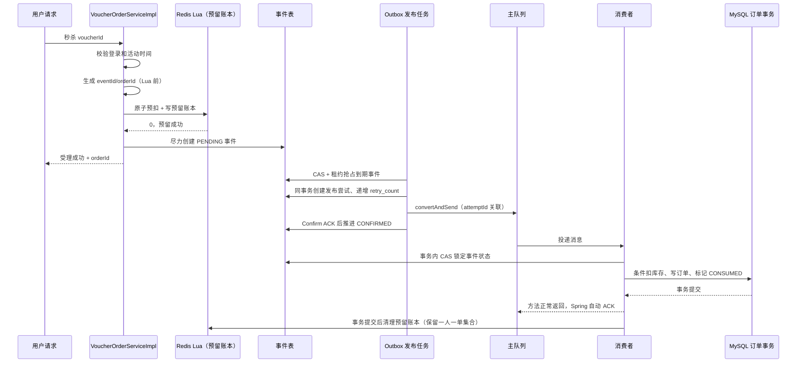

# RabbitMQ 优惠券秒杀可靠性闭环说明与验收

> 本文对应 2026-08-21 完成的秒杀可靠性闭环改造，开发规格见 [`10-rabbitmq-seckill-reliability-development-spec.md`](../development/10-rabbitmq-seckill-reliability-development-spec.md)。
>
> 文档纪律：先说当前代码已实现的部分，再说未验收边界；不虚构压测数据和生产可靠性结论。

## 1. RabbitMQ 在这里解决什么问题

秒杀请求到达时，接口不直接创建 MySQL 订单，而是先用 Redis Lua 完成库存预扣、一人一单判断和预留账本登记，再把订单事件交给 Outbox 任务发布到 RabbitMQ。消费者异步写 MySQL，从而削减请求高峰对数据库的直接冲击。

这套方案的目标是：

- Redis 快速拦截无库存和重复请求，预留账本关闭"Lua 成功、事件未落库"的崩溃窗口。
- MySQL 事件表作为 Outbox，是唯一的生产者重试入口。
- RabbitMQ 缓冲订单写入流量，提供至少一次投递。
- MySQL 条件更新和唯一索引守住最终数据正确性。
- 持久化回滚任务、双向对账和 DLQ 失败处置闭环保证失败不静默丢失。

本项目不追求分布式"恰好一次"：允许消息重复，但不允许重复订单、错误恢复库存、库存为负数或失败静默丢失。

## 2. 队列拓扑

| 组件 | 名称 | 作用 |
| --- | --- | --- |
| 主交换机 | `dianping.seckill.direct` | 接收秒杀订单消息 |
| 主路由键 | `seckill.order.create` | 把订单消息路由到主队列 |
| 主队列 | `dianping.seckill.order.queue` | 保存等待消费的订单消息 |
| 死信交换机 | `dianping.seckill.dlx` | 接收主队列拒绝的消息 |
| 死信路由键 | `seckill.order.dead` | 把死信路由到秒杀专用 DLQ |
| 死信队列 | `dianping.seckill.order.dlq` | 隔离最终无法处理的订单消息，并有独立消费者补充证据 |

交换机、队列和消息均配置为持久化。主队列通过死信参数绑定死信交换机；消息重试耗尽后会被拒绝且不重新进入主队列，随后由 RabbitMQ 转发到 DLQ。

注意：经典队列的死信转发不是可靠持久化边界，消息可能在主队列到 DLQ 之间丢失。因此消费失败的最终持久化事实是 MySQL 的 `tb_seckill_failure_case`，DLQ 只是运维副本。

## 3. 正常秒杀流程



关键顺序变化（相对旧实现）：

- `eventId/orderId` 必须在 Lua 前生成，预留账本才能记录事件归属。
- 请求线程不再直接发布 RabbitMQ 消息，也不做发布重试；只写 PENDING 事件后立即返回"已受理"。
- 统一由 Outbox 发布任务（`SeckillOrderPublishRetryTask`）发送消息。

### 3.1 正常流程逐步拆解

| 阶段 | 执行位置 | 做什么 | 成功后的状态 |
| --- | --- | --- | --- |
| 1. 请求校验 | `VoucherOrderServiceImpl` | 校验参数、登录状态、优惠券是否存在以及活动时间 | 尚未修改 Redis、RabbitMQ、MySQL |
| 2. 生成标识 | `VoucherOrderServiceImpl` | 在 Lua 前生成固定 `orderId` 和随机 `eventId` | 后续所有重发复用这两个 ID |
| 3. Redis 预留 | `SeckillVoucherLuaExecutor.reserve()` | Lua 原子完成：库存检查、用户集合检查、DECR 库存、SADD 用户、写预留详情、写用户事件映射、写待对账 ZSet、写 orderId 反向索引 | Redis 已为该用户预留一份资格并留下账本 |
| 4. 事件落库 | `SeckillOrderEventService.createPending()` | 尽力写入 PENDING；失败不回滚 Redis | MySQL 有了可追踪、可补偿的发布记录 |
| 5. 返回受理 | `VoucherOrderServiceImpl` | 返回 `Result.ok(orderId)`，含义是"已受理" | 请求线程使命结束 |
| 6. Outbox 发布 | `SeckillOrderPublishRetryTask` | 扫描到期事件，CAS + 租约抢占，同事务创建发布尝试并递增 `retry_count`，事务提交后调用一次 `convertAndSend` | 发布尝试已发起 |
| 7. Broker 确认 | `SeckillPublishConfirmHandler` | Confirm Future 完成时同时读取 ACK 与 ReturnedMessage，更新本次尝试 | 事件推进为 CONFIRMED |
| 8. 消费落库 | `VoucherOrderHandler.createOrder()` | 事务内 CAS 锁定事件状态、检查幂等、条件扣 MySQL 库存、插入订单、标记 CONSUMED | 数据库订单事务提交 |
| 9. 消费确认 | Spring AMQP 容器 | 监听方法正常返回后自动 ACK | RabbitMQ 才可以删除这次投递 |
| 10. 预留完成 | `SeckillOrderReconciliationTask` | 执行 `seckill_reservation_complete.lua` 清理账本 | 保留一人一单用户集合 |

### 3.2 三个容易说错的时间点

1. 接口返回 `orderId`：表示请求已通过 Redis 预留并尽力创建了 PENDING 事件；不表示消息已发送，更不表示 MySQL 订单已经创建。
2. Confirm ACK：表示消息到达 RabbitMQ 交换机处理流程，不表示消息一定已经被消费者成功处理。
3. Consumer ACK：当前使用 `acknowledge-mode: auto`，监听方法正常返回后由 Spring ACK；它发生在数据库事务方法成功返回之后。

因此，这套实现采用"异步受理 + 至少一次投递 + 业务幂等"，不能宣称 RabbitMQ 帮项目实现了严格的全链路 exactly-once，也不能在真实故障验收前承诺消息绝不丢失。

## 4. 消息里有什么

`SeckillOrderMessage` 包含：

| 字段 | 作用 |
| --- | --- |
| `eventId` | 消息唯一标识，关联事件表、日志和发布回调 |
| `orderId` | 最终订单主键；重发时保持不变 |
| `userId` | 下单用户，也是 Redis 回滚参数 |
| `voucherId` | 秒杀券 ID，也是库存和回滚参数 |
| `createdAt` | 原消息创建时间 |
| `version` | 消息结构版本，当前为 1 |

每次实际发送还生成唯一 `attemptId`，同时写入 `CorrelationData.id` 和消息 Header。这样 Confirm 回调能精确关联"某一次发送"，而不是把多次发送混在一个 eventId 下。

## 5. 事件状态怎么变化

事件表使用一个受控的主状态机（10 态）：

| 状态 | 含义 | 典型来源 |
| --- | --- | --- |
| `PENDING` | 等待 Outbox 发布或补偿发布 | 请求线程创建事件 |
| `CONFIRMED` | Broker 已确认接收，但订单未必落库 | Confirm ACK |
| `CONSUMED` | 订单事务已完成，业务成功终态 | 订单处理器提交事务 |
| `FAILED` | 旧状态，仅兼容迁移，新代码禁止写入 | 历史数据 |
| `PUBLISH_UNKNOWN` | 存在结果未知的发送尝试 | 同步异常、确认超时 |
| `ROLLBACK_PENDING` | 已决定回滚，等待执行 | 失败决策服务 |
| `ROLLBACK_EXECUTING` | 回滚脚本正在执行 | 回滚任务 CAS 抢占 |
| `ROLLED_BACK` | Redis 已恢复，业务失败终态 | 回滚任务执行成功 |
| `DLQ` | 消息已隔离并持久化失败记录 | 消费重试耗尽 |
| `MANUAL_REVIEW` | 自动处理停止，等待人工核对 | 超过最大尝试/存活时间、证据矛盾 |

主要状态迁移（由 `SeckillOrderEventStateMachine` 强制约束）：

| 原状态 | 允许转入 |
| --- | --- |
| PENDING | CONFIRMED、PUBLISH_UNKNOWN、CONSUMED、ROLLBACK_PENDING、MANUAL_REVIEW |
| PUBLISH_UNKNOWN | CONFIRMED、CONSUMED、ROLLBACK_PENDING、MANUAL_REVIEW |
| CONFIRMED | CONSUMED、DLQ、MANUAL_REVIEW |
| DLQ | PENDING、CONSUMED、ROLLBACK_PENDING、MANUAL_REVIEW |
| ROLLBACK_PENDING | ROLLBACK_EXECUTING、CONFIRMED、CONSUMED、PENDING、MANUAL_REVIEW |
| ROLLBACK_EXECUTING | ROLLED_BACK、ROLLBACK_PENDING、MANUAL_REVIEW |

规则：

- `CONSUMED` 不允许被迟到的 Confirm、Return 或失败回调覆盖。
- `ROLLED_BACK` 后收到迟到消息时禁止创建订单，记录异常并 ACK 隔离。
- 所有状态更新必须带当前状态或 `row_version` 条件（CAS），禁止无条件覆盖。
- 事件表新增租约列（`lease_owner/lease_until/lease_token`）防止多实例并发抢占；租约到期判断使用 MySQL `CURRENT_TIMESTAMP`，避免多实例本地时钟偏差。

## 6. Redis 预留账本

### 6.1 Key 设计

六个 Key 使用相同 hash tag `{voucherId}`，确保在 Redis Cluster 中位于同一槽，Lua 脚本原子执行：

```text
seckill:stock:{voucherId}                 String  可售库存
seckill:order:{voucherId}                 Set     已预留或已下单 userId
seckill:reservation:{voucherId}           Hash    eventId -> 预留详情（orderId|userId|createdAt|version）
seckill:reservation:user:{voucherId}      Hash    userId -> eventId
seckill:reservation:pending:{voucherId}   ZSet    eventId -> reservedAt（待对账）
seckill:reservation:order:{voucherId}     Hash    orderId -> eventId（反向索引）
```

orderId 反向索引是优惠券维度的 Hash（field=orderId，value=eventId），与其他五个 Key 共用 `{voucherId}` Hash Tag，供订单状态查询直接定位预留事件，避免 Lua 操作跨槽 Key 触发 Redis Cluster `CROSSSLOT` 错误。不要把所有秒杀 Key 改成固定 `{seckill}` 标签——那会让全部优惠券集中到同一个槽形成热点。

对账另有辅助 Key `seckill:reservation:manual:{voucherId}`（ZSet，eventId -> 移交时间）：信息不完整的异常预留写人工失败单后由 `seckill_reservation_manual.lua` 原子转入，避免持续异常的排头记录永久阻塞待对账 ZSet 中后面的正常记录。

### 6.2 四个 Lua 脚本

| 脚本 | 职责 | 关键规则 |
| --- | --- | --- |
| `seckill.lua` | 预留 | 一次原子完成库存检查、用户检查、DECR、SADD、四个账本写入（预留详情、用户事件映射、待对账 ZSet、orderId 反向索引）；库存 Key 不存在返回 3，不足返回 1，重复用户返回 2 |
| `seckill_rollback.lua` | 事件级回滚 | 按 `eventId + userId` 校验；映射不存在返回 0（幂等）；映射指向其他事件返回 -2（冲突，禁止动库存）；只有确实移除用户时才 INCR 库存，并同步 HDEL orderId 反向索引 |
| `seckill_reservation_complete.lua` | 预留完成 | 校验映射匹配后删除账本（含 orderId 反向索引），但保留一人一单用户集合；重复执行幂等成功 |
| `seckill_reservation_manual.lua` | 异常预留移交人工 | 对账写人工失败单成功后先 `ZSCORE` 确认源成员，再 `ZADD` 人工集合，最后 `ZREM` 待对账入口；目标写入失败时保留源入口，已不在待对账集合返回 0（幂等） |

**面试点：** 回滚为什么按 `eventId + userId` 而不是只按 userId？因为同一用户可能先预留事件 A、回滚后再预留事件 B。如果只按用户回滚，事件 A 的迟到回滚会误删事件 B 的预留。用户事件映射（userId -> eventId）保证了"只有当前持有预留的事件才能回滚它"。

**面试点：** 预留账本解决什么崩溃窗口？旧实现里 Redis 预扣成功后、事件落库前崩溃，会留下没有事件记录的预扣，只能靠人工发现。预留账本把这个事实持久化在 Redis 中（待对账 ZSet），对账任务可以按账本幂等补建 PENDING 事件，或核对订单后收敛状态。

## 7. 各类失败怎么处理

### 7.1 失败决策服务（核心变化）

旧实现里 Confirm NACK、Return、发送异常各自为政地决定回滚，容易误回滚。新实现中所有回调只记录证据，统一由 `SeckillOrderFailureDecisionService` 决策：

决策顺序不可调整：

1. 查询 MySQL 订单。订单存在：事件收敛为 CONSUMED，安排 Redis 预留完成，禁止回滚。
2. 订单不存在，检查发布尝试和事件状态。
3. 只要存在"ACK 且没有 Return"的可路由尝试，或存在"没有 Return 的 WAITING/UNKNOWN 尝试"，就不能自动回滚。
4. 所有尝试都明确 NACK 或 Return，且没有消费证据，才能进入 ROLLBACK_PENDING。
5. 临时消费异常进入有限重放。
6. 永久消息异常、数据冲突或证据矛盾进入 MANUAL_REVIEW。

决策服务拆成两层：纯决策函数只根据订单、事件、尝试快照返回决策，不访问 Redis/RabbitMQ；执行层通过 CAS 落状态或创建任务。这样决策逻辑可以完整单元测试。

### 7.2 失败场景总表

| 场景 | 处理方式 | 是否回滚 Redis |
| --- | --- | --- |
| 请求校验或 Lua 预扣失败 | 直接返回明确结果，不创建事件 | 否（预留未成功） |
| Redis 预留成功，事件写入失败 | 不回滚；对账任务按预留账本补建 PENDING 事件 | 否 |
| Outbox 发布同步异常 | 尝试记为异常，事件转 PUBLISH_UNKNOWN，按退避重试 | 否 |
| Confirm NACK | 尝试记 NACK；决策服务综合所有尝试判断 | 视决策结果 |
| Return（不可路由） | 尝试记 returned；决策服务综合判断 | 视决策结果 |
| 确认超时（WAITING 超时） | `SeckillPublishConfirmTimeoutTask` 标记未知并安排重试 | 否 |
| 超过最大尝试/存活时间 | 转 MANUAL_REVIEW，停止自动发布 | 否（人工判断） |
| 消费临时技术异常 | 1/2/4 秒有限重试（`SeckillRetryableException`） | 否 |
| 消息字段/版本错误 | 不重试直接 DLQ（`SeckillPermanentMessageException`） | 否 |
| 库存/状态冲突 | 持久化失败记录进人工（`SeckillConsistencyException`） | 否 |
| 消费重试耗尽 | 先落 `tb_seckill_failure_case`，再拒绝进 DLQ | 否，等人工/对账 |
| 重复消息或重复订单 | 查询和唯一索引识别为幂等成功，标记 CONSUMED | 否 |
| 回滚决定后 | `SeckillReservationRollbackTask` 按 eventId 执行回滚 Lua | 是（持久化任务） |

### 7.3 请求校验或 Redis 预留失败

- 参数错误、未登录、优惠券不存在、尚未开始或已经结束：直接返回失败，三个存储均不产生秒杀订单状态。
- Lua 返回 `1`：Redis 库存不足；`2`：用户已在购买集合；`3`：库存 Key 未初始化。
- Redis 调用超时（结果未知）：尽力按 `voucherId + userId` 查询用户事件映射，找到预留则返回原 `orderId` 或"处理中"；Redis 仍不可用返回"请求结果确认中"，不描述成确定失败。

### 7.4 Redis 预留成功，但 PENDING 事件写入失败

旧实现会立即执行回滚 Lua，但 `createPending()` 抛异常不等于数据库一定没有提交，存在误回滚风险。新实现：

```text
Redis 已扣库存并写预留账本
  -> createPending() 失败
  -> 不回滚，接口仍返回受理结果（或按实现返回处理中）
  -> 对账任务扫描 reservation:pending 超过阈值的 eventId
  -> MySQL 订单存在：事件收敛 CONSUMED
  -> 事件不存在：按预留详情幂等补建 PENDING 事件
  -> 信息不完整：写失败记录转人工，禁止猜测回滚
```

### 7.5 发布结果未知

Outbox 是唯一重试控制者。快速重试 1/2/4 秒，慢速补偿 30 秒/2 分钟/10 分钟/30 分钟（`SeckillPublishRetryPolicy`），超过最大尝试次数或最大存活时间转 MANUAL_REVIEW。

`spring.rabbitmq.template.retry` 已禁用，避免模板重试与 Outbox 重试相乘。

**面试点：** 生产者 Outbox 重试处理进程崩溃、长时间未确认和跨调用的可靠恢复；消费者重试处理消息已到队列但落库暂时失败。两者不在同一层次，也不允许再有第三个入口（如请求线程直接重试）。

### 7.6 Confirm、Return 与确认超时

- 每次发送使用唯一 `CorrelationData(attemptId)`，Confirm Future 完成时同时读取 Confirm 结果与 `getReturnedMessage()`，在一个结果处理器（`SeckillPublishConfirmHandler`）中更新发送尝试。
- ACK 且无 Return：消息已被目标队列接收，事件推进 CONFIRMED。
- ACK 且有 ReturnedMessage：交换机收到消息但没有路由到队列，该次尝试明确未投递。
- NACK：Broker 拒绝承担该次消息。
- 同步异常、连接关闭或确认超时：记为 UNKNOWN，不能推断消息一定未到 Broker。
- `SeckillPublishConfirmTimeoutTask` 扫描超过可配置确认超时时间仍为 WAITING 的尝试，标记未知并安排事件重试。
- 迟到回调不得覆盖 CONSUMED、ROLLED_BACK 等终态。

RabbitMQ 对 mandatory 不可路由消息保证先发送 `basic.return`，再发送 publisher confirm；Spring AMQP 2.2 保证在 Confirm Future 完成前把 ReturnedMessage 写入 CorrelationData，因此不需要人为增加"等待 Return 的猜测窗口"。

### 7.7 消费失败与异常分类

消费者异常分为三类：

```text
SeckillRetryableException          数据库连接、超时、死锁等临时故障 -> 1/2/4 秒有限重试
SeckillPermanentMessageException   字段、版本、反序列化等永久错误 -> 不重试直接 DLQ
SeckillConsistencyException        Redis/MySQL 库存或事件状态冲突 -> 持久化失败记录进人工
```

数据库库存不足不是普通瞬时异常，它表示 Redis 和 MySQL 可能不一致，抛 `SeckillConsistencyException`。

消费事务（`VoucherOrderHandler.createOrder()`）内的状态保护：

1. 事务内 CAS 检查事件状态。
2. CONSUMED：幂等返回。
3. ROLLED_BACK：禁止创建订单，记录迟到消息异常。
4. ROLLBACK_EXECUTING：抛可重试异常，等回滚收敛。
5. ROLLBACK_PENDING：先 CAS 取消回滚（转回 PENDING），成功后才继续。
6. 查询已有订单；存在则标记 CONSUMED。
7. 条件扣减 MySQL 库存。
8. 写订单。
9. 标记事件 CONSUMED。
10. 事务提交后由监听容器自动 ACK。

**面试点：** 为什么要设置 ROLLBACK_EXECUTING 状态？为了处理"回滚 Lua 已恢复库存、数据库状态还未更新"的窗口。这个状态下消费者并发到达时抛可重试异常等待收敛，防止"库存已恢复 + 订单同时创建"的双重成功。

### 7.8 监听器之前的转换失败

反序列化和消息转换异常可能发生在 `@RabbitListener` 方法执行前，普通消费者代码无法捕获。`SeckillRabbitListenerErrorHandler`（容器 ErrorHandler）从失败的原始 AMQP Message 提取 messageId、Header 和受限长度的消息摘要，先持久化失败记录，再拒绝进入 DLQ；持久化失败时强制重新入队。禁止把无法转换的原始消息无限完整写入日志或数据库。

### 7.9 重试耗尽与 DLQ 闭环

```text
消费重试耗尽
  -> MessageRecoverer 先幂等写入 tb_seckill_failure_case（独立事务先提交）
  -> 同一事务把事件改为 DLQ
  -> 事务提交后再拒绝消息（requeue=false），由 Broker 死信机制转入 DLQ
  -> SeckillOrderDeadLetterConsumer 读取死信和 x-death 信息补充失败记录
  -> 事件已 CONSUMED 的按幂等成功关闭失败记录
  -> 失败记录落库失败时抛 ImmediateRequeueAmqpException，禁止 ACK 或丢弃
```

失败处置由 `SeckillOrderFailureAdminService` 提供（重放/回滚/关闭 + 审计），因项目没有 RBAC，暂不暴露 Controller。重放必须复用原 eventId/orderId、检查订单是否已存在、限制 replayCount、记录操作者和原因，且不允许直接调用 RabbitTemplate 绕过 Outbox——事件重新置为 PENDING，由发布任务统一发送。

**面试点：** 为什么失败记录和拒绝异常不能放在同一个数据库事务？因为最终抛出的拒绝异常会把刚写入的失败记录一起回滚。所以失败记录由独立 Service 的 `@Transactional` 方法先提交完成，Recoverer 返回后再执行拒绝。

### 7.10 重复投递与 Consumer ACK 丢失

幂等顺序：

1. 消费事务先 CAS 检查事件状态；CONSUMED 直接幂等返回。
2. 按 `(user_id, voucher_id)` 查询订单；已存在则只标记 CONSUMED。
3. 并发请求同时通过查询时，数据库联合唯一索引最终拦截。
4. 插入抛 `DuplicateKeyException` 时，事务回滚本次库存扣减；消费者再查询订单，确认存在后按幂等成功处理。
5. 固定 `orderId` 避免同一事件重发时生成不同订单主键。

### 7.11 进程崩溃窗口

| 崩溃位置 | 结果 | 兜底 |
| --- | --- | --- |
| Redis 预留前 | 没有预留、没有事件 | 用户可重新请求 |
| Redis 预留后、事件写入前 | Redis 有账本，MySQL 无事件 | 对账任务按预留账本补建 PENDING 事件（缺口已关闭） |
| 事件写入后、Outbox 发布前 | 事件保持 PENDING | 到期扫描触发发布 |
| Outbox 抢占后、发布前崩溃 | 租约未释放 | 租约到期后其他实例可重新抢占 |
| Broker 收到消息、Confirm 回调前 | 可能重复补发 | 固定 ID、唯一索引和消费者幂等兜底 |
| 回滚 Lua 成功后、事件更新前 | Redis 已恢复，事件仍 ROLLBACK_EXECUTING | 对账任务按预留是否仍存在收敛状态 |
| 数据库事务提交后、Consumer ACK 前 | Broker 可能重新投递 | 消费者识别已有订单按幂等成功返回 |

## 8. 持久化回滚任务

`SeckillReservationRollbackTask`：

1. 扫描 ROLLBACK_PENDING 到期事件。
2. 再次查询 MySQL 订单；存在则改为 CONSUMED，禁止回滚。
3. CAS 改为 ROLLBACK_EXECUTING 并记录执行令牌。
4. 调用按 eventId 校验的回滚 Lua。
5. Lua 返回 1 或 0，标记 ROLLED_BACK。
6. 返回 -1、-2 或抛异常，恢复为 ROLLBACK_PENDING 并按 `SeckillRollbackRetryPolicy` 退避重试（第 1～4 次失败依次退避 5/30/300/1800 秒）。
7. 达到上限后进入 MANUAL_REVIEW，并持久化失败记录。

## 9. Redis/MySQL 双向对账

对账采用"快速扫描 + 永久兜底扫描"两层任务，保证任意历史优惠券的孤儿预留都有发现入口：

- **快速任务**：每分钟扫描最近 7 天（`reservation-voucher-lookback-days`）内开始/结束的优惠券，负责时效。
- **安全任务**：每小时（`safety-scan-cron`，默认 `0 0 * * * *`）按游标分页（`WHERE voucher_id > ? ORDER BY voucher_id LIMIT N`）扫描全部 `tb_seckill_voucher`，负责最终一致性；即使故障持续超过 7 天，孤儿预留仍能被兜底发现。

两层任务针对每个 `voucherId` 只读取 `seckill:reservation:pending:{voucherId}`，并继续使用 `reservation-threshold-minutes` 过滤未到期预留，分批处理，禁止全量 Scan 阻塞 Redis，也不使用 Redis `KEYS` 作为核心兜底。

**异常预留不阻塞排头：** 每轮固定读取待对账 ZSet 最早 N 条，信息不完整的记录若只写人工失败单仍留在原处，当前排记录持续异常会永久阻塞后面的正常记录。因此失败单落库成功后，由 `seckill_reservation_manual.lua` 在同槽脚本中先确认源成员、写入人工集合，再移除待对账入口。Redis Lua 的原子性不等于运行时错误回滚；这个顺序保证 `ZADD` 因类型异常等原因失败时，原待对账入口仍然存在，下一轮可以重试。

| 方向 | 检查内容 | 收敛动作 |
| --- | --- | --- |
| Redis 预留 → MySQL | `reservation:pending` 超过阈值的 eventId | 订单存在收敛 CONSUMED；事件不存在按账本补建 PENDING；信息不完整转人工 |
| MySQL 事件 → Redis | CONSUMED 未清理预留、ROLLED_BACK 残留、ROLLBACK_EXECUTING 超时、PUBLISH_UNKNOWN 超时 | 执行预留完成脚本；确认已清理；按预留存在性收敛；超时转 MANUAL_REVIEW |
| 库存账面一致性 | `MySQL 库存 - Redis 库存 - 待对账预留数` | divergence > 0 或库存值非法写失败记录转人工；滞后窗口仅计指标 |

库存重建安全公式（禁止简单 `Redis = MySQL`）：

```text
Redis 可售库存 = MySQL 当前剩余库存 - 尚未创建订单但仍有效的 Redis 预留数
```

用户集合由"MySQL 已下单用户 + 有效预留用户"重建。

## 10. 库存安全初始化

`VoucherServiceImpl` 通过 `seckill_stock_init.lua` 原子初始化：

1. 库存 Key 已存在：幂等成功，不覆盖。
2. 库存 Key 不存在但用户集合或预留 Key 已存在：返回冲突，写失败记录转人工，禁止清空。
3. 所有相关 Key 都不存在：写入初始库存。

禁止无条件 `delete(orderKey)`。`SeckillStockInitScanTask` 定期扫描 MySQL 有秒杀券但 Redis 库存 Key 缺失的情况，调用安全初始化逻辑；有历史用户或预留数据时进入人工处理。初始化执行失败时也由该任务补偿。

## 11. 订单状态查询

推荐接口 `GET /voucher-order/status/{voucherId}/{orderId}`：通过券维度的 orderId 反向索引 Hash 直接定位 Redis 预留事件，查询精确且不依赖扫描。旧接口 `GET /voucher-order/status/{orderId}` 暂时保留兼容：先查 MySQL 订单和事件表，无法定位 Redis 预留时返回 `UNAVAILABLE`（不误报 `NOT_FOUND`）。秒杀受理响应中同时返回 `orderId` 和 `voucherId`，前端应逐渐迁移到新接口。

返回六种状态：

| 状态 | 含义 |
| --- | --- |
| `PROCESSING` | 已预留或正在发布/消费 |
| `SUCCESS` | MySQL 订单已创建 |
| `FAILED` | 已安全回滚 |
| `MANUAL_REVIEW` | 自动流程无法判断 |
| `NOT_FOUND` | 无订单、事件和预留证据 |
| `UNAVAILABLE` | 依赖暂时不可用，当前无法判断 |

裁决顺序：MySQL 订单 → 事件状态 → Redis 预留。只能查询自己的订单（他人订单按 NOT_FOUND 处理，不泄露存在性）；只有相关数据源都成功查询且确实没有记录才返回 NOT_FOUND；MySQL 或 Redis 查询失败返回 UNAVAILABLE，禁止把技术故障伪装成"订单不存在"。

## 12. 相关代码

| 职责 | 类 |
| --- | --- |
| 秒杀入口与状态查询 | `VoucherOrderServiceImpl` |
| Redis 预留/回滚/完成/初始化 | `SeckillVoucherLuaExecutor`、`seckill.lua`、`seckill_rollback.lua`、`seckill_reservation_complete.lua`、`seckill_stock_init.lua` |
| RabbitMQ 拓扑和重试 | `RabbitMqConfig` |
| 消息和关联数据 | `SeckillOrderMessage`、`SeckillOrderCorrelationData` |
| Outbox 发布 | `SeckillOrderPublishRetryTask`、`SeckillOrderPublisher`、`SeckillPublishRetryPolicy` |
| Confirm/Return 处理 | `SeckillPublishConfirmHandler`、`RabbitMqPublisherCallback`、`SeckillPublishConfirmTimeoutTask` |
| 发布尝试证据 | `SeckillPublishAttemptService`、`SeckillPublishAttempt` |
| 失败决策 | `SeckillOrderFailureDecisionService` |
| 事件状态机与租约 | `SeckillOrderEventStateMachine`、`SeckillOrderEventService`、`SeckillOrderEvent` |
| 消费消息 | `SeckillOrderConsumer`、`SeckillRabbitListenerErrorHandler` |
| 数据库事务 | `VoucherOrderHandler` |
| 持久化回滚 | `SeckillReservationRollbackTask`、`SeckillRollbackRetryPolicy` |
| 双向对账 | `SeckillOrderReconciliationTask` |
| 库存扫描 | `SeckillStockInitScanTask` |
| DLQ 闭环 | `SeckillOrderDeadLetterConsumer`、`SeckillFailureEvidence` |
| 失败记录与处置 | `SeckillFailureCaseService`、`SeckillOrderFailureAdminService` |
| 库存安全初始化 | `VoucherServiceImpl` |

## 13. 源码阅读路径与建议

### 13.1 第一遍：先建立组件地图

1. [`application.yaml`](../../src/main/resources/application.yaml)：确认 RabbitMQ 地址、Confirm、消费者开关和 `dish-review.seckill.*` 全部任务参数。
2. [`RabbitMqConstants.java`](../../src/main/java/com/dish/review/utils/RabbitMqConstants.java)：主交换机、主队列、路由键和死信拓扑。
3. [`SeckillOrderEvent.java`](../../src/main/java/com/dish/review/entity/SeckillOrderEvent.java)：10 态主状态机、租约列、row_version。
4. [`SeckillOrderEventStateMachine.java`](../../src/main/java/com/dish/review/service/SeckillOrderEventStateMachine.java)：合法迁移表。
5. 五个 Lua 脚本：预留、回滚、完成、初始化、异常移交人工各自的返回码语义。

第一遍只需回答：

- 一次秒杀从请求到订单落库经过哪些组件？
- 哪些状态是终态？迟到回调为什么不能覆盖终态？
- Outbox 为什么是唯一生产者入口？
- `attemptId` 和 `eventId` 为什么是两个概念？

### 13.2 第二遍：顺着正常链路阅读

```text
VoucherOrderController.seckillVoucher()
  -> VoucherOrderServiceImpl.seckillVoucher()   // ID 前置 + Lua 预留 + 尽力写事件
  -> SeckillOrderPublishRetryTask（Outbox）      // CAS 抢占 + 创建尝试 + convertAndSend
  -> SeckillPublishConfirmHandler               // Confirm Future + ReturnedMessage
  -> SeckillOrderConsumer.consume()
  -> VoucherOrderHandler.createOrder()          // 事务内 CAS + 条件扣库存 + 写订单
  -> SeckillOrderReconciliationTask             // 预留完成清理
```

建议记录每一步对三个存储的影响：

| 步骤 | Redis | RabbitMQ | MySQL |
| --- | --- | --- | --- |
| Lua 预留 | 库存减一、用户入 Set、三份账本 | 无 | 无 |
| 事件落库 | 不变 | 无 | 新增 PENDING |
| Outbox 发布 | 不变 | 消息进入队列（待 Confirm） | 新增发布尝试、retry_count+1 |
| Confirm ACK | 不变 | 消息可被投递 | CONFIRMED |
| 消费提交 | 不变 | 等待 ACK 删除消息 | 扣库存、建订单、CONSUMED |
| 预留完成 | 清理账本（保留用户集合） | 无 | 无 |

### 13.3 第三遍：倒推失败链路

1. 事件写入失败：为什么不回滚？对账任务如何按账本补建？
2. 发布同步异常：事件为什么转 PUBLISH_UNKNOWN 而不是 FAILED？
3. Confirm NACK / Return：尝试表记录什么？决策服务第 3、4 条规则如何阻止误回滚？
4. 确认超时：`SeckillPublishConfirmTimeoutTask` 如何标记未知？
5. 消费三类异常：分别走到哪里（重试/DLQ/人工）？
6. 回滚与消费并发：`ROLLBACK_PENDING → PENDING` 的 CAS 取消如何工作？
7. 重试耗尽：失败记录、事件 DLQ 状态和 Broker DLQ 的写入顺序为什么重要？
8. 监听前转换失败：ErrorHandler 为什么不能依赖业务 Listener？
9. 重复投递：CAS + 查询 + 唯一索引三层幂等如何配合？

### 13.4 第四遍：回扣数据库和运维边界

- [`20260821_seckill_reliability_upgrade.sql`](../../src/main/resources/db/migration/20260821_seckill_reliability_upgrade.sql)：事件表新列、发布尝试表、失败记录表。
- [`20260822_add_seckill_failure_audit.sql`](../../src/main/resources/db/migration/20260822_add_seckill_failure_audit.sql)：失败处置审计表。
- 上线迁移顺序见规格 17.1 节：备份 → 加列加表 → 暂停入口 → 逐条核对旧事件（旧 FAILED 只能转 MANUAL_REVIEW）→ 兼容部署 → 小流量验证。

### 13.5 阅读完成的自测标准

1. 为什么 `eventId/orderId` 必须在 Lua 前生成？
2. 预留账本的六个 Key 分别解决什么问题？为什么必须同槽（含 orderId 反向索引）？
3. 事件写入失败为什么不立即回滚 Redis？对账任务如何补救？
4. Outbox 发布任务的租约机制防什么？进程崩溃后如何恢复？
5. 决策服务为什么禁止"最后一次发送失败"推断"从未到达"？
6. 消费者遇到 ROLLBACK_PENDING / ROLLBACK_EXECUTING 分别怎么处理？
7. 失败记录为什么必须先于拒绝消息提交？
8. NOT_FOUND 和 UNAVAILABLE 的区别是什么？为什么查询失败不能返回 NOT_FOUND？

## 14. 高频面试追问与参考回答

### 14.1 为什么秒杀入口用了 Redis Lua，还要 RabbitMQ？

Lua 解决高并发请求的快速判断和原子预留，RabbitMQ 解决流量缓冲与异步落库。两者分别负责"快速取得下单资格"和"异步完成订单"。

### 14.2 什么是 Outbox 模式？项目怎么实现的？

业务操作和消息发送之间存在崩溃窗口。Outbox 把"要发送的消息"先持久化到数据库（事件表），再由独立任务扫描并发送。项目中事件表就是 Outbox：请求线程只写 PENDING 事件，`SeckillOrderPublishRetryTask` 是唯一发布入口，通过 CAS + 租约抢占事件，同事务记录发布尝试，事务提交后调用一次 `convertAndSend`。这样即使发布前进程崩溃，事件仍在数据库，到期后会被重新扫描发送。

### 14.3 为什么禁止请求线程直接发布消息？

三个原因：请求线程无法可靠地做发布重试（进程崩溃即丢失上下文）；模板重试和事件补偿叠加后发送次数无法解释；发布结果未知时请求线程容易做出误回滚决策。统一收到 Outbox 后，重试次数、租约和发送证据都可解释、可审计。

### 14.4 预留账本是什么？解决什么问题？

Redis 侧的五份结构化记录（库存、用户集合、事件预留详情、用户事件映射、待对账 ZSet），解决"Lua 预扣成功后、事件落库前崩溃"的窗口：预扣事实不再只存在于库存数字的变化里，而是有独立账本可查。对账任务据此补建事件或核对订单，不再需要人工发现。

### 14.5 为什么回滚必须按 eventId 校验？

同一用户可能先预留事件 A、回滚后再预留事件 B。按用户回滚会让事件 A 的迟到回滚误删事件 B 的预留并错误恢复库存。用户事件映射（userId -> eventId）配合 Lua 校验，保证只有当前持有预留的事件才能回滚它。

### 14.6 发布结果未知为什么不能回滚？

网络异常只说明生产者没有拿到确定结果，消息可能已经到达 Broker。此时恢复 Redis 资格会允许用户再次下单，而原消息仍可能被消费，形成重复订单。决策服务的规则是：存在 ACK 且无 Return 的可路由尝试、或存在未知尝试时，一律禁止自动回滚。

### 14.7 项目如何保证不重复下单？

Redis 用户集合在入口拦截；消费事务 CAS 检查事件状态；消费者查询已有订单；固定 `orderId/eventId` 保持业务身份；MySQL `(user_id, voucher_id)` 联合唯一索引最终防线；重复键异常只有在确认订单确实存在后才按幂等成功处理。

### 14.8 为什么不能做到 exactly-once？

RabbitMQ、Redis 和 MySQL 是独立系统，没有共享本地事务。生产者可能丢失确认，消费者也可能在数据库提交后丢失 ACK，因此消息可能重复投递。项目选择 at-least-once 思路，通过重试保证尽量到达，再通过数据库事务和业务幂等消化重复。

### 14.9 DLQ 消息为什么不能直接恢复库存？

进入 DLQ 只说明消费端最终没有正常返回，并不能证明数据库订单一定不存在（例如事务已提交只是 ACK 丢失）。必须先按 `eventId/orderId/userId/voucherId` 核对订单、事件和预留，由失败处置 Service 决定重放、回滚或关闭。且经典队列死信转发本身不是可靠边界，MySQL 失败记录才是持久化事实。

### 14.10 回滚和消费并发怎么办？

回滚决定后事件进入 ROLLBACK_PENDING；消费者到达时先 CAS 取消回滚（转回 PENDING）才继续创建订单，失败则等待。回滚任务执行时事件处于 ROLLBACK_EXECUTING，消费者遇到该状态抛可重试异常等待收敛。CAS + 状态机保证回滚和消费不会同时成功。

### 14.11 订单状态查询为什么有 UNAVAILABLE？

如果 MySQL 或 Redis 查询失败时返回 NOT_FOUND，用户会以为订单不存在而重新下单，技术故障被伪装成业务结果。UNAVAILABLE 明确表示"当前无法判断"，前端可提示稍后再查。

### 14.12 对账任务为什么分批？库存为什么不能直接覆盖？

分批防止全量 Scan 阻塞 Redis。库存直接覆盖（Redis = MySQL）会把仍在途的有效预留再次卖出，造成超卖；安全公式是"MySQL 剩余库存减去尚未创建订单但仍有效的预留数"。

### 14.13 面试时怎样用一分钟讲完整方案？

> 秒杀入口先校验活动，生成固定 eventId/orderId 后用 Redis Lua 原子完成库存预扣、一人一单判断和预留账本登记，再尽力写 PENDING 事件后立即返回受理结果。Outbox 任务是唯一生产者入口，CAS 加租约抢占到期事件，同事务记录发布尝试，事务提交后发送持久化消息。Confirm/Return 回调只按 attemptId 落证据，统一失败决策服务依据订单、尝试和预留快照判断：订单存在优先收敛 CONSUMED，存在可路由或未知尝试禁止回滚，全部明确失败才进入持久化回滚任务按 eventId 执行回滚 Lua。消费者事务内先 CAS 锁定事件状态再条件扣库存写订单；异常分三类处理，重试耗尽先落失败记录再进 DLQ，DLQ 消费者补充 x-death 证据。定时对账双向核对 Redis 预留与 MySQL 事件并检查库存账面一致性，用户侧提供六态订单状态查询。真实 RabbitMQ 故障演练和并发压测尚未完成。

## 15. 启用条件

消费者默认关闭，RabbitMQ 可达且账号、交换机、队列声明正常后再设置：

```bash
export RABBITMQ_HOST=115.29.220.133
export RABBITMQ_PORT=5672
export RABBITMQ_USERNAME=实际账号
export RABBITMQ_PASSWORD=实际密码
export SECKILL_RABBIT_CONSUMER_ENABLED=true
```

任务参数（批次大小、租约时长、确认超时、回滚退避、对账阈值、失败重放上限等）均支持 `SECKILL_*` 环境变量覆盖，见 `application.yaml` 的 `dish-review.seckill` 节。

不要把示例中的账号文字直接当作真实配置提交到仓库。

## 16. 验收结果

### 2026-08-21 可靠性闭环改造

| 验收项 | 结果 | 说明 |
| --- | --- | --- |
| Java 8 全量源码编译 | PASS | 编译通过 |
| 单元测试 | PASS | 185 个测试全部通过（含回滚退避、兜底扫描、异常预留安全移交人工、路径穿越用例矩阵、`SecurityFixTests`） |
| 状态机单元测试 | PASS | 所有允许与禁止的迁移、迟到回调不覆盖 CONSUMED |
| 失败决策单元测试 | PASS | 订单存在优先、未知禁止回滚、全部明确失败才回滚 |
| 回滚/对账/扫描任务测试 | PASS | 事件级回滚幂等、孤儿预留补建、库存账面一致性 |
| DLQ 闭环测试 | PASS | 失败记录幂等、监听前 ErrorHandler、审计记录 |
| 数据库迁移 SQL | 静态检查通过 | 新增列与三张表；未授权不在线执行 |
| RabbitMQ 端到端 | 未执行 | 需要真实环境故障演练（见已知边界） |
| 重复消费和并发压测 | 未执行 | 需要 RabbitMQ 恢复后验证 |

当前不能声称"RabbitMQ 秒杀已通过真实环境验收"。

## 17. 已知边界

- 真实 RabbitMQ 故障注入（交换机不存在、routing key 错误、Confirm 丢失、DLX 目标不可用等规格 18.4 节场景）尚未执行。
- 跨存储崩溃窗口（Lua 成功后进程终止、回滚 Lua 后进程终止等规格 18.5 节场景）尚未真实演练，仅单元测试覆盖逻辑。
- 上线迁移（规格 17.1 节）步骤 1-2 已于 2026-08-21 获授权在远程环境执行：事件表已备份（`tb_seckill_order_event_bak_20260821`）、两个新迁移已应用并验证表结构；事件表当前为空，无存量 FAILED 事件需转 MANUAL_REVIEW。步骤 3-8（存量核对、Redis 用户集合补录、兼容部署、小流量验证）待真实流量上线前逐步执行。
- 失败处置 Service 没有 Controller：项目没有 RBAC，重放/回滚/关闭接口禁止在无管理员授权模型下暴露公网。
- 消费者默认关闭（`SECKILL_RABBIT_CONSUMER_ENABLED=false`），真实连通性验收后才能启用。
- 部署可靠性前提（Redis 持久化策略、RabbitMQ 集群与 quorum queue、心跳配置等规格 19.1 节）未逐项确认。

## 18. 面试简述

> 秒杀链路采用 Redis Lua 原子预留（含六 Key 同槽预留账本与 orderId 反向索引）、MySQL 事件 Outbox、RabbitMQ 至少一次投递、数据库幂等消费、持久化回滚和双层定时对账（7 天快速扫描 + 全量分页兜底）实现最终一致性；对结果未知的发送不直接恢复库存，而是依据订单、发送尝试和预留记录完成状态判定；消费失败先落 MySQL 失败记录再进 DLQ，人工处置走审计流程。真实故障演练和并发压测是明确的下一步。
