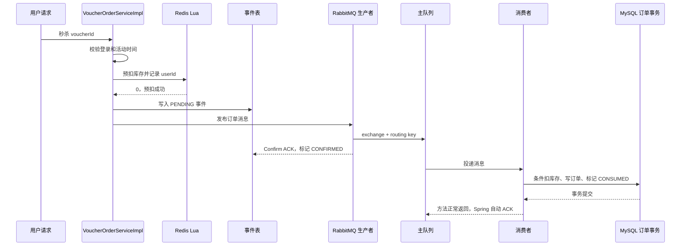

# RabbitMQ 优惠券秒杀链路说明与验收

## 1. RabbitMQ 在这里解决什么问题

秒杀请求到达时，接口不直接创建 MySQL 订单，而是先用 Redis Lua 完成库存预扣和一人一单判断，再把订单消息发送到 RabbitMQ。消费者异步写 MySQL，从而削减请求高峰对数据库的直接冲击。

这套方案的目标是：

- Redis 快速拦截无库存和重复请求。
- RabbitMQ 缓冲订单写入流量。
- MySQL 条件更新和唯一索引守住最终数据正确性。
- 事件表记录消息状态，为发布结果未知和失败补偿提供依据。

## 2. 队列拓扑

| 组件 | 名称 | 作用 |
| --- | --- | --- |
| 主交换机 | `dianping.seckill.direct` | 接收秒杀订单消息 |
| 主路由键 | `seckill.order.create` | 把订单消息路由到主队列 |
| 主队列 | `dianping.seckill.order.queue` | 保存等待消费的订单消息 |
| 死信交换机 | `dianping.seckill.dlx` | 接收主队列拒绝的消息 |
| 死信路由键 | `seckill.order.dead` | 把死信路由到秒杀专用 DLQ |
| 死信队列 | `dianping.seckill.order.dlq` | 隔离最终无法处理的订单消息 |

交换机、队列和消息均配置为持久化。主队列通过死信参数绑定死信交换机；消息重试耗尽后会被拒绝且不重新进入主队列，随后由 RabbitMQ 转发到 DLQ。

## 3. 正常秒杀流程



关键顺序是“Redis 预扣 → 事件落库 → 发布消息”。事件必须先落库，否则生产者发生异常时没有持久化依据进行补偿。

## 4. 消息里有什么

`SeckillOrderMessage` 包含：

| 字段 | 作用 |
| --- | --- |
| `eventId` | 消息唯一标识，关联事件表、日志和发布回调 |
| `orderId` | 最终订单主键；重发时保持不变 |
| `userId` | 下单用户，也是 Redis 回滚参数 |
| `voucherId` | 秒杀券 ID，也是库存和回滚参数 |
| `createdAt` | 原消息创建时间 |
| `version` | 消息结构版本，当前为 1 |

生产者还把关键 ID 写入 Header。Confirm 使用 `SeckillOrderCorrelationData` 找到事件并取得回滚参数；Return 使用消息 Header 完成同样的定位。

## 5. 事件状态怎么变化

| 状态 | 含义 | 典型来源 |
| --- | --- | --- |
| `PENDING` | 等待发布确认或补偿重发 | 发布前创建事件 |
| `CONFIRMED` | RabbitMQ 已接收消息，但订单未必落库 | Confirm ACK |
| `CONSUMED` | 消费事务已完成 | 订单处理器提交事务 |
| `FAILED` | 已确定发布失败或消费最终失败 | NACK、Return、重试耗尽 |

正常状态是 `PENDING → CONFIRMED → CONSUMED`。如果消费者先于 Confirm 回调完成，也允许 `PENDING → CONSUMED`；后到的 ACK 会把它视为幂等成功，不会倒退状态。

## 6. 各类失败怎么处理

| 场景 | 处理方式 | 是否立即回滚 Redis |
| --- | --- | --- |
| 发送方法抛出连接异常 | 结果可能未知，事件保持 PENDING，安排 1/2/4 秒补偿 | 否 |
| Confirm NACK | 先标记 FAILED，再执行回滚 Lua | 是 |
| Return，不可路由 | 先记录返回原因并标记 FAILED，再执行回滚 Lua | 是 |
| 消费时数据库临时异常 | 监听器按 1/2/4 秒有限重试 | 否 |
| 消息字段或版本错误 | 判定为永久错误，不做无意义重试 | 否 |
| 消费重试耗尽 | MessageRecoverer 标记 FAILED，拒绝消息并进入 DLQ | 否，等待对账 |
| 重复消息或重复订单 | 查询和唯一索引识别为幂等成功，标记 CONSUMED | 否 |

不能在所有发送异常中直接恢复 Redis，因为生产者收到网络异常时，消息可能已经到达 RabbitMQ。此时立即恢复购买资格可能让同一用户再次下单，形成重复订单。

## 7. 生产者补偿和消费者重试的区别

- 生产者模板自身会对同步发送异常有限重试。
- 如果发送结果仍未知，事件表补偿任务扫描到期的 PENDING 事件，并使用原 `eventId/orderId` 重发。
- 消费者重试解决的是消息已经进入队列，但数据库处理暂时失败的问题。
- DLQ 保存消费端最终无法处理的消息，不负责生产者到交换机之前的失败。

补偿任务在领取事件时设置 30 秒短租约，避免多个应用实例同时重发。即使仍发生重复投递，消费者查询、订单唯一索引和固定订单 ID 仍负责业务幂等。

## 8. 相关代码

| 职责 | 类 |
| --- | --- |
| 秒杀入口 | `VoucherOrderServiceImpl` |
| Redis 预扣/回滚 | `SeckillVoucherLuaExecutor`、`seckill.lua`、`seckill_rollback.lua` |
| RabbitMQ 拓扑和重试 | `RabbitMqConfig` |
| 消息和关联数据 | `SeckillOrderMessage`、`SeckillOrderCorrelationData` |
| 发布消息 | `SeckillOrderPublisher` |
| Confirm/Return | `RabbitMqPublisherCallback` |
| 发布补偿 | `SeckillOrderPublishRetryTask`、`SeckillOrderEventService` |
| 消费消息 | `SeckillOrderConsumer` |
| 数据库事务 | `VoucherOrderHandler` |
| 事件持久化 | `SeckillOrderEvent`、`SeckillOrderEventMapper` |

## 9. 源码阅读路径与建议

### 9.1 第一遍：先建立组件地图

先读配置和数据结构，不要一开始钻进异常分支：

1. [`application.yaml`](../../src/main/resources/application.yaml)：确认 RabbitMQ 地址、Confirm、Return、生产者重试、消费者重试和消费者开关。
2. [`RabbitMqConstants.java`](../../src/main/java/com/dish/review/utils/RabbitMqConstants.java)：记住主交换机、主队列、路由键和死信拓扑的对应关系。
3. [`RabbitMqConfig.java`](../../src/main/java/com/dish/review/config/RabbitMqConfig.java)：看交换机、队列、Binding、JSON 转换器、RetryPolicy 和 MessageRecoverer 如何装配。
4. [`SeckillOrderMessage.java`](../../src/main/java/com/dish/review/dto/SeckillOrderMessage.java)：理解一条消息携带哪些业务事实。
5. [`SeckillOrderEvent.java`](../../src/main/java/com/dish/review/entity/SeckillOrderEvent.java)：理解 PENDING、CONFIRMED、CONSUMED、FAILED 四种状态。

第一遍只需要回答：

- 消息发到哪个交换机，使用什么 routing key？
- 主队列处理失败后为什么能进入 DLQ？
- `eventId` 和 `orderId` 为什么不能混为一个概念？
- Confirm ACK 和业务订单完成分别对应什么状态？

### 9.2 第二遍：顺着正常链路阅读

按一次成功秒杀的执行顺序阅读：

```text
VoucherOrderController.seckillVoucher()
  -> VoucherOrderServiceImpl.seckillVoucher()
  -> SeckillVoucherLuaExecutor.reserve()
  -> SeckillOrderEventService.createPending()
  -> SeckillOrderPublisher.publish()
  -> RabbitMqPublisherCallback.confirm(ACK)
  -> SeckillOrderConsumer.consume()
  -> VoucherOrderHandler.createOrder()
  -> SeckillOrderEventService.markConsumed()
  -> Spring 自动 ACK RabbitMQ 消息
```

对应源码：

1. [`VoucherOrderController.java`](../../src/main/java/com/dish/review/controller/VoucherOrderController.java)：找到 HTTP 入口和 `voucherId` 来源。
2. [`VoucherOrderServiceImpl.java`](../../src/main/java/com/dish/review/service/impl/VoucherOrderServiceImpl.java)：重点看时间校验、Lua 返回码、订单/事件 ID 创建、事件先落库再发消息的顺序。
3. [`SeckillVoucherLuaExecutor.java`](../../src/main/java/com/dish/review/service/SeckillVoucherLuaExecutor.java)、[`seckill.lua`](../../src/main/resources/seckill.lua)：看库存和用户集合为什么能在一次 Redis 原子操作中修改。
4. [`SeckillOrderEventService.java`](../../src/main/java/com/dish/review/service/SeckillOrderEventService.java)：先只读 `createPending()`、`markConfirmed()`、`markConsumed()`。
5. [`SeckillOrderPublisher.java`](../../src/main/java/com/dish/review/mq/SeckillOrderPublisher.java)：看消息持久化、Header 和 CorrelationData 如何写入。
6. [`SeckillOrderCorrelationData.java`](../../src/main/java/com/dish/review/mq/SeckillOrderCorrelationData.java)：理解 Confirm 回调如何找到原事件和 Redis 回滚参数。
7. [`RabbitMqPublisherCallback.java`](../../src/main/java/com/dish/review/mq/RabbitMqPublisherCallback.java)：正常链路先只看 `confirm(..., ack=true, ...)`。
8. [`SeckillOrderConsumer.java`](../../src/main/java/com/dish/review/mq/SeckillOrderConsumer.java)：看消息校验、重复键分支和方法正常返回后的自动 ACK。
9. [`VoucherOrderHandler.java`](../../src/main/java/com/dish/review/service/VoucherOrderHandler.java)：看数据库条件扣库存、订单插入和事件完成为什么处于同一个事务。

建议用一张纸记录每一步对三个存储的影响：

| 步骤 | Redis | RabbitMQ | MySQL |
| --- | --- | --- | --- |
| Lua 预扣 | 库存减一、用户入 Set | 无 | 无 |
| 事件落库 | 不变 | 无 | 新增 PENDING |
| 发布成功 | 不变 | 消息进入队列 | CONFIRMED |
| 消费提交 | 不变 | 等待 ACK 删除消息 | 扣库存、建订单、CONSUMED |

### 9.3 第三遍：倒推失败链路

正常链路读通后，再逐个制造“在哪一步失败”的问题：

1. `publish()` 同步抛异常：阅读 `VoucherOrderServiceImpl` 的 catch 和 `scheduleRetry()`，理解为什么结果未知时不能立即回滚 Redis。
2. Confirm NACK：阅读 `RabbitMqPublisherCallback.confirm()`，确认顺序是先记录 FAILED，再执行回滚 Lua。
3. Return：阅读 `returnedMessage()`，理解“到达交换机”和“进入队列”是两件事。
4. 数据库暂时异常：阅读消费者 RetryPolicy，确认总尝试次数和 1/2/4 秒退避。
5. 消息格式错误：阅读 `validate()` 和 `AmqpRejectAndDontRequeueException`，理解永久错误为什么不重试。
6. 消费重试耗尽：阅读 `seckillOrderMessageRecoverer()` 和死信配置，确认事件先标记 FAILED，再拒绝消息进入 DLQ。
7. 发布结果长期未知：阅读 [`SeckillOrderPublishRetryTask.java`](../../src/main/java/com/dish/review/mq/SeckillOrderPublishRetryTask.java) 的扫描、抢占租约和原 ID 重发。
8. 重复投递：阅读 `orderAlreadyExists()`、数据库联合唯一索引和 DuplicateKeyException 分支。

### 9.4 第四遍：回扣数据库和 Redis 脚本

最后再看持久化底线：

- [`20260819_add_voucher_order_unique_index.sql`](../../src/main/resources/db/migration/20260819_add_voucher_order_unique_index.sql)：数据库如何最终阻止一人多单。
- [`20260820_add_seckill_order_event.sql`](../../src/main/resources/db/migration/20260820_add_seckill_order_event.sql)：事件表字段、唯一约束和补偿扫描索引。
- [`seckill_rollback.lua`](../../src/main/resources/seckill_rollback.lua)：为什么只有成功移除用户标记时才恢复库存。
- [`VoucherServiceImpl.java`](../../src/main/java/com/dish/review/service/impl/VoucherServiceImpl.java)：新建秒杀券后为什么要等 MySQL 事务提交，再初始化 Redis 库存。

### 9.5 阅读时的具体建议

- 始终用同一个 `eventId` 串联请求日志、事件表、CorrelationData、消息 Header 和消费日志。
- 每读一个方法，都回答四个问题：输入是什么、修改了什么状态、失败时抛不抛异常、调用方如何处理异常。
- 把“生产者重试”“事件表补偿”“消费者重试”“死信处理”分开画，不要都笼统称为重试。
- 先确认数据库事务边界，再判断 RabbitMQ 是否会 ACK；`@Transactional` 失败回滚和 RabbitMQ ACK 是两个机制。
- 读到回滚代码时先问“当前结果是确定失败还是未知”，这是判断能否恢复 Redis 资格的核心。
- 不要只背类名。至少能独立讲清正常流程、Confirm ACK + Return、数据库短暂故障、重复消息四条时间线。

### 9.6 阅读完成的自测标准

如果不看源码也能回答下面问题，说明已经掌握主链路：

1. 为什么必须先创建 PENDING 事件再发布消息？
2. Confirm ACK 为什么不能直接改成 CONSUMED？
3. routing key 错误时为什么可能同时出现 Confirm ACK 和 Return？
4. 为什么同步发送异常不能直接恢复 Redis 库存？
5. 消费者事务提交后 ACK 丢失，重复消息为什么不会重复扣库存和建订单？
6. 生产者补偿和消费者 1/2/4 秒重试分别解决哪一段故障？
7. 消息进入 DLQ 后，为什么不能未经核对就直接恢复库存？
8. 当前还有哪两个崩溃或回滚补偿缺口没有彻底解决？

## 10. 启用条件

消费者默认关闭，RabbitMQ 可达且账号、交换机、队列声明正常后再设置：

```bash
export RABBITMQ_HOST=115.29.220.133
export RABBITMQ_PORT=5672
export RABBITMQ_USERNAME=实际账号
export RABBITMQ_PASSWORD=实际密码
export SECKILL_RABBIT_CONSUMER_ENABLED=true
```

不要把示例中的账号文字直接当作真实配置提交到仓库。

## 11. 2026-08-20 验收结果

| 验收项 | 结果 | 说明 |
| --- | --- | --- |
| Java 8 全量源码编译 | PASS | 编译通过，仅有 javac 注解处理提示 |
| Java 8 测试源码编译 | PASS | 测试类可编译；本机无 Maven/JUnit Console，未执行测试 |
| Git 差异格式检查 | PASS | `git diff --check` 无错误 |
| 事件表结构和索引 | PASS | 远端 MySQL 已核验，当前事件行数为 0 |
| MySQL/Redis 端口 | PASS | 远端 3306 和 6379 可连接 |
| 静态消息闭环 | PASS | 入口、事件、发布、回调、消费、重试和 DLQ 已接线 |
| RabbitMQ 端到端 | 未通过 | `115.29.220.133:5672` 当前拒绝连接 |
| RabbitMQ 管理端 | 未通过 | `115.29.220.133:15672` 当前拒绝连接 |
| 重复消费和并发压测 | 未执行 | 需要 RabbitMQ 恢复后验证 |

当前不能声称“RabbitMQ 秒杀已通过真实环境验收”。

## 12. 已知边界

- 进程若在 Redis Lua 预扣成功后、事件写入前崩溃，会留下没有事件记录的预扣，需要增加 Redis 与订单/事件表对账。
- NACK/Return 已标记 FAILED 后，如果 Redis 回滚本身失败，目前只记录日志，需要增加持久化回滚补偿或告警。
- DLQ 暂无人工处理接口；处理前必须先核对订单是否已经落库，不能直接恢复库存。
- 尚未完成真实 RabbitMQ 故障演练、重复投递测试和并发验收。

## 13. 面试简述

> 秒杀入口先用 Redis Lua 原子完成库存预扣和一人一单判断，再写 PENDING 事件并发布 RabbitMQ。Confirm ACK 只表示 Broker 接收消息，消费者在事务内条件扣 MySQL 库存、写订单并标记 CONSUMED。发送结果未知时通过事件表有限补偿，明确的 NACK/Return 才回滚 Redis；消费重试耗尽后进入专用 DLQ。数据库联合唯一索引和幂等消费负责最终防重。
