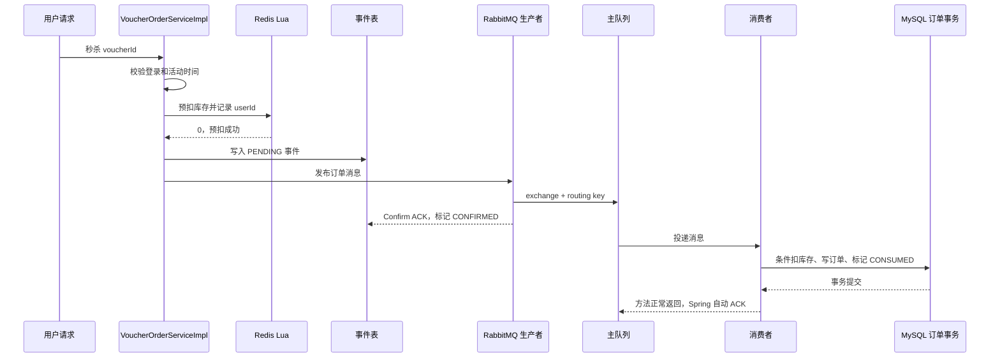

# RabbitMQ 优惠券秒杀链路说明与验收

## 1. RabbitMQ 在这里解决什么问题

秒杀请求到达时，接口不直接创建 MySQL 订单，而是先用 Redis Lua 完成库存预扣和一人一单判断，再把订单消息发送到 RabbitMQ。消费者异步写 MySQL，从而削减请求高峰对数据库的直接冲击。

这套方案的目标是：

- Redis 快速拦截无库存和重复请求。
- RabbitMQ 缓冲订单写入流量。
- MySQL 条件更新和唯一索引守住最终数据正确性。
- 事件表记录消息状态，为发布结果未知和失败补偿提供依据。

## 2. 队列拓扑

| 组件 | 名称 | 作用 |
| --- | --- | --- |
| 主交换机 | `dianping.seckill.direct` | 接收秒杀订单消息 |
| 主路由键 | `seckill.order.create` | 把订单消息路由到主队列 |
| 主队列 | `dianping.seckill.order.queue` | 保存等待消费的订单消息 |
| 死信交换机 | `dianping.seckill.dlx` | 接收主队列拒绝的消息 |
| 死信路由键 | `seckill.order.dead` | 把死信路由到秒杀专用 DLQ |
| 死信队列 | `dianping.seckill.order.dlq` | 隔离最终无法处理的订单消息 |

交换机、队列和消息均配置为持久化。主队列通过死信参数绑定死信交换机；消息重试耗尽后会被拒绝且不重新进入主队列，随后由 RabbitMQ 转发到 DLQ。

## 3. 正常秒杀流程



关键顺序是“Redis 预扣 → 事件落库 → 发布消息”。事件必须先落库，否则生产者发生异常时没有持久化依据进行补偿。

## 4. 消息里有什么

`SeckillOrderMessage` 包含：

| 字段 | 作用 |
| --- | --- |
| `eventId` | 消息唯一标识，关联事件表、日志和发布回调 |
| `orderId` | 最终订单主键；重发时保持不变 |
| `userId` | 下单用户，也是 Redis 回滚参数 |
| `voucherId` | 秒杀券 ID，也是库存和回滚参数 |
| `createdAt` | 原消息创建时间 |
| `version` | 消息结构版本，当前为 1 |

生产者还把关键 ID 写入 Header。Confirm 使用 `SeckillOrderCorrelationData` 找到事件并取得回滚参数；Return 使用消息 Header 完成同样的定位。

## 5. 事件状态怎么变化

| 状态 | 含义 | 典型来源 |
| --- | --- | --- |
| `PENDING` | 等待发布确认或补偿重发 | 发布前创建事件 |
| `CONFIRMED` | RabbitMQ 已接收消息，但订单未必落库 | Confirm ACK |
| `CONSUMED` | 消费事务已完成 | 订单处理器提交事务 |
| `FAILED` | 已确定发布失败或消费最终失败 | NACK、Return、重试耗尽 |

正常状态是 `PENDING → CONFIRMED → CONSUMED`。如果消费者先于 Confirm 回调完成，也允许 `PENDING → CONSUMED`；后到的 ACK 会把它视为幂等成功，不会倒退状态。

## 6. 各类失败怎么处理

| 场景 | 处理方式 | 是否立即回滚 Redis |
| --- | --- | --- |
| 发送方法抛出连接异常 | 结果可能未知，事件保持 PENDING，安排 1/2/4 秒补偿 | 否 |
| Confirm NACK | 先标记 FAILED，再执行回滚 Lua | 是 |
| Return，不可路由 | 先记录返回原因并标记 FAILED，再执行回滚 Lua | 是 |
| 消费时数据库临时异常 | 监听器按 1/2/4 秒有限重试 | 否 |
| 消息字段或版本错误 | 判定为永久错误，不做无意义重试 | 否 |
| 消费重试耗尽 | MessageRecoverer 标记 FAILED，拒绝消息并进入 DLQ | 否，等待对账 |
| 重复消息或重复订单 | 查询和唯一索引识别为幂等成功，标记 CONSUMED | 否 |

不能在所有发送异常中直接恢复 Redis，因为生产者收到网络异常时，消息可能已经到达 RabbitMQ。此时立即恢复购买资格可能让同一用户再次下单，形成重复订单。

## 7. 生产者补偿和消费者重试的区别

- 生产者模板自身会对同步发送异常有限重试。
- 如果发送结果仍未知，事件表补偿任务扫描到期的 PENDING 事件，并使用原 `eventId/orderId` 重发。
- 消费者重试解决的是消息已经进入队列，但数据库处理暂时失败的问题。
- DLQ 保存消费端最终无法处理的消息，不负责生产者到交换机之前的失败。

补偿任务在领取事件时设置 30 秒短租约，避免多个应用实例同时重发。即使仍发生重复投递，消费者查询、订单唯一索引和固定订单 ID 仍负责业务幂等。

## 8. 相关代码

| 职责 | 类 |
| --- | --- |
| 秒杀入口 | `VoucherOrderServiceImpl` |
| Redis 预扣/回滚 | `SeckillVoucherLuaExecutor`、`seckill.lua`、`seckill_rollback.lua` |
| RabbitMQ 拓扑和重试 | `RabbitMqConfig` |
| 消息和关联数据 | `SeckillOrderMessage`、`SeckillOrderCorrelationData` |
| 发布消息 | `SeckillOrderPublisher` |
| Confirm/Return | `RabbitMqPublisherCallback` |
| 发布补偿 | `SeckillOrderPublishRetryTask`、`SeckillOrderEventService` |
| 消费消息 | `SeckillOrderConsumer` |
| 数据库事务 | `VoucherOrderHandler` |
| 事件持久化 | `SeckillOrderEvent`、`SeckillOrderEventMapper` |

## 9. 启用条件

消费者默认关闭，RabbitMQ 可达且账号、交换机、队列声明正常后再设置：

```bash
export RABBITMQ_HOST=115.29.220.133
export RABBITMQ_PORT=5672
export RABBITMQ_USERNAME=实际账号
export RABBITMQ_PASSWORD=实际密码
export SECKILL_RABBIT_CONSUMER_ENABLED=true
```

不要把示例中的账号文字直接当作真实配置提交到仓库。

## 10. 2026-08-20 验收结果

| 验收项 | 结果 | 说明 |
| --- | --- | --- |
| Java 8 全量源码编译 | PASS | 编译通过，仅有 javac 注解处理提示 |
| Java 8 测试源码编译 | PASS | 测试类可编译；本机无 Maven/JUnit Console，未执行测试 |
| Git 差异格式检查 | PASS | `git diff --check` 无错误 |
| 事件表结构和索引 | PASS | 远端 MySQL 已核验，当前事件行数为 0 |
| MySQL/Redis 端口 | PASS | 远端 3306 和 6379 可连接 |
| 静态消息闭环 | PASS | 入口、事件、发布、回调、消费、重试和 DLQ 已接线 |
| RabbitMQ 端到端 | 未通过 | `115.29.220.133:5672` 当前拒绝连接 |
| RabbitMQ 管理端 | 未通过 | `115.29.220.133:15672` 当前拒绝连接 |
| 重复消费和并发压测 | 未执行 | 需要 RabbitMQ 恢复后验证 |

当前不能声称“RabbitMQ 秒杀已通过真实环境验收”。

## 11. 已知边界

- 进程若在 Redis Lua 预扣成功后、事件写入前崩溃，会留下没有事件记录的预扣，需要增加 Redis 与订单/事件表对账。
- NACK/Return 已标记 FAILED 后，如果 Redis 回滚本身失败，目前只记录日志，需要增加持久化回滚补偿或告警。
- DLQ 暂无人工处理接口；处理前必须先核对订单是否已经落库，不能直接恢复库存。
- 尚未完成真实 RabbitMQ 故障演练、重复投递测试和并发验收。

## 12. 面试简述

> 秒杀入口先用 Redis Lua 原子完成库存预扣和一人一单判断，再写 PENDING 事件并发布 RabbitMQ。Confirm ACK 只表示 Broker 接收消息，消费者在事务内条件扣 MySQL 库存、写订单并标记 CONSUMED。发送结果未知时通过事件表有限补偿，明确的 NACK/Return 才回滚 Redis；消费重试耗尽后进入专用 DLQ。数据库联合唯一索引和幂等消费负责最终防重。
